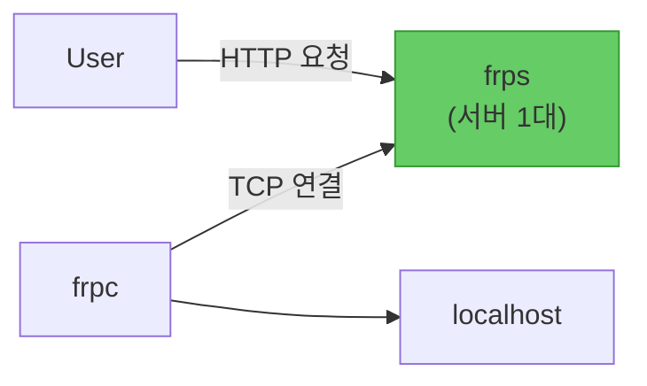
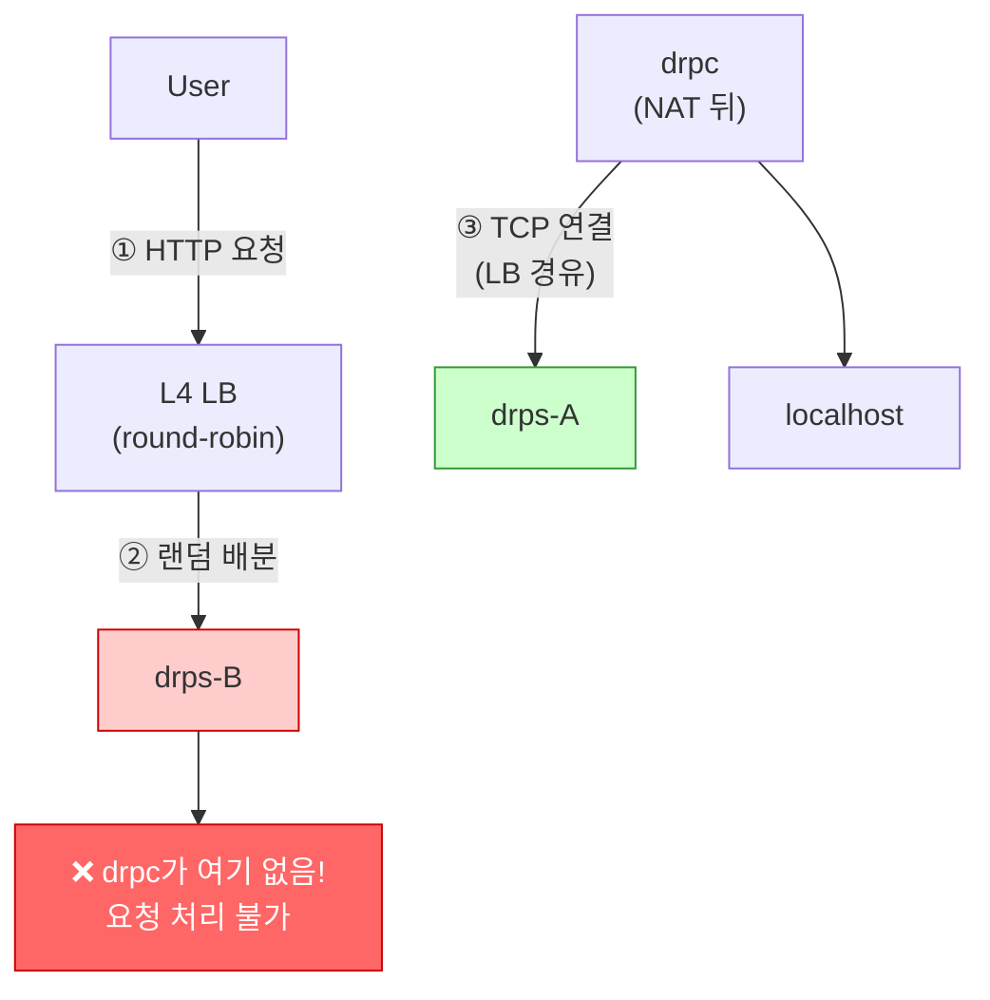
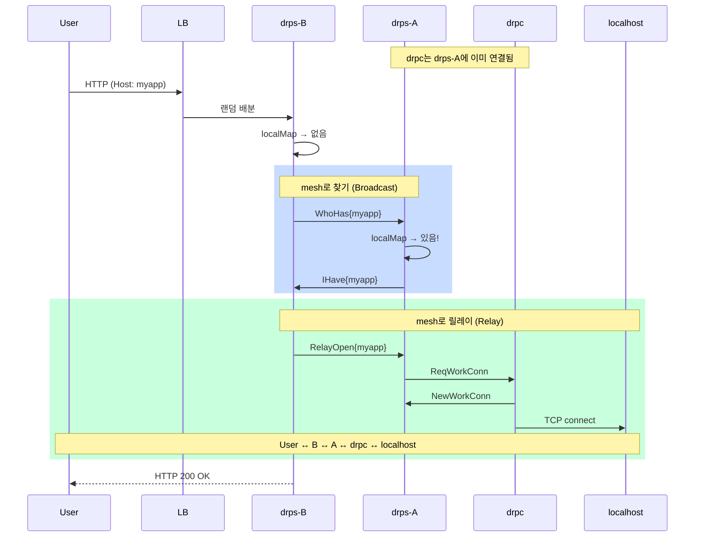

# ADR-003: 서버 메시와 서비스 검색

## 상태
Accepted

## 컨텍스트

### 문제

```
User → LB → Server-B (클라이언트 없음)
              ↓
           어떻게 클라이언트를 찾아서 연결할까?
```

클라이언트(drpc)는 NAT 뒤에서 LB를 통해 서버 1대에만 연결한다.
사용자 요청이 **다른 서버**에 도착하면 어떻게 처리하나?

### 왜 mesh가 필요한가?

#### frp: 서버 1대 — 문제 없음



서버가 1대. User도, frpc도 **같은 서버**로 간다. 라우팅 문제가 없다.

#### drp: 서버 N대 — 문제 발생



서버가 N대. LB가 User를 **아무 서버나**로 보낸다.
drpc는 drps-A에 연결되어 있는데, User가 drps-B로 왔다.
**drps-B는 drpc를 모른다. 요청 처리 불가.**

#### drp + mesh — 해결



**핵심**: mesh = 서버 간 통신 채널. User가 어떤 서버에 도착하든, mesh를 통해 drpc가 있는 서버를 **찾아서**(broadcast) **중계**(relay)한다.

### 검토한 접근

| 접근 | 문제 |
|------|------|
| Redis/etcd | 외부 인프라 의존. 운영 부담 |
| 클라이언트가 모든 서버에 연결 | 연결 수 = 서버 수. 확장 시 재설정 |
| 특정 서버에 직접 연결 | NAT 뒤에서 Pod IP 접근 불가 |
| 해시링 + Istio | 인프라 종속 |

## 결정

**서버들이 mesh로 연결. Broadcast로 찾고, Relay로 중계한다.**

drp의 분산 로직은 두 단계로 환원된다:

1. **찾기** — "이 서비스 누가 있어?" broadcast
2. **릴레이** — 찾은 노드를 통해 데이터 중계

### 동작 흐름

```
1. User → LB → Server-B (요청 도착)
2. Server-B: 로컬에 해당 클라이언트? → 없음
3. Server-B → broadcast → Server-A, C: "myapp 누가 있어?"
4. Server-A: "나!" → Server-B에 응답
5. Server-B ↔ Server-A: relay stream
6. Data: User ↔ Server-B ↔ [mesh] ↔ Server-A ↔ Client ↔ localhost
```

### Mesh 구조

서버들이 TCP로 서로 연결:

```
Full mesh (최적, 1 hop):     Partial mesh (허용, multi-hop):

  A ──── B                     A ──── B ──── C
  │ \  / │
  │  \/  │                     A→C 요청: A → B → C (2 hop)
  │  /\  │
  │ /  \ │
  C ──── D
```

- Full mesh = 1 hop. N*(N-1)/2 연결 (5대 = 10개)
- **Partial mesh도 동작** — TTL + 루프 방지. 설정 실수에 견고

### Peer Discovery

- `--peers` 플래그로 초기 peer 지정
- **Seed node**: 1개 주소만 알면 충분
- 연결 시 peer 목록 교환 (gossip)
- **단방향 설정**: A가 B를 지정하면 B는 자동 수락

### Broadcast 알고리즘

```
on_receive_whohas(msg, sender):
    if seen(msg.id): return           # 루프 방지
    mark_seen(msg.id)

    if msg.ttl <= 0: return           # 홉 제한

    if local_has(msg.service):
        reply_ihave(sender, msg)      # 있으면 응답
        return

    msg.ttl -= 1
    msg.path.append(my_id)
    for peer in peers:
        if peer != sender:
            forward(peer, msg)        # 없으면 이웃에게 전파
```

응답(IHave)은 **역경로**(path를 역순)로 돌아온다.

### Relay 성능

서버 간 통신은 **클러스터 내부**:

| 특성 | 값 |
|------|------|
| 지연 | sub-millisecond |
| 대역폭 | 10Gbps+ |

WebSocket long-lived 연결도 문제없음 (relay stream = ~4KB 메모리).

### HA (선택 옵션)

클라이언트는 **기본 1개** 서버에 연결. 필요 시 HA 활성화:

| 모드 | 서버 3대 기준 | 장점 |
|------|-------------|------|
| 기본 (1개 연결) | ~33% 직접, ~67% relay | 설정 단순 |
| HA (2개 연결) | ~67% 직접, ~33% relay | fault tolerance |

HA 연결 시 LB가 라운드로빈으로 다른 서버에 분배.
서버 장애 시 → 남은 연결로 서비스 계속 + 끊긴 연결 backoff 재연결.

### 인터페이스 분리

HTTP 프록시 로직과 mesh 로직은 완전 분리:

```
interface ConnGetter:
    get_conn(service_name) → connection

# 구현체가 로컬 확인 → broadcast → relay를 숨김
```

이로써 HTTP 라우팅은 ConnGetter만 호출하면 되고, mesh 구현은 교체 가능.

## 결과

### 장점
- 외부 의존성 제로
- 어떤 LB, 어떤 인프라에서든 동작
- Partial mesh 허용 — 설정 실수에 견고
- Gossip으로 자동 peer 발견
- 클라이언트 설정 단순 (LB 주소 하나)

### 단점
- Full mesh 시 O(N²) 연결 (목표 2~5대에서 무시 가능)
- Partial mesh에서 multi-hop (intra-cluster라 sub-ms)
- Broadcast 오버헤드 (연결 수립 시 1회)

### 대안 (선택하지 않음)

| 대안 | 미선택 이유 |
|------|------------|
| Redis/etcd | 외부 의존성. 운영 부담 |
| 클라이언트 → 모든 서버 연결 | 서버 수에 비례. 확장 시 재설정 |
| L2/ARP | 클라우드 불가 |
| 해시링 + Istio | 인프라 종속 |
| Gossip library (memberlist) | drp 규모에서 과한 복잡도 |

## 참고 자료
- [ADR-001](./001-scope-and-philosophy.md)
- [ADR-002](./002-host-sni-routing.md)
- [ADR-004](./004-protocol-and-messages.md)
