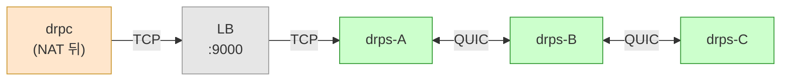

# ADR-005: Mesh 전송 계층 — QUIC

## 상태
Proposed

## 컨텍스트

### 문제

현재 POC에서 mesh 릴레이(drps ↔ drps)는 요청마다 **새 TCP 연결**을 생성한다:

```
요청 1 → TCP 연결 #1 (drps-B → drps-A)
요청 2 → TCP 연결 #2 (drps-B → drps-A)
요청 3 → TCP 연결 #3 (drps-B → drps-A)
...
```

| 항목 | 현재 (새 TCP) | 문제 |
|------|-------------|------|
| fd 사용 | 요청당 2개 (in + out) | 1000 동시 요청 = 2000 fd |
| 핸드셰이크 | 요청마다 TCP 3-way | 지연 누적 |
| 상태 | 커널 소켓 버퍼 ~10KB/연결 | 메모리 비례 증가 |
| 확장성 | drps 수와 무관하게 fd 제한 | **ulimit에 의한 상한선** |

### 해결 방향: 멀티플렉싱

하나의 연결 위에 여러 논리적 스트림을 다중화:

```
drps-B ═══════════════════ drps-A     (1개 연결)
          ├── stream 1: relay 요청 #1
          ├── stream 2: relay 요청 #2
          ├── stream 3: relay 요청 #3
          └── ...
```

fd 1개로 수천 개의 동시 릴레이 가능.

### 멀티플렉싱 구현 방법 비교

| 방법 | 설명 | 장단점 |
|------|------|--------|
| 자체 구현 | stream ID + 프레이밍 직접 구현 | HTTP/2 스펙은 96페이지. 현실적이지 않음 |
| yamux/smux | TCP 위 userspace 멀티플렉싱 | 검증됨. 하지만 HoL blocking 존재 |
| QUIC | UDP 위 커널/프로토콜 레벨 멀티플렉싱 | **HoL blocking 없음. 스트림이 1등 시민** |

## 결정

**mesh 전송 계층(drps ↔ drps)에 QUIC를 사용한다. 클라이언트 연결(drpc ↔ drps)은 TCP를 유지한다.**



### 왜 TCP + QUIC 분리인가

| 구간 | 프로토콜 | 이유 |
|------|---------|------|
| drpc ↔ drps | TCP | 인터넷 경유. 기업 방화벽이 UDP 차단할 수 있음 |
| drps ↔ drps | QUIC | 내부 클러스터. UDP 제한 없음. 멀티플렉싱 필요 |

### QUIC가 mesh에 적합한 이유

#### 1. 네이티브 멀티플렉싱 (HoL blocking 없음)

TCP 위 멀티플렉싱(yamux, HTTP/2)은 **Head-of-Line blocking** 문제가 있다:

```
TCP (yamux/smux):
  stream 1: ████████░░░░    ← 패킷 손실!
  stream 2: ████ (대기중)    ← stream 1의 재전송을 기다림
  stream 3: ██ (대기중)      ← stream 1의 재전송을 기다림

QUIC:
  stream 1: ████████░░░░    ← 패킷 손실! (이 스트림만 영향)
  stream 2: ████████████    ← 정상 진행
  stream 3: ██████████      ← 정상 진행
```

QUIC의 스트림은 **독립적으로 재전송**된다. 하나의 스트림 손실이 다른 스트림에 영향 없음.

#### 2. 0-RTT 스트림 생성

```
새 TCP 연결:   SYN → SYN-ACK → ACK → 데이터     (1.5 RTT)
QUIC 새 스트림: 데이터                             (0 RTT, 연결 이미 수립됨)
```

mesh는 peer 간 QUIC 연결이 **항상 유지**된다. 새 릴레이 요청은 기존 연결 위에 스트림만 열면 됨.

#### 3. fd 효율

| 방식 | peer 3대, 동시 릴레이 1000개 | fd 사용 |
|------|---------------------------|---------|
| 새 TCP | 1000 × 2 (in + out) | **2000** |
| QUIC | peer당 1 UDP 소켓 | **3** |

#### 4. 내장 TLS 1.3

QUIC은 TLS 1.3이 프로토콜에 내장되어 있다. 별도 TLS 설정 없이 peer 간 암호화:

- AES-NI가 있는 현대 CPU에서 multi-Gbps AES 암호화를 **CPU ~3%** 로 처리
- peer 인증 (99-production-requirements.md #6)이 자연스럽게 해결됨 — mTLS 사용

#### 5. 검증된 처리량

KIT 2025 연구 (10 Gbps 하드웨어 테스트베드, 데이터센터 조건):

- quic-go: **10G 링크에서 multi-Gbps 지속 처리량** 달성
- quic-go 자체 벤치마크 `BenchmarkStreamChurn`: **1e10(100억) 동시 스트림**으로 테스트, 성능 절벽 없음

### 리소스 비교

| 항목 | 새 TCP (현재) | QUIC (제안) |
|------|-------------|-------------|
| fd/peer | 릴레이 수에 비례 | **1** (UDP 소켓) |
| 메모리/스트림 | ~10KB (커널 소켓 버퍼) | **~1KB** (userspace 버퍼) |
| 핸드셰이크 | 1.5 RTT/릴레이 | **0 RTT** (스트림) |
| HoL blocking | 있음 (TCP) | **없음** |
| 암호화 | 별도 설정 필요 | **내장** (TLS 1.3) |
| 동시 스트림 | ulimit 제한 | **설정 가능** (기본 100, 최대 2^60) |

### quic-go 설정

```go
quicConfig := &quic.Config{
    MaxIncomingStreams:  10000,           // 동시 릴레이 상한
    MaxIdleTimeout:     30 * time.Second,
    KeepAlivePeriod:    10 * time.Second, // heartbeat 대체
}
```

| 설정 | 기본값 | drp 권장값 | 이유 |
|------|--------|-----------|------|
| MaxIncomingStreams | 100 | 10,000 | 동시 릴레이 수 |
| MaxIdleTimeout | 30s | 30s | 유휴 연결 정리 |
| KeepAlivePeriod | 0 (비활성) | 10s | mesh heartbeat 대체 |

### 구현 영향

#### mesh.go 변경

```
현재 (TCP):
  peer 연결 → TCP connect → _peer_loop (TLV 메시지)
  relay 요청 → 새 TCP connect → pipe()

변경 (QUIC):
  peer 연결 → QUIC dial → 1개 control stream (TLV 메시지)
  relay 요청 → 같은 QUIC 연결에 새 stream open → pipe()
```

#### 프로토콜 변경

| 메시지 | 현재 | 변경 |
|--------|------|------|
| MeshHello | TCP 연결 시 교환 | QUIC 연결 시 첫 stream에서 교환 |
| WhoHas/IHave | control TCP에서 TLV | control stream에서 TLV |
| RelayOpen | **새 TCP 연결** 필요 | **새 stream open** (0-RTT) |
| pipe() | TCP fd ↔ TCP fd | QUIC stream ↔ TCP fd |

#### RelayOpen 단순화

```
현재:
  1. B → A: RelayOpen (TCP control)
  2. A: 새 TCP 리스너 준비 또는 B가 새 TCP 연결
  3. B → A: 새 TCP 연결 (relay data)
  4. pipe(새_TCP, user_conn)

변경:
  1. B: 기존 QUIC 연결에 stream.Open()
  2. B → A: stream에 RelayOpen TLV 전송
  3. pipe(stream, user_conn)
```

## 결과

### 장점
- **확장성**: fd 제한 해소. drps 추가 시 진정한 수평 확장
- **성능**: 0-RTT 스트림, HoL blocking 없음
- **보안**: TLS 1.3 내장. peer 인증(mTLS) 자연스럽게 해결
- **단순성**: RelayOpen이 `stream.Open()` 한 줄로 단순화
- **heartbeat 통합**: QUIC KeepAlive가 peer heartbeat 대체

### 단점
- **외부 의존성**: `quic-go` 라이브러리 필요 (Go stdlib에 아직 QUIC 없음)
- **UDP 튜닝 필요**: `net.core.rmem_max`, `net.core.wmem_max` 커널 파라미터 조정
- **디버깅 복잡**: TCP 대비 패킷 캡처/분석 도구 미성숙
- **CPU 오버헤드**: TLS 1.3 필수 (AES-NI로 완화, 내부 트래픽에서 무시 가능 수준)

### 검증된 사례

| 프로젝트 | QUIC 용도 | 라이브러리 | 규모 |
|---------|----------|-----------|------|
| **Google 내부** | 마이크로서비스 간 통신 | 자체 구현 | 수천 대 서버 (2017~) |
| **frp** | frpc↔frps 전송 프로토콜 (TCP/KCP/QUIC/WS 중 선택) | quic-go | 90k+ stars, 프로덕션 |
| **cloudflared** | cloudflared↔Cloudflare Edge 터널 전송 | quic-go (fork) | 전 세계 프로덕션 |
| **Caddy** | HTTP/3 서버 | quic-go v0.59.0 | 60k+ stars, 프로덕션 |
| **Syncthing** | 파일 동기화 전송 | quic-go | 67k+ stars, 프로덕션 |
| **libp2p** | P2P 네트워크 전송 (IPFS, Filecoin) | quic-go | 분산 시스템 프로덕션 |

### 대안 (선택하지 않음)

| 대안 | 미선택 이유 |
|------|------------|
| TCP + yamux | HoL blocking. fd는 줄지만 성능 열화 |
| TCP + smux | yamux와 동일한 문제 |
| TCP 연결 풀링 | fd 문제 완화만, 근본 해결 안 됨 |
| HTTP/2 | 바이너리 릴레이에 부자연스러움. HoL blocking 동일 |
| 자체 멀티플렉싱 | 구현 비용 과다 (HTTP/2 = 96페이지 스펙) |

### Go QUIC 생태계 현황

| 구현 | 상태 | 비고 |
|------|------|------|
| **quic-go** | 프로덕션 | 11.4k stars. 사실상 Go 표준. RFC 9000/9001/9002 준수 |
| **golang.org/x/net/quic** | 실험적 | Go 팀 개발 중. stdlib 편입까지 1~2년+ |
| 기타 | 없음 | Go 생태계가 quic-go로 수렴 |

→ quic-go 사용. stdlib 편입 시 마이그레이션 검토.

### 운영 시 주의사항

| 항목 | 조치 |
|------|------|
| UDP 버퍼 | `sysctl net.core.rmem_max=7500000 wmem_max=7500000` (quic-go 권장 7MB) |
| 방화벽 | 클러스터 내부 UDP 포트 허용 |
| MTU | quic-go가 RFC 8899 DPLPMTUD 구현. 자동 처리 (기본 1200 bytes) |
| 모니터링 | quic-go 메트릭 (`quic_connections_active`, `quic_streams_active`) |

## 참고 자료
- [ADR-003](./003-server-mesh-and-discovery.md) — mesh 설계
- [ADR-004](./004-protocol-and-messages.md) — TLV 프로토콜
- [quic-go](https://github.com/quic-go/quic-go) — Go QUIC 구현
- [RFC 9000 - QUIC Transport](https://tools.ietf.org/html/rfc9000)
- [RFC 9001 - QUIC TLS](https://tools.ietf.org/html/rfc9001)
- [frp QUIC 지원](https://github.com/fatedier/frp/blob/dev/client/connector.go)
- [cloudflared QUIC 터널](https://github.com/cloudflare/cloudflared)
