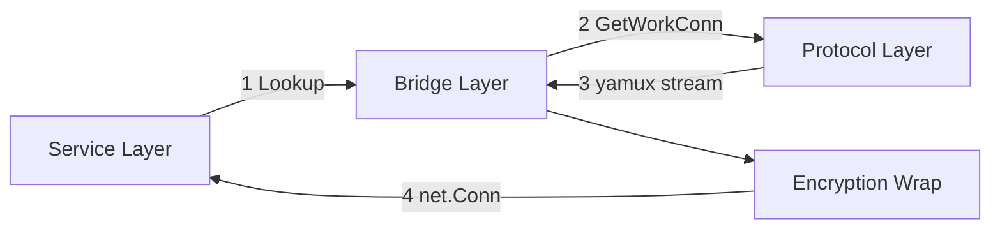
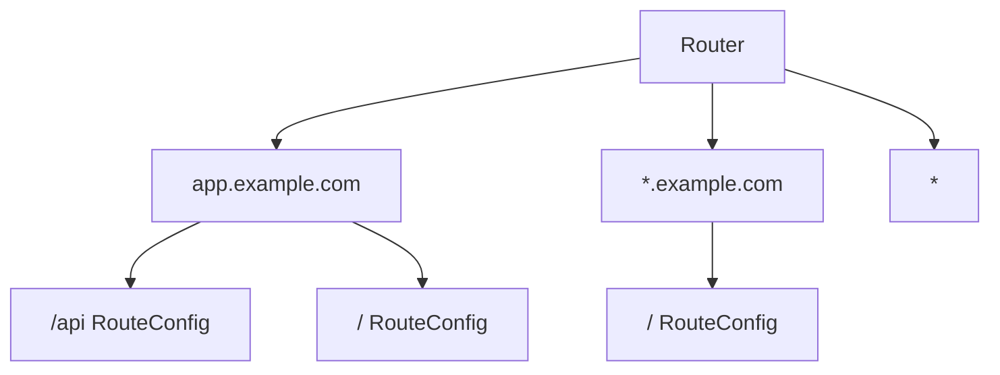
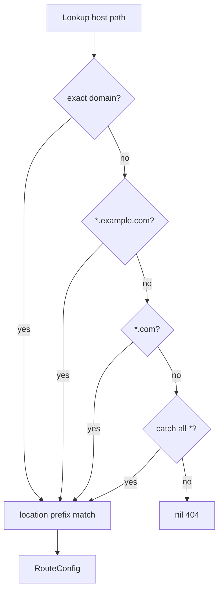
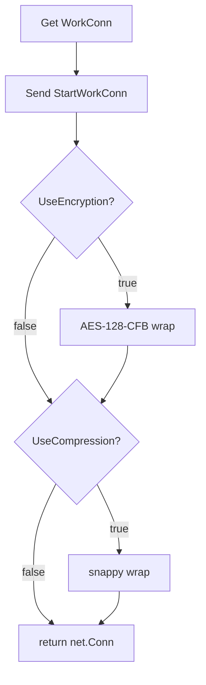
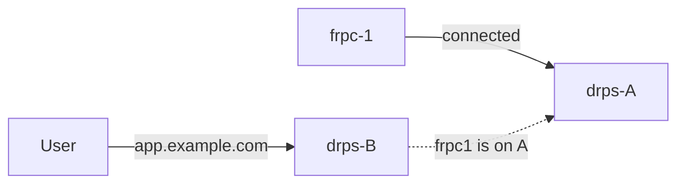
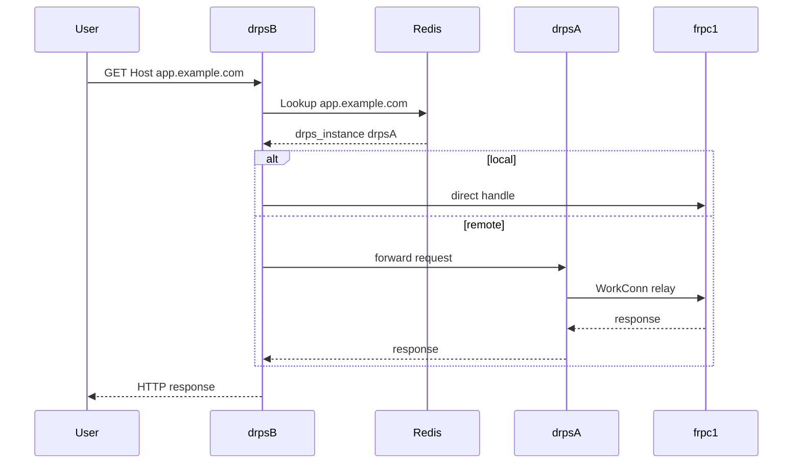

# Bridge Layer

Service Layer의 HTTP 요청을 Protocol Layer의 워크 커넥션에 연결합니다.
이 레이어의 관심사는 **"이 요청을 어떤 frpc에게 보낼까?"** 입니다.

## 브릿지 역할



## RouteConfig

두 레이어를 연결하는 핵심 구조체입니다.

```go
type RouteConfig struct {
    Domain            string
    Location          string
    ProxyName         string
    GetWorkConn       func() (net.Conn, error)
    HostHeaderRewrite string
    Headers           map[string]string
    ResponseHeaders   map[string]string
    HTTPUser          string
    HTTPPwd           string
    UseEncryption     bool
    UseCompression    bool
}
```

`GetWorkConn`이 **Protocol Layer와 Service Layer를 연결하는 유일한 접점**입니다.
Service Layer는 이 함수를 호출하면 `net.Conn`을 받을 뿐,
그것이 yamux 스트림인지, 어떤 frpc에서 왔는지 알지 못합니다.

## 라우팅 테이블



location은 **내림차순 정렬** (longest-prefix match):
`/api/v2` → `/api` → `/`

### 라우팅 알고리즘



## 워크 커넥션 암호화 래핑



래핑 순서 (양쪽 동일해야 함):
- drps: `yamux stream → [AES] → [snappy] → HTTP I/O`
- frpc: `yamux stream → [AES] → [snappy] → localhost`

## 인터페이스 설계

```go
// Protocol Layer가 라우트를 등록/해제할 때 사용
type ProxyRegistrar interface {
    Register(rc *RouteConfig) error
    Unregister(proxyName string)
}

// Protocol Layer가 ControlManager에서 자신을 제거할 때 사용
type ControlRegistry interface {
    Del(runID string, ctl *Control)
}

// Phase 1: Router가 ProxyRegistrar를 구현
var _ ProxyRegistrar = (*Router)(nil)

// Phase 2: DistributedRouter가 동일한 인터페이스 구현
var _ ProxyRegistrar = (*DistributedRouter)(nil)
```

## Phase 2: 분산 확장

### 문제



### 해결: 라우팅 정보에 drps 인스턴스 포함

```
Phase 1 라우팅 테이블:
  "app.example.com" → GetWorkConn (로컬 Control)

Phase 2 라우팅 테이블 (Redis):
  "app.example.com" → {
    proxy_name: "my-web",
    drps_instance: "drps-A:9000",
    registered_at: "2026-03-23T..."
  }
```

### Phase 2 요청 흐름



### Phase 2 추가 컴포넌트

| 컴포넌트 | 역할 |
|----------|------|
| `DistributedRouter` | ProxyRegistrar 구현 (Redis/etcd) |
| `InstanceRegistry` | drps 인스턴스 등록/발견/헬스체크 |
| `RequestForwarder` | drps 간 요청 전달 |

**Protocol Layer와 Service Layer 코드 변경 없이 Bridge Layer만 교체합니다.**

## 소스 파일

| 파일 | 역할 |
|------|------|
| `router.go` | 라우팅 테이블 (Phase 1: 인메모리) |
| `interfaces.go` | 레이어 간 계약 (ProxyRegistrar, ControlRegistry) |
| `config.go` | 서버 설정 |
