# 컴포넌트 상세

각 내부 패키지의 구조와 책임.

## 1. config

환경변수/플래그 파싱. 기본값 내장.

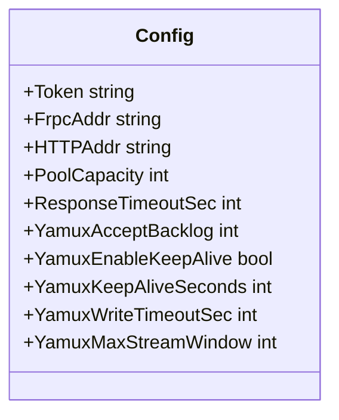

환경변수 접두사: `DRPS_*`

운영 플래그/환경변수:
- `DRPS_DEBUG=1` : 제어채널/워크커넥션 디버그 로그 출력
- `DRPS_PPROF=1` : `/debug/pprof/*` 엔드포인트 활성화
- `DRPS_RESPONSE_TIMEOUT_SEC` (`--response-timeout-sec`) : upstream I/O deadline (0이면 비활성)

---

## 2. server (Protocol Layer)

frpc와의 제어 채널을 관리. **단일 writer 원칙** — 제어 채널에 바이트를 쓰는 goroutine 은 `controlWriter.run()` 하나뿐.

### 파일 레이아웃

`internal/server/handle.go` 는 5개 파일로 분할되었다. 기존 `metrics.go`, `util.go` 는 그대로 유지된다.

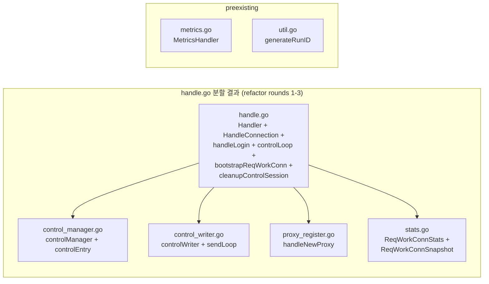

### 주요 타입

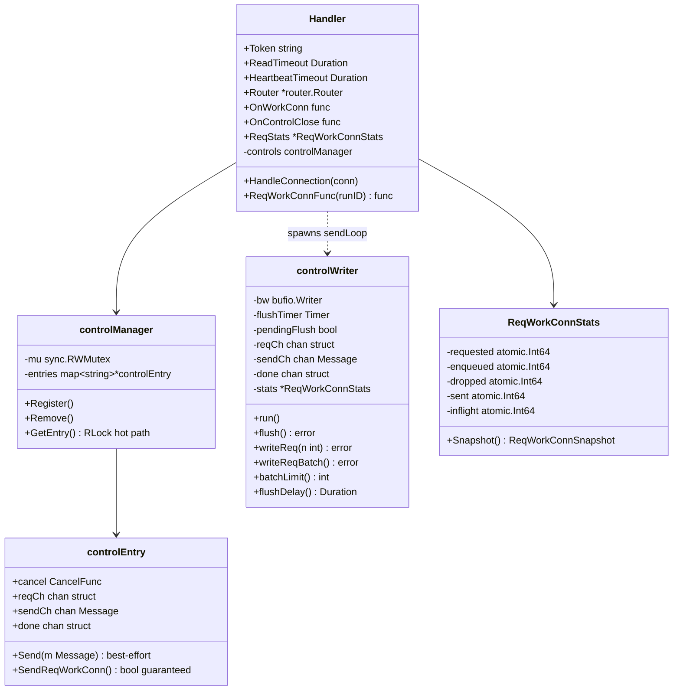

### 제어 흐름

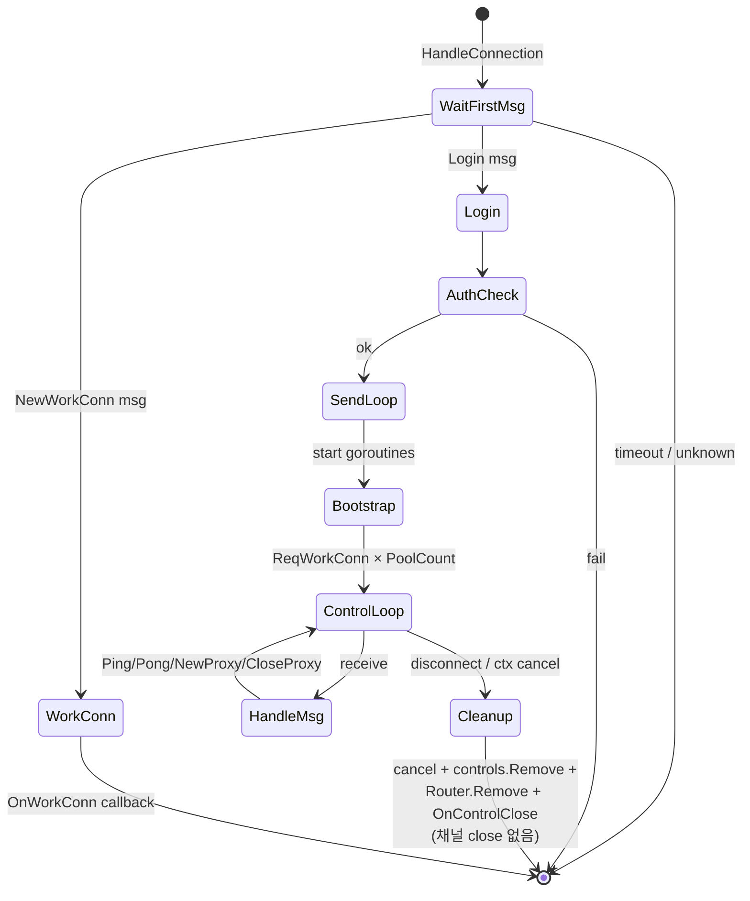

### controlWriter / sendLoop

제어 채널의 유일한 writer. `sendLoop(w, reqCh, sendCh, done, stats)` 는 얇은 래퍼이고, 실제 로직은 `controlWriter.run()` 에 있음.

- `reqCh`(ReqWorkConn 요청): backlog 깊이별로 adaptive batch + flush
  - `≥ 512`: batch 128, flush 50μs
  - `≥ 128`: batch 64,  flush 200μs
  - `else` : batch 16,  flush 400μs
- `sendCh`(일반 메시지): 양쪽에서 즉시 flush (latency 최소화)
- 통계: requested / enqueued / dropped / sent / inflight

### shutdown 시그널

**단일 시그널 원칙**: 제어 세션 종료는 `ctx.Done()` (= `controlEntry.done`) 하나로만 전파된다.

- `cleanupControlSession` 순서:
  1. `cancel()` — ctx 취소, `controlWriter.run()` 의 `<-done` case 가 발화
  2. `controls.Remove(runID)` — controlManager 에서 제거
  3. `Router.Remove(name)` — 해당 세션이 등록한 모든 proxy route 제거
  4. `OnControlClose(runID)` 콜백 — 외부(main.go)에 알림 (예: pool.Registry.Remove)
- **핵심**: `close(reqCh)` / `close(sendCh)` 는 **호출하지 않는다**. 채널은 GC 가 회수한다.
- `controlWriter.run()` 은 루프 매 iteration 시작에 `<-done` 빠른-탈출 + select 내부에도 `<-done` case.
- `SendReqWorkConn()` 은 `reqCh <-` 와 `<-done` 둘 중 먼저 오는 쪽을 취한다 (send-on-closed-channel 레이스 없음, `recover()` 불필요).

---

## 3. proxy (Service Layer)

HTTP 요청을 워크 커넥션으로 전달. `NewHandler` 는 얇은 orchestrator 이고, 실제 wiring 은 named builder/hook 으로 분해되어있다.

### 구성

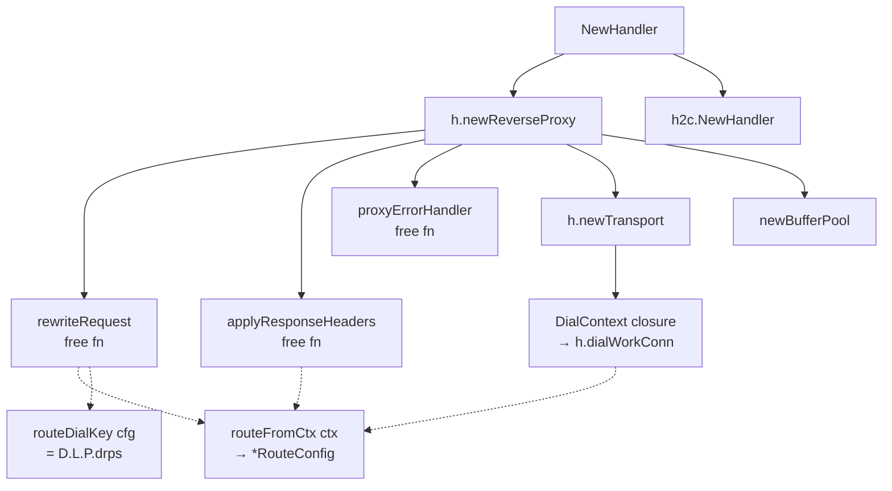

### 주요 타입

```mermaid
classDiagram
    class Handler {
        -router *router.Router
        -poolLookup PoolLookup
        -aesKey []byte
        -proxy http.Handler
        +WorkConnTimeout Duration
        +ResponseTimeout Duration
        +ServeHTTP(w, r)
        +newReverseProxy() *ReverseProxy
        +newTransport() *http.Transport
        +dialWorkConn(ctx) net.Conn
    }

    class bufferPool {
        -pool sync.Pool
        +Get() []byte
        +Put(b []byte)
    }

    Handler --> bufferPool : newBufferPool 32KiB
    Handler --> "router.Router" : Lookup
    Handler --> "pool.Registry" : poolLookup runID
    Handler --> "wrap" : Wrap aesKey
```

### 요청 처리

1. `Router.Lookup(Host, Path)` → `RouteConfig` (RunID 포함)
2. Basic Auth 검증 (HTTPUser 설정 시)
3. `context.WithValue(ctx, routeCtxKey{}, cfg)` — 이후 모든 hook 은 `routeFromCtx(ctx)` 로 cfg 재조회 (router 재실행 안 함)
4. `rewriteRequest` hook:
   - `URL.Host = routeDialKey(cfg)` — idle-conn 풀이 라우트 단위로 분리되도록 **합성 호스트** 사용 (`Domain.Location.ProxyName.drps`). 포맷이 `.drps` 로 끝나므로 실 DNS 이름과 충돌 불가.
   - HostHeaderRewrite + custom headers 주입
5. `Transport.DialContext` → `h.dialWorkConn(ctx)`:
   - `poolLookup(cfg.RunID)` → `*Pool`
   - `Pool.Get(timeout)` → 워크 커넥션
   - `wrap.Wrap(conn, aesKey, proxyName, enc, comp)` → StartWorkConn + AES/snappy
   - `ResponseTimeout` 설정 시 `wrapped.SetDeadline` 적용
6. `h2c.NewHandler` 래핑으로 HTTP/2 cleartext(h2c) 업그레이드 지원
7. `applyResponseHeaders` hook 에서 response headers 주입 (WebSocket 101 포함 업그레이드는 ReverseProxy 가 처리)
8. 에러는 `proxyErrorHandler` 로 수렴: `net.Error.Timeout()` → 504, 그 외 → 502

### 왜 routeDialKey 인가

`http.Transport` 의 idle-connection pool 은 **URL.Host 단위** 로 분리된다. 모든 요청이 동일한 실 호스트(예: `backend`)를 가진다면 `MaxIdleConnsPerHost=5` 제한이 전체 라우트에 공유되어 한 upstream 이 느려지면 다른 라우트까지 blocking 된다. `routeDialKey(cfg)` 로 합성 키를 쓰면 Transport 내부 pool 이 **라우트별로 격리**된다 — 실제 dial 은 `DialContext` 가 하므로 호스트 이름은 임의여도 무관.

---

## 4. router (Bridge Layer)

도메인+경로 → RouteConfig 매핑.

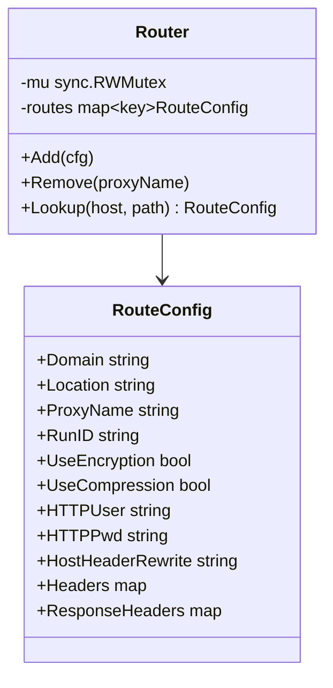

매칭 우선순위:

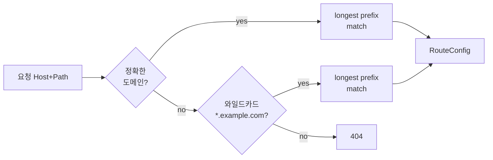

---

## 5. pool

워크 커넥션 풀. 채널 기반. 필드는 역할별로 4 그룹으로 정렬됨 (connection queue / refill machinery / statistics / teardown).

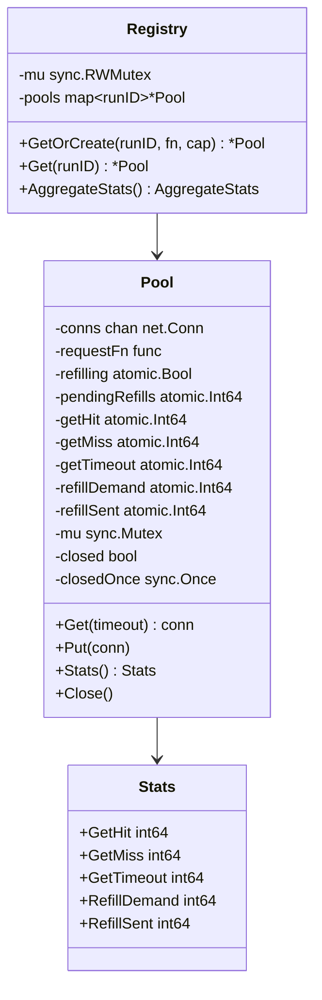

`defaultCapacity = 64`. `New(requestFn, capacity...)` 의 variadic 은 테스트 편의용으로 유지되며, 프로덕션 경로(`cmd/drps/main.go` → `Registry.GetOrCreate`) 는 항상 명시적 capacity 를 전달한다.

### Get/Put 상태

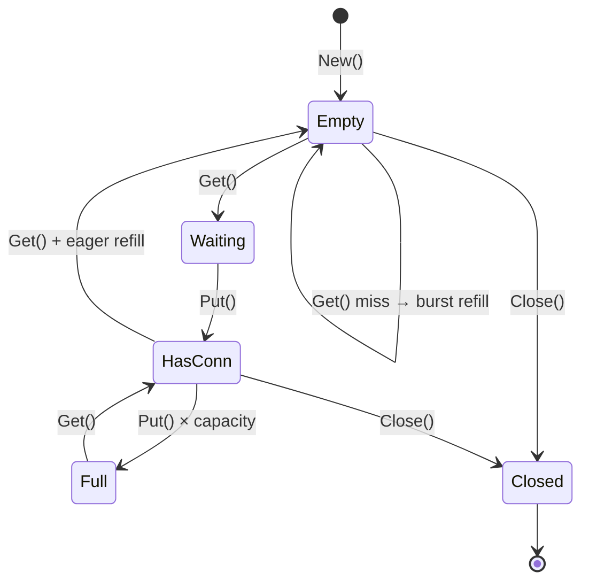

### Burst Refill

`Get` 시 pool이 비어있으면 단건이 아니라 여러 개를 일괄 요청 → 지연 감소.

- burst 크기 = `max(2, min(8, capacity/4))`
- `requestAsyncRefill(n)` → `refillWorker` → `requestFn × n`

---

## 6. wrap

워크 커넥션을 사용 준비 상태로 만든다.

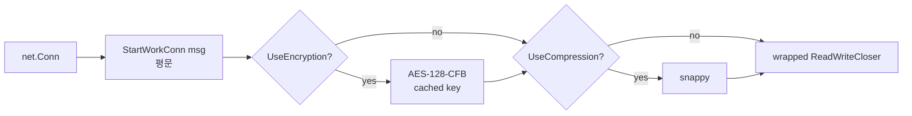

**핵심**: aesKey는 호출자가 캐싱한 값을 전달. DeriveKey는 서버 시작 시 1회만 호출.

---

## 7. msg

frp 와이어 프로토콜. 구조: `[1B type][8B length BE][JSON body]`

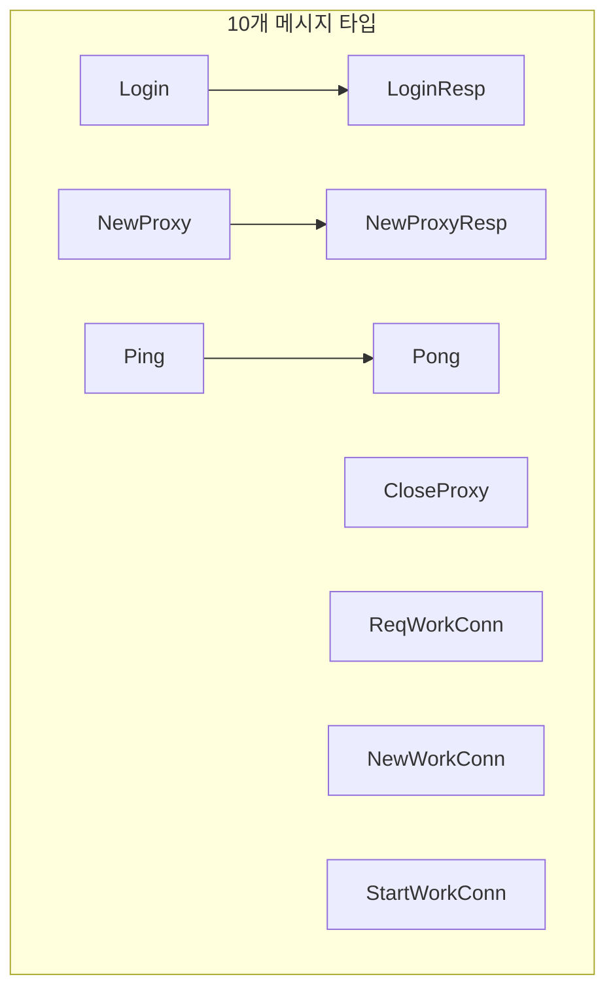

### 성능 최적화

| 항목 | 방식 |
|------|------|
| WriteMsg syscall | type+length+body 단일 버퍼 → 1회 Write |
| TypeOf | switch type assertion (0 allocs) |
| ReadMsg | 헤더 9B 스택 할당, body sync.Pool |
| MaxBodySize | 10240 bytes |

frp v0.68.0 필드 완전 일치.

---

## 8. auth

`MD5(token + timestamp)` 인증. constant-time 비교(`subtle.ConstantTimeCompare`).

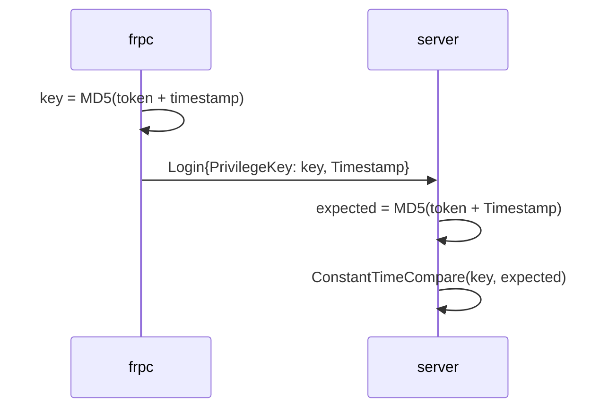

---

## 9. crypto

AES 암호화 + snappy 압축.

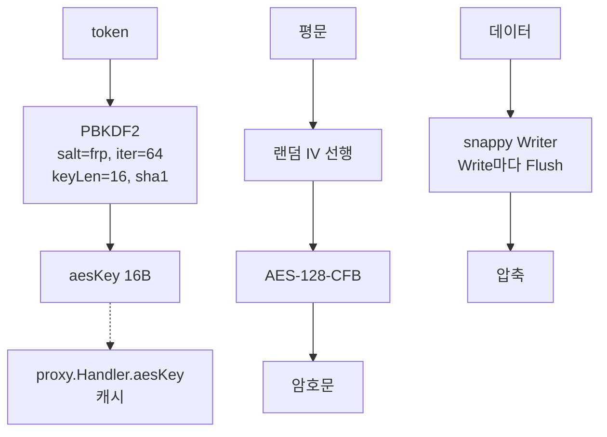

**DeriveKey**: 서버 시작 시 1회만 호출 → `proxy.Handler.aesKey`로 캐시.

---

## 10. metrics (server 패키지 내부)

`/__drps/metrics` 엔드포인트. atomic 카운터 스냅샷 + pool 집계.

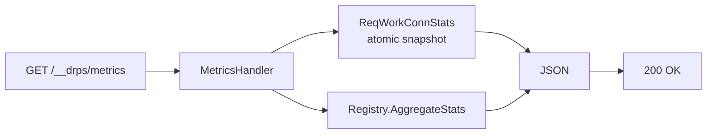

응답 구조:
```json
{
  "req_work_conn": {
    "requested": N,
    "enqueued":  N,
    "dropped":   N,
    "sent":      N,
    "inflight":  N
  },
  "pool": {
    "get_hit":       N,
    "get_miss":      N,
    "get_timeout":   N,
    "refill_demand": N,
    "refill_sent":   N,
    "active_pools":  N
  }
}
```

---

## 외부 의존성

| 라이브러리 | 용도 |
|-----------|------|
| `hashicorp/yamux` (fork) | TCP 멀티플렉싱 |
| `golang/snappy` | 압축 |
| `x/crypto` | PBKDF2 키 파생 |
| `x/net/http2` | h2c 지원 |
