# 컴포넌트 상세

각 내부 패키지의 구조와 책임.

## 1. config

환경변수/플래그 파싱. 기본값 내장.

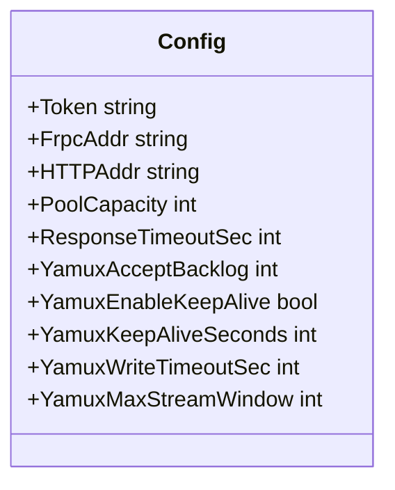

환경변수 접두사: `DRPS_*`

운영 플래그/환경변수:
- `DRPS_DEBUG=1` : 제어채널/워크커넥션 디버그 로그 출력
- `DRPS_PPROF=1` : `/debug/pprof/*` 엔드포인트 활성화
- `DRPS_RESPONSE_TIMEOUT_SEC` (`--response-timeout-sec`) : upstream I/O deadline (0이면 비활성)

---

## 2. server (Protocol Layer)

frpc와의 제어 채널을 관리. 단일 writer 원칙(sendLoop).

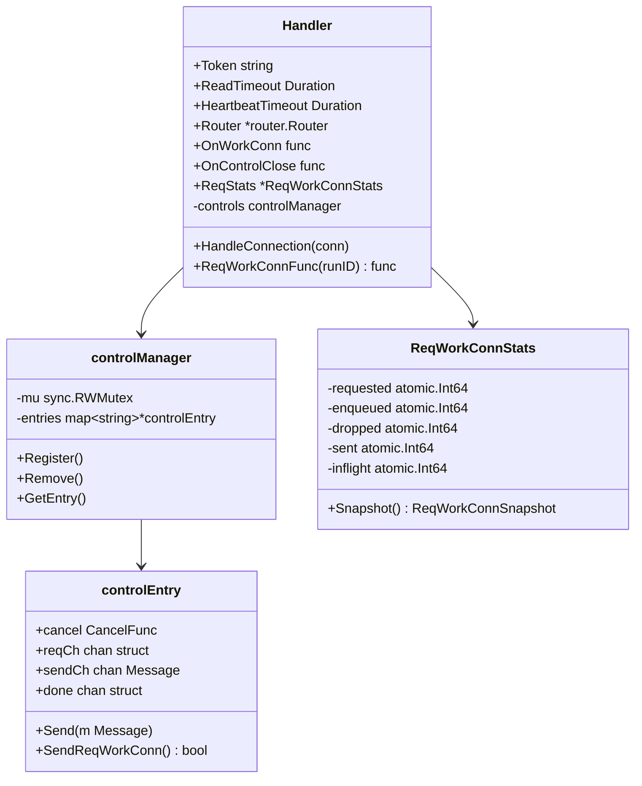

### 제어 흐름

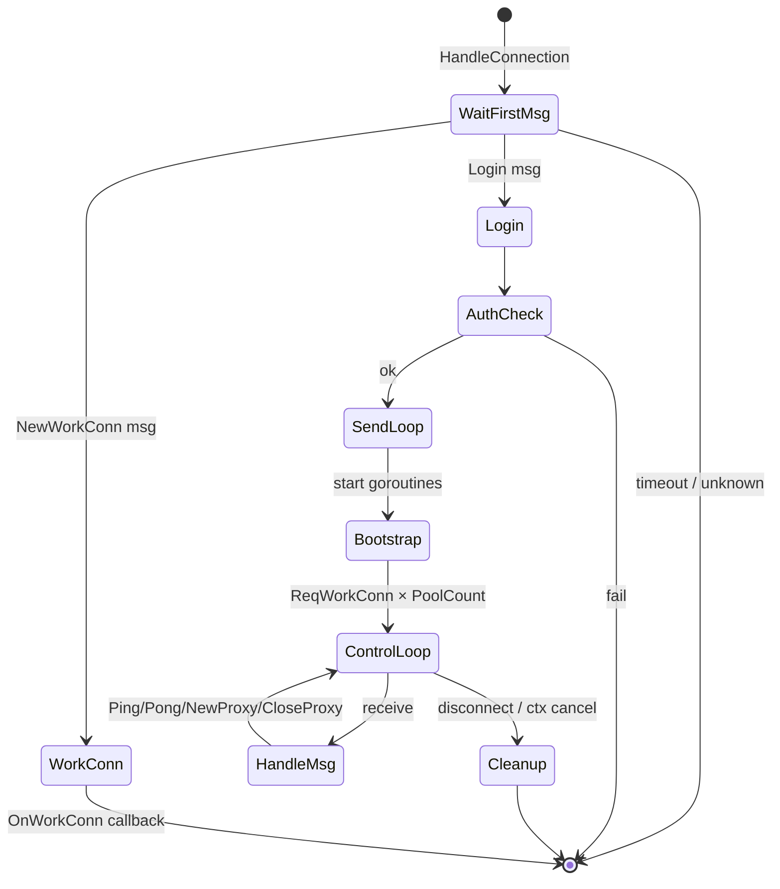

### sendLoop

제어 채널의 유일한 writer. `reqCh`(ReqWorkConn 요청)와 `sendCh`(일반 메시지)를 배칭해서 flush.

- `reqCh` 깊이에 따라 adaptive flush (50μs ~ 400μs)
- `sendCh`는 즉시 flush
- 통계: requested / enqueued / dropped / sent / inflight

---

## 3. proxy (Service Layer)

HTTP 요청을 워크 커넥션으로 전달.

```mermaid
classDiagram
    class Handler {
        -router *router.Router
        -poolLookup PoolLookup
        -aesKey []byte
        -proxy http.Handler
        +WorkConnTimeout Duration
        +ResponseTimeout Duration
        +ServeHTTP(w, r)
    }

    class reverseProxy {
        +h2c.NewHandler(http2.Server)
        +Rewrite()
        +ModifyResponse()
        +DialContext()
        +ErrorHandler()
    }

    Handler --> reverseProxy
    Handler --> "router.Router" : Lookup
    Handler --> "pool.Registry" : poolLookup(runID)
    Handler --> "wrap" : Wrap(aesKey)
```

### 요청 처리

1. `Router.Lookup(Host, Path)` → `RouteConfig` (RunID 포함)
2. Basic Auth 검증 (HTTPUser 설정 시)
3. `poolLookup(cfg.RunID)` → `*Pool` 직접 조회 (이중 조회 제거)
4. `Pool.Get(timeout)` → 워크 커넥션
5. `wrap.Wrap(conn, aesKey, proxyName, enc, comp)` → StartWorkConn + AES/snappy
6. ReverseProxy `Rewrite` 단계에서 HostHeaderRewrite + custom headers 주입
7. ReverseProxy `DialContext`가 wrapped conn을 반환해 백엔드와 바이트 교환
8. Transport keying: `URL.Host = Domain.Location.ProxyName.drps` 로 라우트별 idle conn 분리
9. `h2c.NewHandler`로 HTTP/2 cleartext(h2c) 지원
10. `ModifyResponse`에서 response headers 주입 (WebSocket 101 포함 업그레이드는 ReverseProxy가 처리)

---

## 4. router (Bridge Layer)

도메인+경로 → RouteConfig 매핑.

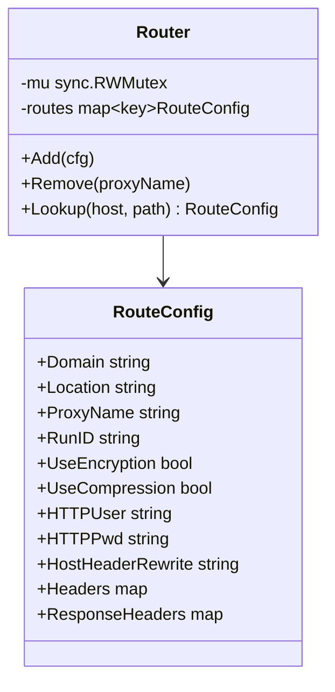

매칭 우선순위:

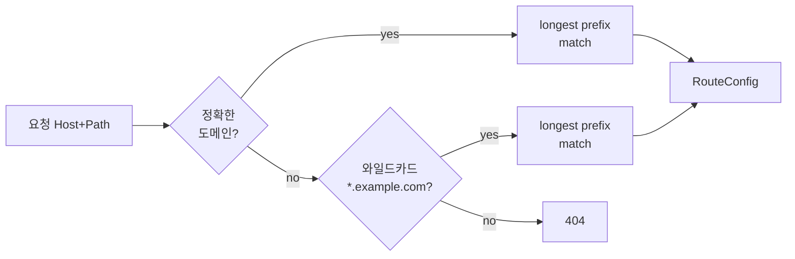

---

## 5. pool

워크 커넥션 풀. 채널 기반. 설정 가능한 capacity.

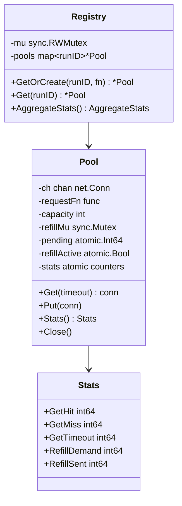

### Get/Put 상태

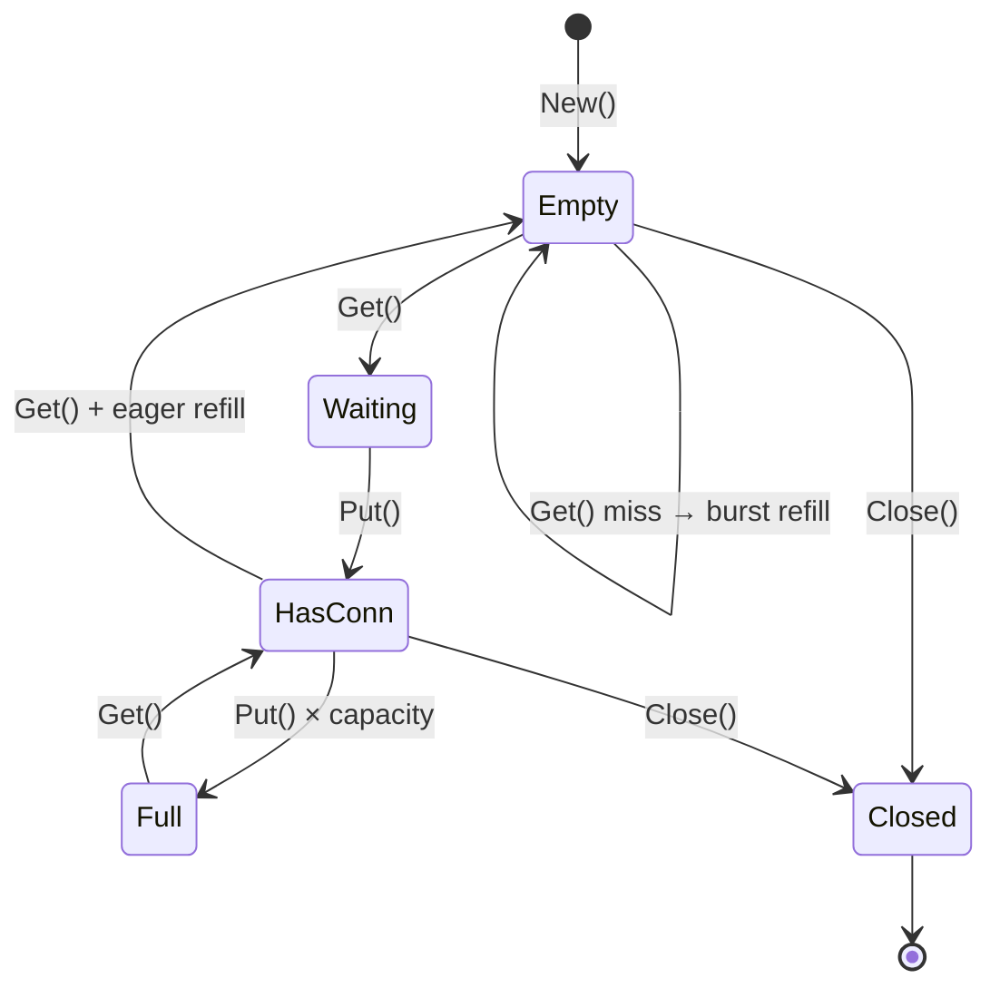

### Burst Refill

`Get` 시 pool이 비어있으면 단건이 아니라 여러 개를 일괄 요청 → 지연 감소.

- burst 크기 = `max(2, min(8, capacity/4))`
- `requestAsyncRefill(n)` → `refillWorker` → `requestFn × n`

---

## 6. wrap

워크 커넥션을 사용 준비 상태로 만든다.

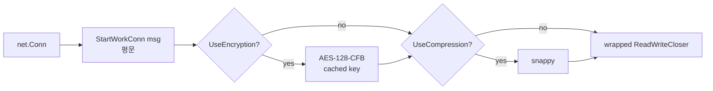

**핵심**: aesKey는 호출자가 캐싱한 값을 전달. DeriveKey는 서버 시작 시 1회만 호출.

---

## 7. msg

frp 와이어 프로토콜. 구조: `[1B type][8B length BE][JSON body]`

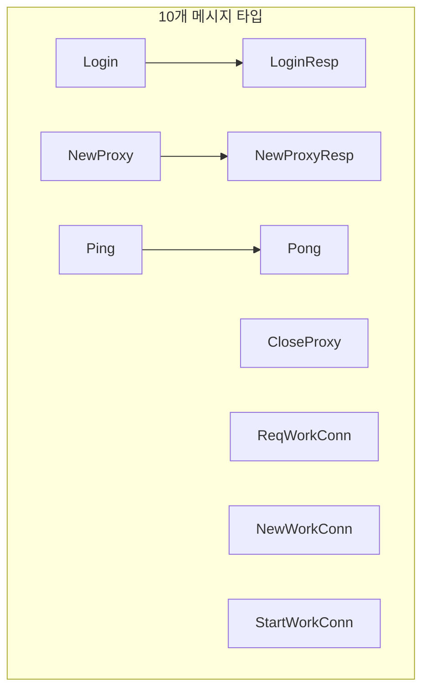

### 성능 최적화

| 항목 | 방식 |
|------|------|
| WriteMsg syscall | type+length+body 단일 버퍼 → 1회 Write |
| TypeOf | switch type assertion (0 allocs) |
| ReadMsg | 헤더 9B 스택 할당, body sync.Pool |
| MaxBodySize | 10240 bytes |

frp v0.68.0 필드 완전 일치.

---

## 8. auth

`MD5(token + timestamp)` 인증. constant-time 비교(`subtle.ConstantTimeCompare`).

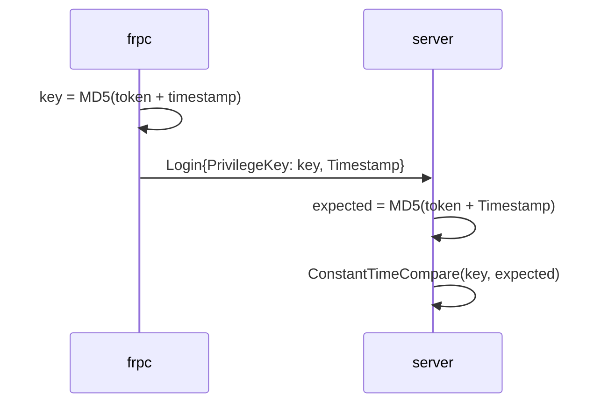

---

## 9. crypto

AES 암호화 + snappy 압축.

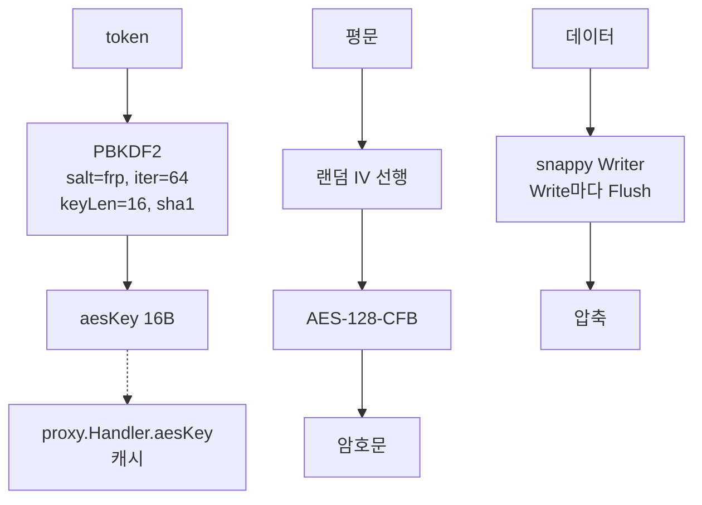

**DeriveKey**: 서버 시작 시 1회만 호출 → `proxy.Handler.aesKey`로 캐시.

---

## 10. metrics (server 패키지 내부)

`/__drps/metrics` 엔드포인트. atomic 카운터 스냅샷 + pool 집계.

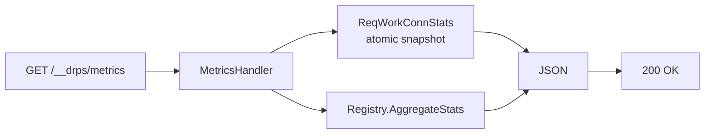

응답 구조:
```json
{
  "req_work_conn": {
    "requested": N,
    "enqueued":  N,
    "dropped":   N,
    "sent":      N,
    "inflight":  N
  },
  "pool": {
    "get_hit":       N,
    "get_miss":      N,
    "get_timeout":   N,
    "refill_demand": N,
    "refill_sent":   N,
    "active_pools":  N
  }
}
```

---

## 외부 의존성

| 라이브러리 | 용도 |
|-----------|------|
| `hashicorp/yamux` (fork) | TCP 멀티플렉싱 |
| `golang/snappy` | 압축 |
| `x/crypto` | PBKDF2 키 파생 |
| `x/net/http2` | h2c 지원 |
