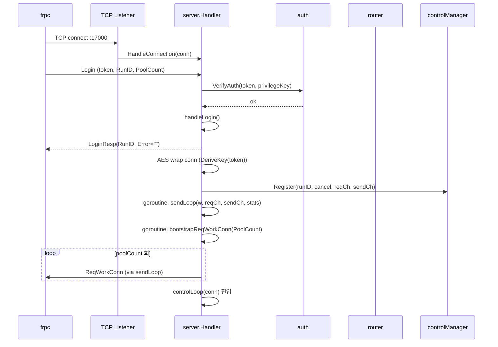
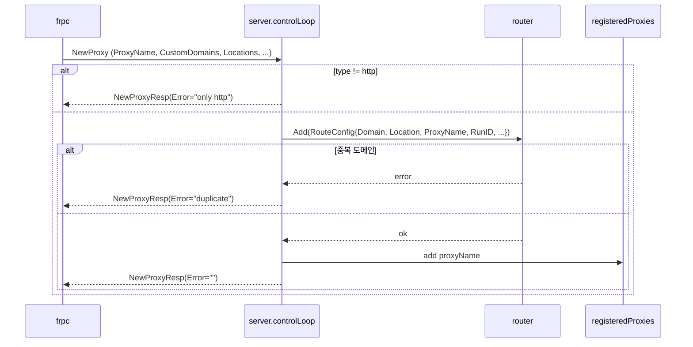
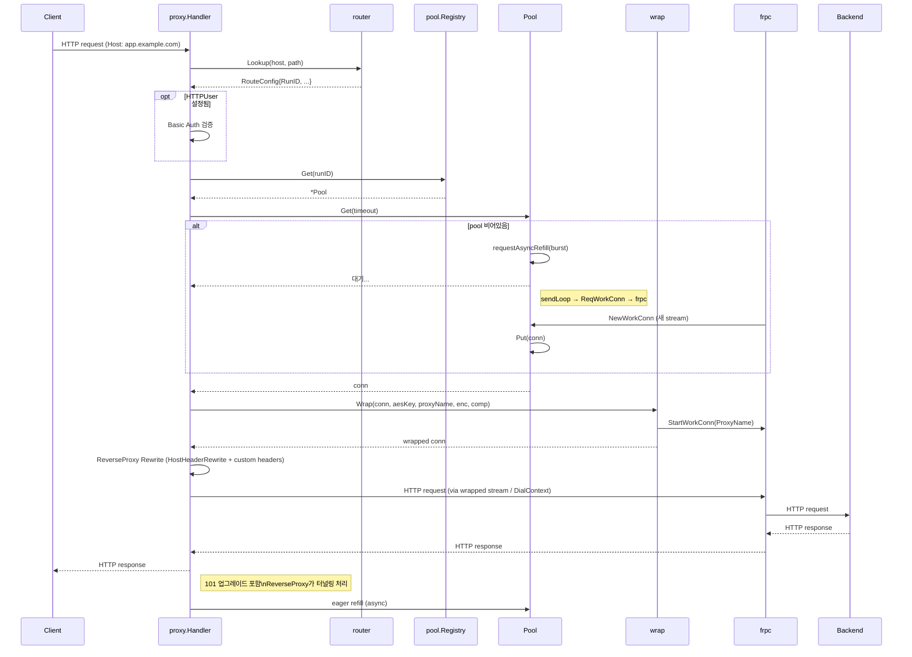
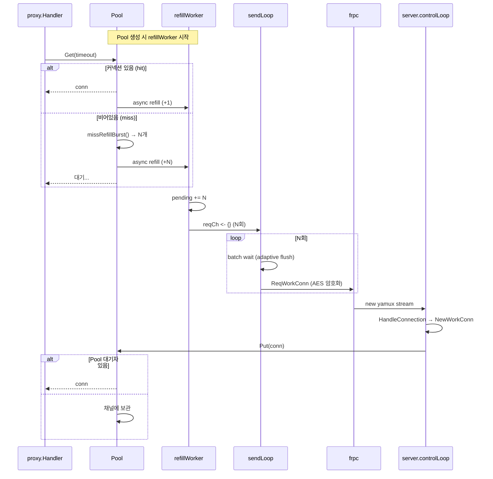
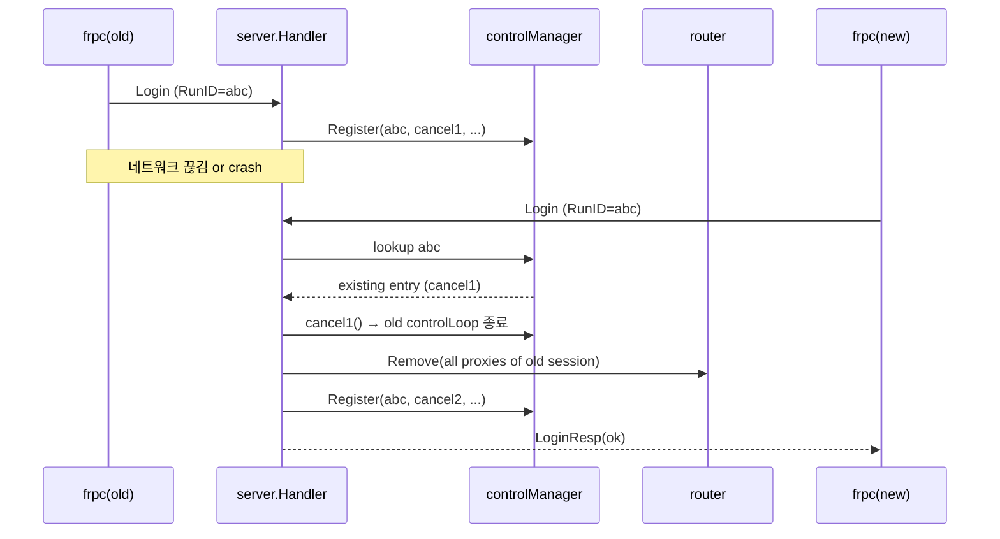
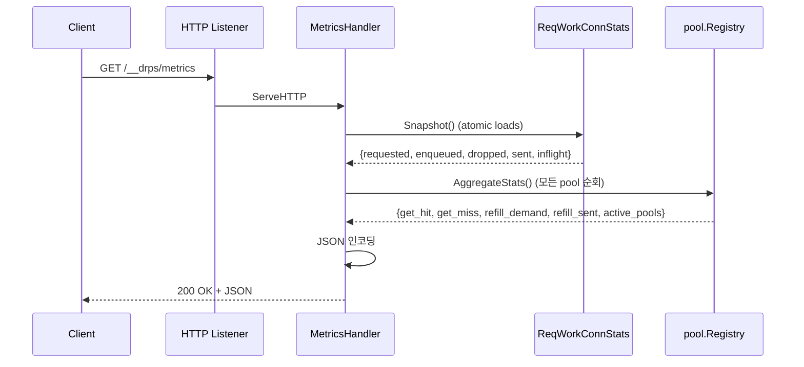
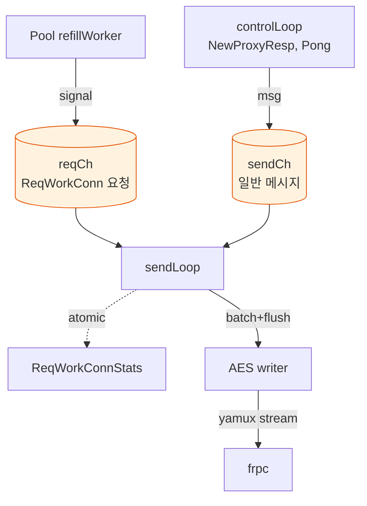
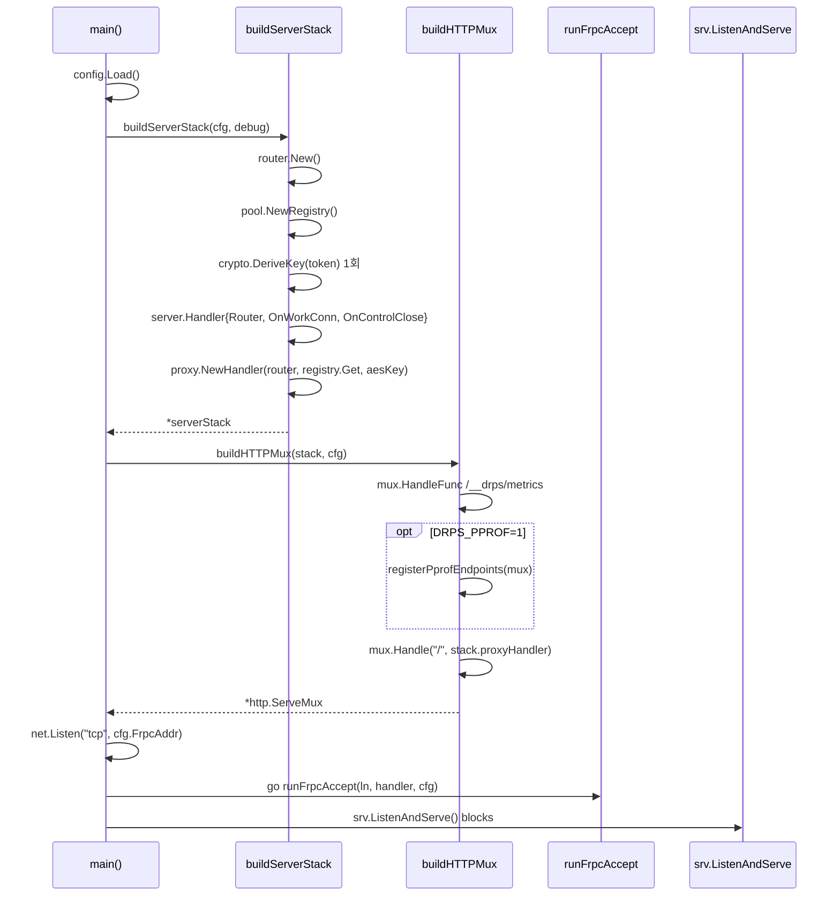
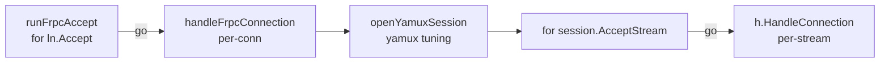

# 주요 시나리오 플로우

drps의 핵심 동작을 시퀀스 다이어그램으로 설명한다.

## 1. frpc 연결 수립 (Login)

## 2. NewProxy 등록

## 3. HTTP 요청 프록싱

## 4. 워크 커넥션 수명주기

## 5. 재연결 처리

## 6. 메트릭 엔드포인트

## 7. sendLoop 배칭 동작

제어 채널은 **단일 writer** 원칙. `sendLoop`가 유일한 writer.

배칭 규칙:
- 큐가 깊으면 flush 간격 짧게 (floor 50μs)
- 기본 200μs, 최대 400μs
- 즉시 flush 조건: sendCh (일반 메시지)가 들어오면 우선 전송

## 8. 서버 시작 시 초기화

`main()` 은 얇은 orchestrator 이고, setup 은 네 개의 named helper 로 분해되어있다: `buildServerStack`, `buildHTTPMux`, `runFrpcAccept`, `handleFrpcConnection` (+ `openYamuxSession`).

### frpc accept 루프

각 단계는 별도 함수로 분리되어 main() 이 "config → stack → mux → listener → go accept → serve" 의 **의도 레벨** 로만 읽힌다. yamux tuning (MaxStreamWindowSize 등) 은 `openYamuxSession` 안에만 존재.
