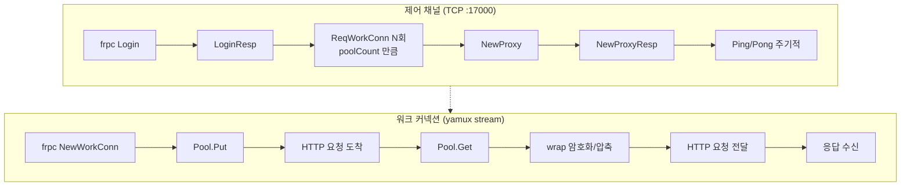
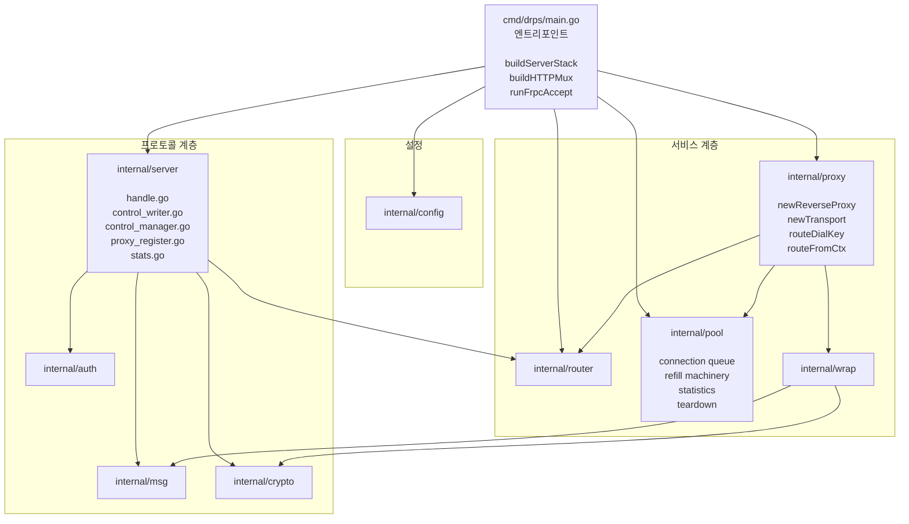
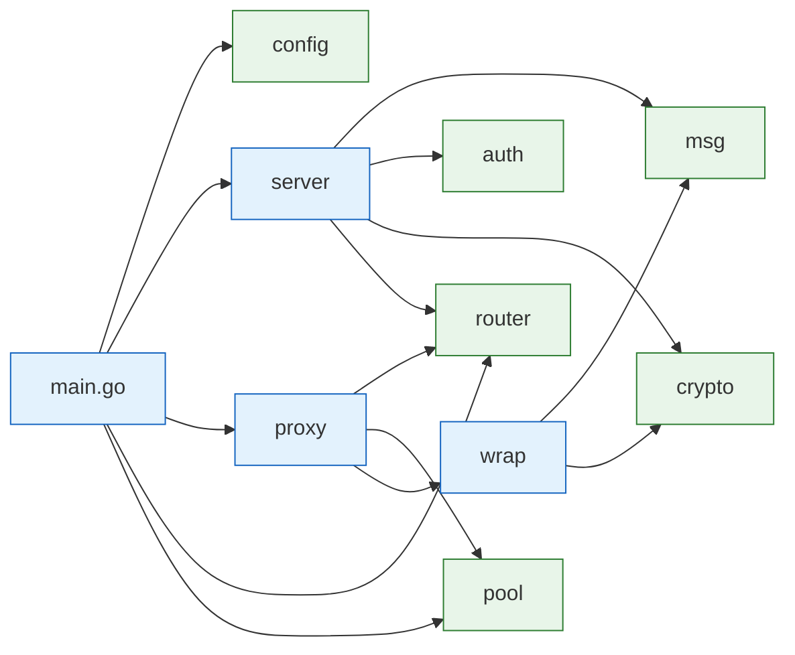
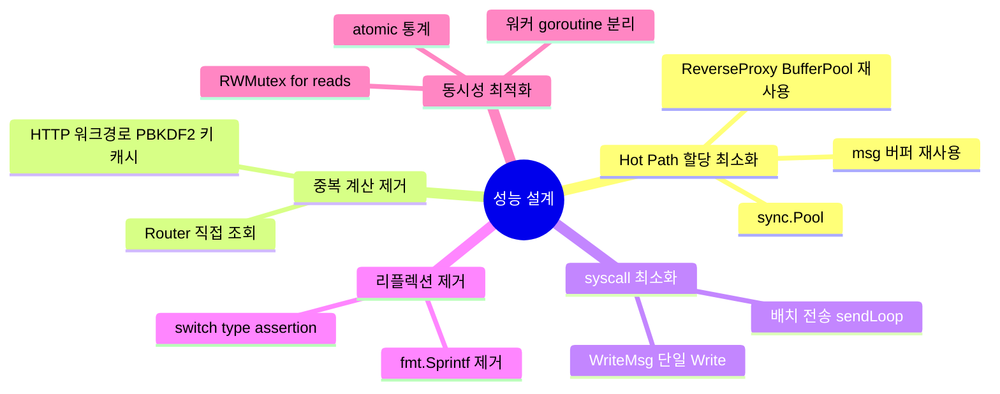

# drps 아키텍처 개요

frps(frp server)의 HTTP 전용 대체. frpc를 수정 없이 사용하며, frp 패키지를 import하지 않고 프로토콜을 직접 구현한다.

## 전체 구성

```mermaid
flowchart LR
    Client[클라이언트<br/>HTTP/WS]
    subgraph drps["drps 서버"]
        direction TB
        HTTP[HTTP Listener<br/>:18080]
        Proxy[proxy<br/>Handler]
        Router[router<br/>Table]
        Registry[pool<br/>Registry]
        Wrap[wrap<br/>Encrypt/Compress]
        TCP[TCP Listener<br/>:17000]
        Server[server<br/>Handler]
        Metrics[/metrics/<br/>Handler]
    end
    Frpc[frpc<br/>클라이언트]
    Backend[백엔드<br/>HTTP/WS]

    Client -->|요청| HTTP
    HTTP --> Proxy
    Proxy --> Router
    Router --> Registry
    Registry --> Wrap
    Wrap -->|yamux stream| Frpc
    Frpc --> Backend

    Frpc -->|TCP yamux| TCP
    TCP --> Server
    Server -.-> Router
    Server -.-> Registry

    HTTP -.-> Metrics
    Metrics -.-> Server
    Metrics -.-> Registry
```

## 데이터 흐름

HTTP 요청과 제어 채널은 완전히 분리된다.



## HTTP mux 구성

```mermaid
flowchart TB
    mux[http.ServeMux]
    root[/]
    metrics[/__drps/metrics]
    pprof[/debug/pprof/*]

    mux --> root
    mux --> metrics
    mux --> pprof

    root --> proxy[proxy.Handler<br/>h2c ReverseProxy]
    metrics --> mh[server.MetricsHandler]
    pprof --> ph[net/http/pprof]
```

- `DRPS_PPROF=1`일 때만 pprof 라우트가 등록된다.
- `DRPS_DEBUG=1`일 때 제어채널/워크커넥션 로그를 추가 출력한다.

## 패키지 구조



## 의존성 방향

순환 의존성 없음. 각 패키지는 단일 책임을 갖는다.



초록 = 독립 패키지, 파랑 = 합성 패키지.

## 성능 설계 원칙



## 관련 문서

- [components.md](components.md) — 각 컴포넌트 상세 구조
- [flows.md](flows.md) — 주요 시나리오 시퀀스 다이어그램
