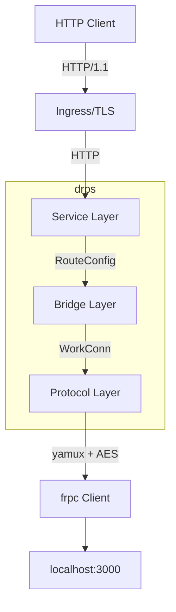
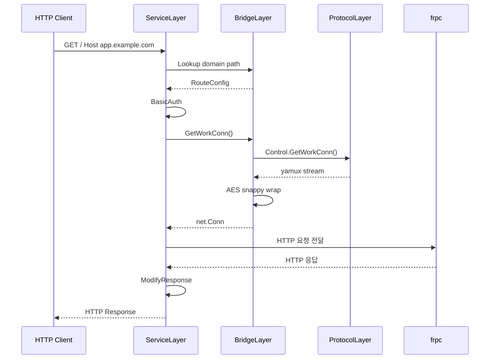
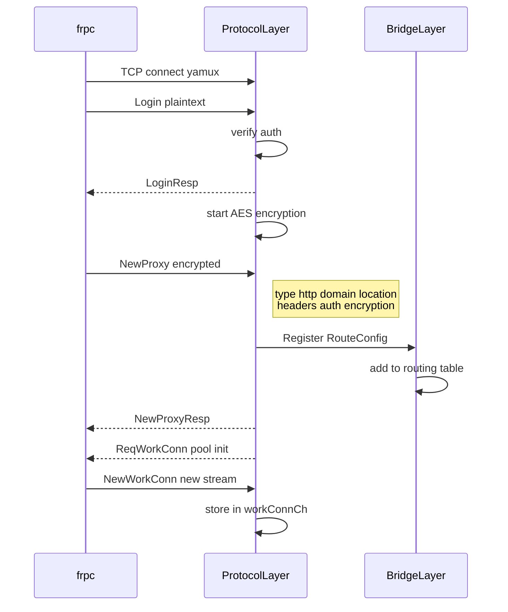
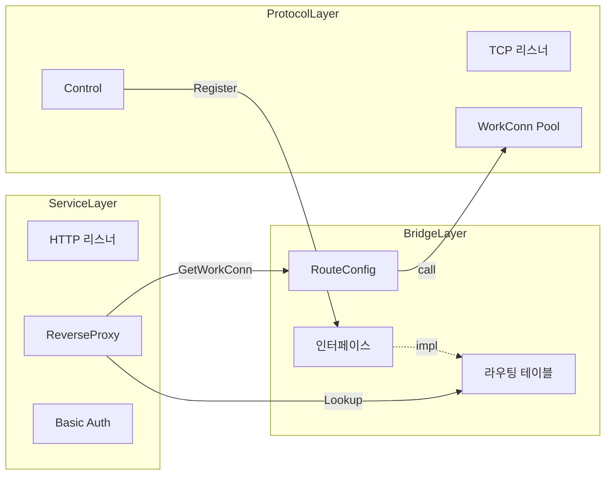

# drps 아키텍처 개요

## drps란?

drps는 frp의 서버(frps)를 HTTP 전용으로 새로 만든 리버스 프록시 서버입니다.
frps는 단일 인스턴스로만 동작하지만, drps는 분산 환경을 목표로 설계합니다.

## 3개 레이어

drps는 **두 개의 서로 다른 프로토콜을 연결하는 브릿지**입니다.

| 레이어 | 관심사 | 상세 |
|--------|--------|------|
| **Service Layer** | "이 HTTP 요청을 어떻게 처리할까?" | [service-layer.md](service-layer.md) |
| **Bridge Layer** | "이 요청을 어떤 frpc에게 보낼까?" | [bridge-layer.md](bridge-layer.md) |
| **Protocol Layer** | "frpc와 어떻게 대화할까?" | [protocol-layer.md](protocol-layer.md) |

## 전체 요청 흐름

## frpc 등록 흐름

## 레이어 독립성

각 레이어는 인터페이스를 통해서만 소통합니다.
**분산 확장 시 Bridge Layer만 교체하면 됩니다.**

## 파일 매핑

| 레이어 | 소스 파일 | 역할 |
|--------|----------|------|
| Protocol | `service.go` (TCP) | frpc 연결 수락, yamux |
| Protocol | `control.go` | 제어 채널, 메시지 처리, 워크 커넥션 풀 |
| Protocol | `control_manager.go` | 모든 frpc 관리 |
| Protocol | `auth.go` | 토큰 인증 |
| Service | `service.go` (HTTP) | HTTP 요청 수신 |
| Service | `httpproxy.go` | ReverseProxy, 헤더, WebSocket |
| Bridge | `router.go` | 라우팅 테이블 |
| Bridge | `interfaces.go` | 레이어 간 계약 |
| Bridge | `config.go` | 서버 설정 |
