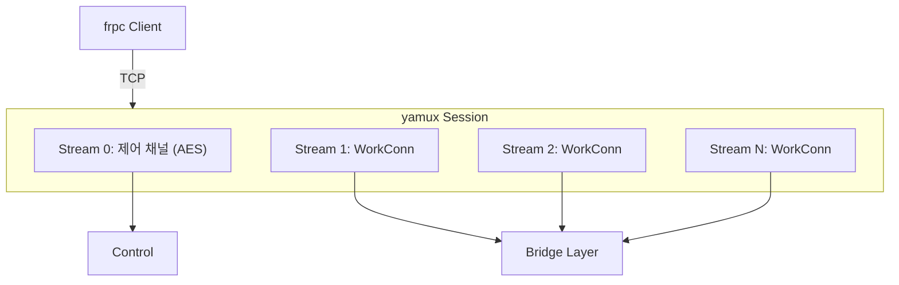
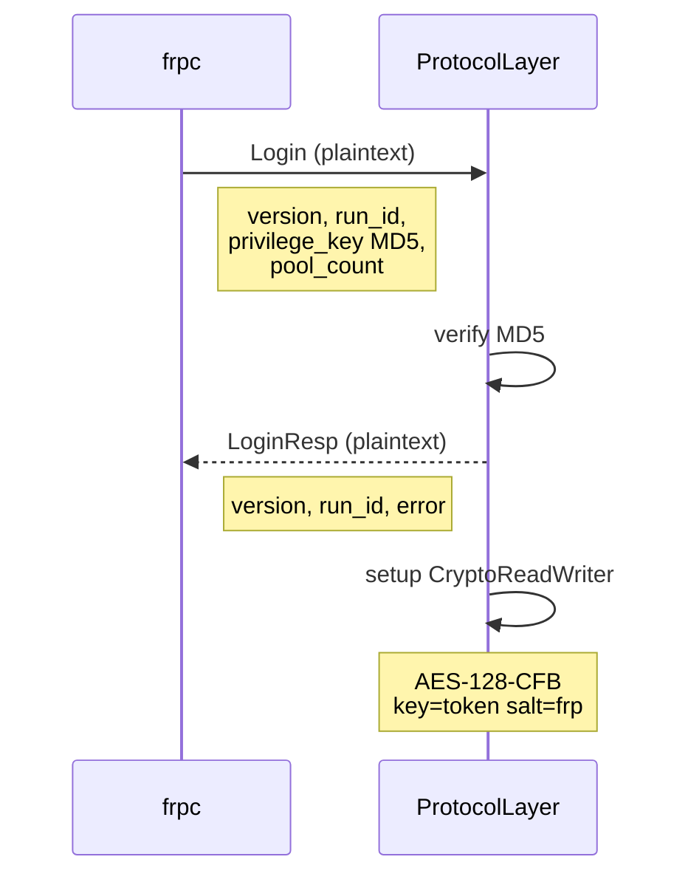
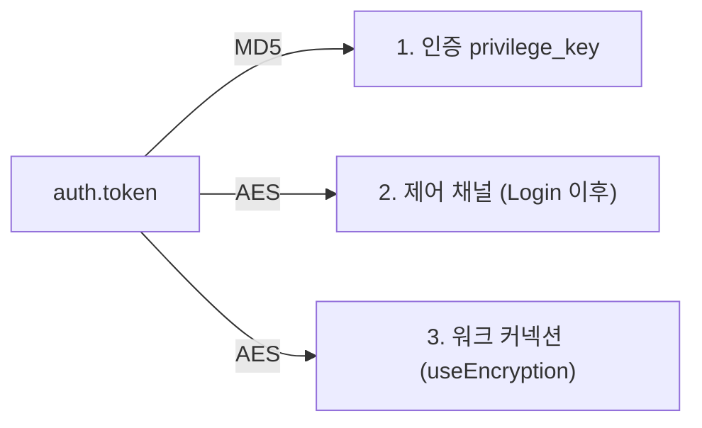
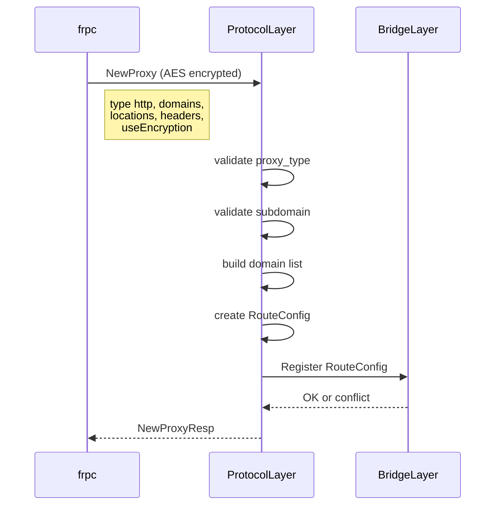
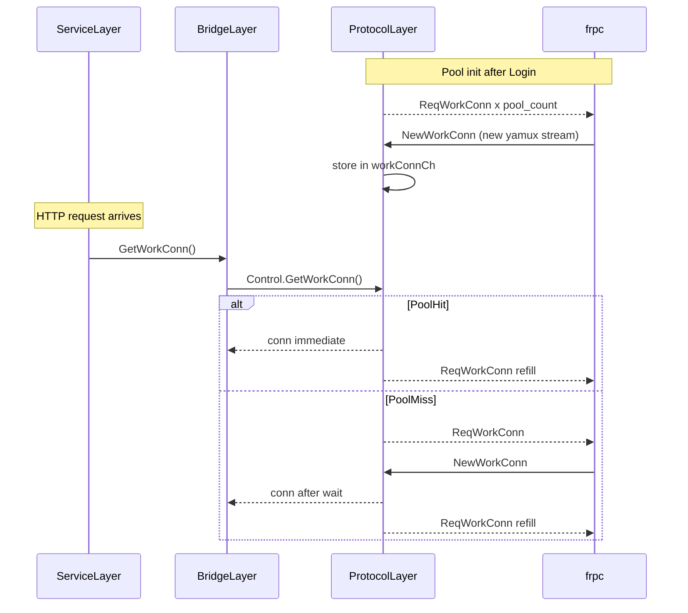
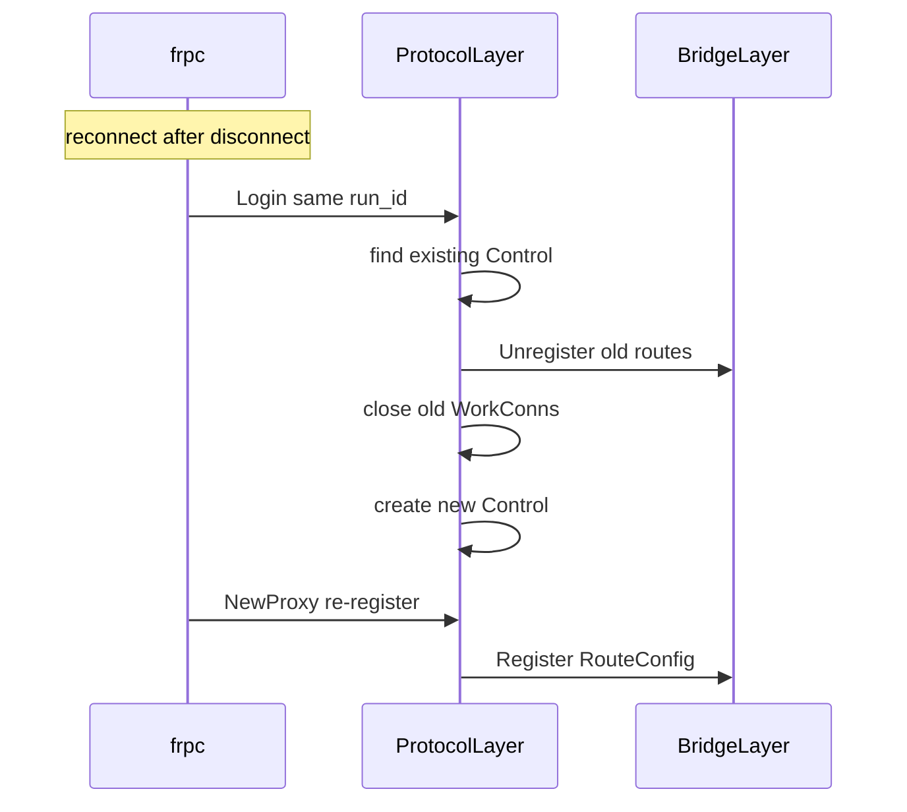

# Protocol Layer

frpc 클라이언트와의 프로토콜 통신을 담당합니다.
이 레이어의 관심사는 **"frpc와 어떻게 대화할까?"** 입니다.

## 연결 구조: yamux

하나의 TCP 연결 위에 여러 논리 스트림을 만듭니다.



설정: `MaxStreamWindowSize = 6MB`, `KeepAliveInterval = 30s`

## Login 흐름



**중요:** Login 메시지 자체는 **평문**. Login 성공 후부터 암호화.

## 메시지 프로토콜

### 프레임 형식

```
[1 byte: Type] [8 bytes: Length (big-endian)] [N bytes: JSON Body]
```

### 메시지 타입

| 바이트 | 이름 | 방향 | 설명 |
|--------|------|------|------|
| `'o'` | Login | frpc→drps | 로그인 요청 |
| `'1'` | LoginResp | drps→frpc | 로그인 응답 |
| `'p'` | NewProxy | frpc→drps | 프록시 등록 |
| `'2'` | NewProxyResp | drps→frpc | 등록 응답 |
| `'c'` | CloseProxy | frpc→drps | 프록시 해제 |
| `'r'` | ReqWorkConn | drps→frpc | 워크 커넥션 요청 |
| `'w'` | NewWorkConn | frpc→drps | 워크 커넥션 등록 |
| `'s'` | StartWorkConn | drps→frpc | 워크 커넥션 사용 시작 |
| `'h'` | Ping | frpc→drps | 하트비트 |
| `'4'` | Pong | drps→frpc | 하트비트 응답 |

## 암호화 구조

`auth.token` 하나로 세 가지를 처리합니다:



## 프록시 등록 흐름



## 워크 커넥션 풀



## 재연결



## Bridge Layer와의 인터페이스

Protocol Layer는 `ProxyRegistrar` 인터페이스를 통해 Bridge Layer에 라우트를 등록합니다.
Router의 구체적인 구현을 알지 못합니다.

```go
type ProxyRegistrar interface {
    Register(rc *RouteConfig) error
    Unregister(proxyName string)
}
```

## 소스 파일

| 파일 | 역할 |
|------|------|
| `service.go` (TCP 부분) | TCP 리스너, yamux 세션, 메시지 분기 |
| `control.go` | 제어 채널 암호화, 디스패처, 워크 커넥션 풀, 프록시 등록 |
| `control_manager.go` | run_id → Control 맵, 재연결 가드 |
| `auth.go` | MD5 토큰 인증 |
