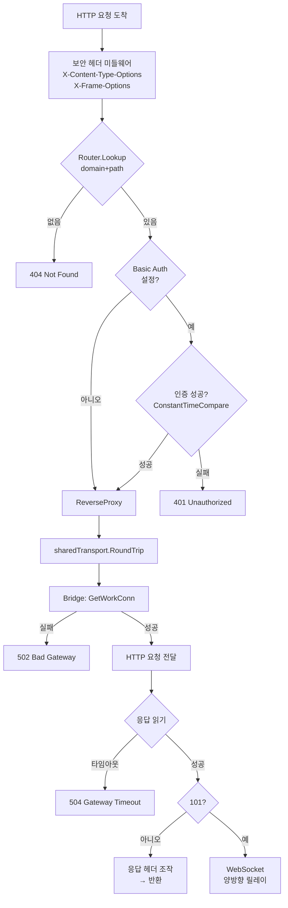
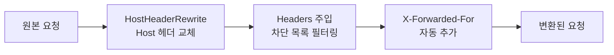
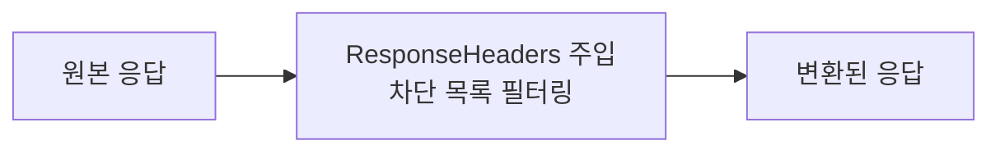
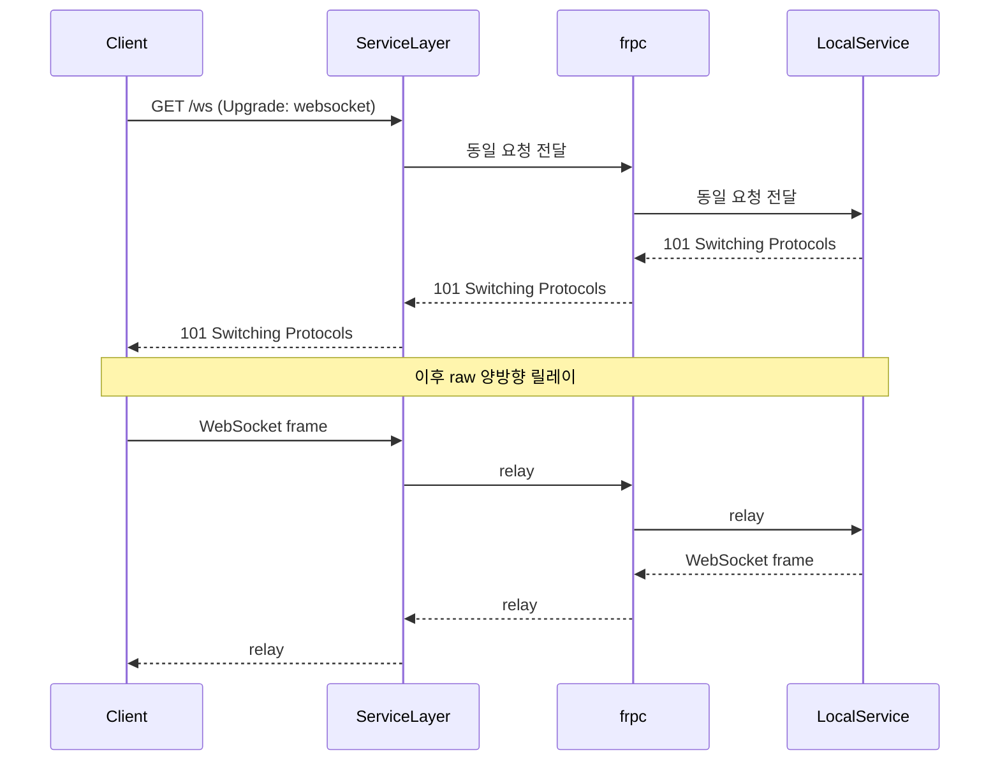

# Service Layer

외부 클라이언트의 HTTP 요청을 처리합니다.
이 레이어의 관심사는 **"이 HTTP 요청을 어떻게 처리할까?"** 입니다.

## HTTP/1.1 전용

| 이유 | 설명 |
|------|------|
| WebSocket | HTTP/1.1의 `101 Switching Protocols`로 동작 |
| frpc 호환 | frpc의 워크 커넥션은 HTTP/1.1 기반 |
| TLS 위임 | 앞단 인그레스가 HTTP/2, TLS를 처리 |

## 요청 처리 흐름

## 헤더 조작

### 요청 → 백엔드

### 백엔드 → 응답

### 헤더 주입 차단 목록

| 방향 | 차단 헤더 |
|------|----------|
| 요청 | Host, Authorization, Cookie, X-Forwarded-For, X-Forwarded-Host, X-Forwarded-Proto, Proxy-Authorization |
| 응답 | Set-Cookie, Www-Authenticate, Strict-Transport-Security, Content-Security-Policy |

## WebSocket

`connClosingBody`가 `io.ReadWriteCloser`를 구현하여
`httputil.ReverseProxy`의 양방향 복사를 지원합니다.

## 에러 처리

| 상황 | HTTP 상태 | 응답 |
|------|-----------|------|
| 도메인 미등록 | 404 | "not found" |
| Basic Auth 실패 | 401 | "Unauthorized" + WWW-Authenticate |
| 워크 커넥션 획득 실패 | 502 | "upstream unavailable" |
| 백엔드 응답 타임아웃 | 504 | "gateway timeout" |

## 보안

| 기능 | 구현 |
|------|------|
| Basic Auth | `subtle.ConstantTimeCompare` (타이밍 공격 방어) |
| 보안 응답 헤더 | `X-Content-Type-Options: nosniff`, `X-Frame-Options: DENY` |
| 서브도메인 검증 | 정규식 기반 악의적 입력 거부 |
| 초기 연결 타임아웃 | 10초 (슬로우로리스 방어) |
| 로그 주입 방어 | `%q` 포맷 사용 |

## 성능 최적화

| 최적화 | 효과 |
|--------|------|
| 공유 `httputil.ReverseProxy` (1개) | 요청당 프록시 생성 제거 |
| `sync.Pool` bufio.Reader | GC 압력 감소 |
| 헤더 키 사전 정규화 (등록 시 1회) | 매 요청 `CanonicalHeaderKey` 호출 제거 |

## 소스 파일

| 파일 | 역할 |
|------|------|
| `service.go` (HTTP 부분) | HTTP 리스너, http.Server 설정 |
| `httpproxy.go` | HTTPProxyHandler, sharedTransport, connClosingBody |
