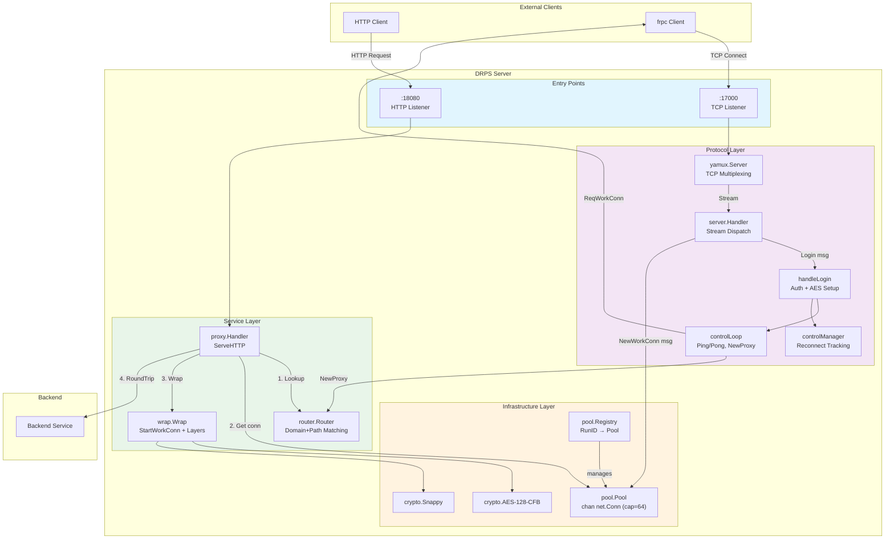
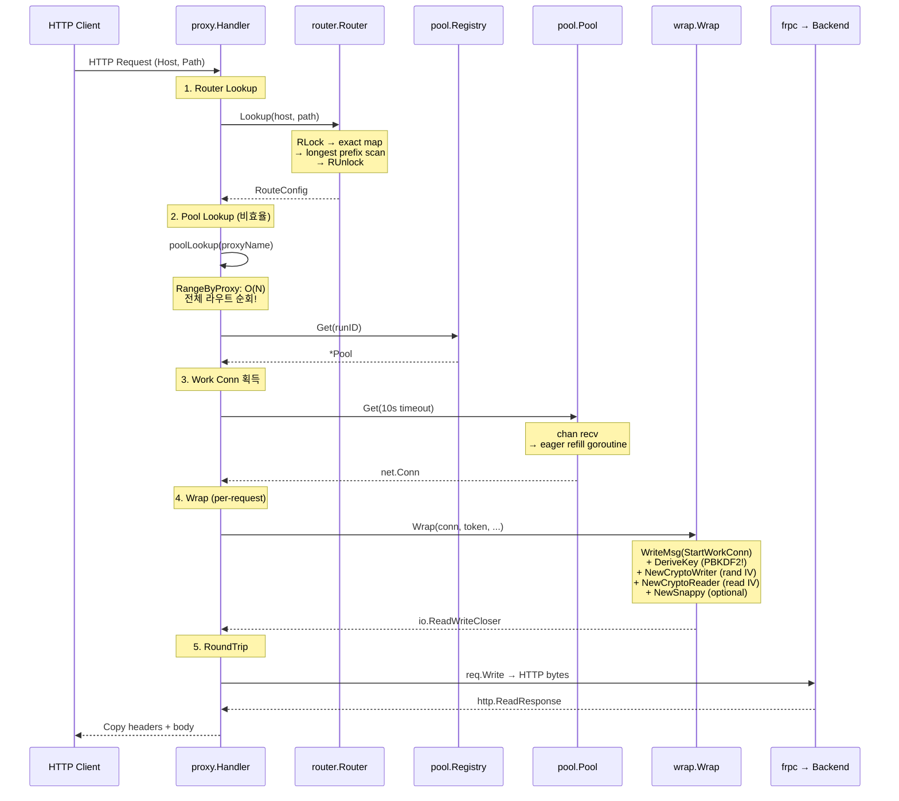
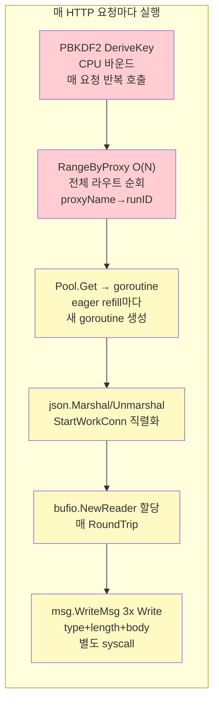
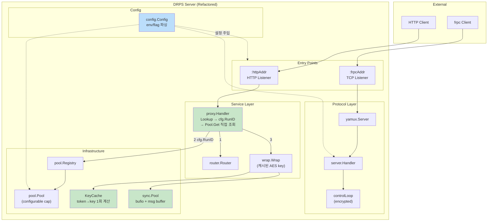

# 성능 리팩토링 계획

## 목표

매 HTTP 요청마다 반복되는 불필요한 비용을 제거하여 Hot Path 성능을 개선한다.

## 현재 아키텍처



## Hot Path 병목 분석



### 병목 요약



| # | 위치 | 심각도 | 문제 |
|---|------|--------|------|
| P1 | `wrap.Wrap` → `crypto.DeriveKey` | Critical | PBKDF2(SHA1, 64 iter) 매 요청 호출. 동일 토큰인데 매번 키 파생 |
| P2 | `main.go:45` → `RangeByProxy` | Critical | proxyName으로 runID 찾기 위해 O(N) 전체 라우트 순회 |
| P3 | `msg.WriteMsg` | High | type(1B) + length(8B) + body를 3번 개별 Write → 3 syscall |
| P4 | `msg.TypeOf` | Medium | `fmt.Sprintf("%T", m)` 으로 타입 룩업 → 매번 문자열 할당 |
| P5 | `proxy.go` connTransport | Medium | 매 요청마다 `bufio.NewReader` 새로 할당 |
| P6 | `msg.ReadMsg` | Medium | `make([]byte, length)` 매번 새 버퍼 할당 |

### 구조적 문제

| # | 위치 | 문제 |
|---|------|------|
| S1 | `main.go` poolLookup 클로저 | Lookup → RunID 반환 → poolLookup에서 다시 RangeByProxy로 RunID 검색. 이중 조회 |
| S2 | `server/handle.go` registeredProxies | `[]string` 선형 검색/삭제 → `map[string]struct{}` |
| S3 | `controlManager` | sessions/writers 두 맵 별도 관리 → 단일 구조체 맵 |
| S4 | `proxy.go` handleUpgrade | 한쪽 done만 받고 리턴 → goroutine leak 가능 |
| S5 | `pool.Pool` | capacity 64 고정, 설정 불가 |
| S6 | `main.go` | token, port 하드코딩 |

---

## 리팩토링 계획

### Phase 1: Hot Path 최적화 (성능 직결)

#### 1.1 PBKDF2 키 캐싱

```
현재: 매 HTTP 요청 → wrap.Wrap → crypto.DeriveKey(token) → PBKDF2 계산
개선: 서버 시작 시 1회 계산, 캐시된 키를 wrap.Wrap에 전달
```

**변경 파일**: `cmd/drps/main.go`, `internal/wrap/wrap.go`, `internal/proxy/proxy.go`

**wrap.Wrap 시그니처 변경**:
```go
// 현재
func Wrap(conn net.Conn, token string, proxyName string, enc, comp bool) (io.ReadWriteCloser, error)

// 개선
func Wrap(conn net.Conn, aesKey []byte, proxyName string, enc, comp bool) (io.ReadWriteCloser, error)
```

#### 1.2 poolLookup 이중 조회 제거

```
현재: ServeHTTP → Lookup → cfg.ProxyName → RangeByProxy O(N) → runID → Registry.Get
개선: ServeHTTP → Lookup → cfg.RunID → Registry.Get O(1)
```

**변경 파일**: `internal/proxy/proxy.go`, `cmd/drps/main.go`

**PoolLookup 시그니처 변경**:
```go
// 현재
type PoolLookup func(proxyName string) (*pool.Pool, bool)

// 개선
type PoolLookup func(runID string) (*pool.Pool, bool)
```

**router.RangeByProxy 제거**: `internal/router/router.go`

#### 1.3 msg.WriteMsg 버퍼링

```
현재: type, length, body를 3번 Write (3 syscall)
개선: 9+len(body) 바이트를 단일 버퍼에 조립 후 1회 Write
```

**변경 파일**: `internal/msg/msg.go`

#### 1.4 msg.TypeOf 리플렉션 제거

```
현재: fmt.Sprintf("%T", m) → map lookup
개선: switch type assertion → 직접 반환
```

**변경 파일**: `internal/msg/msg.go`

### Phase 2: 할당 최적화 (GC 압력 감소)

#### 2.1 bufio.Reader sync.Pool

```
현재: 매 RoundTrip마다 bufio.NewReader 할당
개선: sync.Pool로 재사용
```

**변경 파일**: `internal/proxy/proxy.go`

#### 2.2 msg.ReadMsg 버퍼 재사용

```
현재: make([]byte, length) 매번 할당
개선: 헤더 9바이트 스택 할당, body는 sync.Pool
```

**변경 파일**: `internal/msg/msg.go`

### Phase 3: 구조 개선

#### 3.1 registeredProxies → map

```
현재: []string + 선형 검색/삭제
개선: map[string]struct{} O(1) 검색/삭제
```

**변경 파일**: `internal/server/handle.go`

#### 3.2 controlManager 단일 구조체

```
현재: sessions map + writers map (별도)
개선: entries map[string]*controlEntry (cancel + writer 묶음)
```

**변경 파일**: `internal/server/handle.go`

#### 3.3 WebSocket goroutine leak 수정

```
현재: <-done 1회만 기다림 → 다른 쪽 goroutine 미회수
개선: 양쪽 done 대기 후 정리
```

**변경 파일**: `internal/proxy/proxy.go`

### Phase 4: 설정 외부화

#### 4.1 설정 구조체 도입

```
현재: main.go에 하드코딩 (token, addr, pool capacity)
개선: Config 구조체 + 환경변수 파싱
```

**변경 파일**: 신규 `internal/config/config.go`, `cmd/drps/main.go`

---

## 목표 아키텍처



## 추가 테스트

### 단위 테스트 (10개)

| ID | 테스트 | 패키지 | 검증 |
|----|--------|--------|------|
| M-07 | TestWriteMsgSingleWrite | msg | WriteMsg가 w.Write를 1회만 호출 |
| M-08 | TestTypeByteSwitchConsistency | msg | switch 기반 TypeOf 결과 일관성 |
| P-07 | TestNewWithCapacity | pool | 설정된 capacity 동작 |
| P-08 | TestPutOverflow | pool | capacity 초과 시 conn.Close |
| W-06 | TestWrapWithCachedKey | wrap | 캐시 키로 암호화, DeriveKey 미호출 |
| X-17 | TestProxyPoolLookupByRunID | proxy | RunID 직접 조회 동작 |
| X-18 | TestWebSocketBothGoroutinesComplete | proxy | 양쪽 goroutine 모두 종료 |
| X-19 | TestWebSocketServerClose | proxy | 서버 측 먼저 닫기 → 정리 |
| S-27 | TestCloseProxyMapRemoval | server | map에서 O(1) 제거 |
| S-28 | TestMultipleCloseProxyIdempotent | server | 중복 CloseProxy 안전 |

### 벤치마크 (12개)

| ID | 벤치마크 | 패키지 | 검증 |
|----|---------|--------|------|
| B-M-01 | BenchmarkWriteMsg | msg | 단일 Write 성능 |
| B-M-02 | BenchmarkReadMsg | msg | 버퍼 재사용 성능 |
| B-M-03 | BenchmarkTypeOf | msg | switch vs fmt.Sprintf |
| B-M-04 | BenchmarkMsgRoundTrip | msg | Write+Read throughput |
| B-C-01 | BenchmarkDeriveKey | crypto | PBKDF2 비용 (캐싱 근거) |
| B-C-02 | BenchmarkCryptoRoundTrip | crypto | AES throughput |
| B-C-03 | BenchmarkSnappyRoundTrip | crypto | snappy throughput |
| B-X-01 | BenchmarkServeHTTP | proxy | 전체 hot path |
| B-X-02 | BenchmarkPoolGetPut | pool | Get/Put 사이클 |
| B-X-03 | BenchmarkWrap | proxy | 캐시 키 Wrap |
| B-X-04 | BenchmarkConnTransportRoundTrip | proxy | bufio 재사용 |
| B-X-05 | BenchmarkPoolLookupByRunID | pool | O(1) vs O(N) |

## 우선순위

| 순위 | 작업 | Phase | 난이도 | 성능 임팩트 |
|------|------|-------|--------|------------|
| 1 | PBKDF2 키 캐싱 | 1 | 낮음 | 매우 높음 |
| 2 | poolLookup 이중 조회 제거 | 1 | 낮음 | 높음 |
| 3 | WriteMsg 버퍼링 | 1 | 낮음 | 중간 |
| 4 | TypeOf 리플렉션 제거 | 1 | 낮음 | 중간 |
| 5 | WebSocket goroutine leak | 3 | 낮음 | 안정성 |
| 6 | bufio sync.Pool | 2 | 중간 | 중간 |
| 7 | msg 버퍼 재사용 | 2 | 중간 | 중간 |
| 8 | registeredProxies → map | 3 | 낮음 | 낮음 |
| 9 | controlManager 구조체 | 3 | 낮음 | 낮음 |
| 10 | 설정 외부화 | 4 | 중간 | 운영성 |

## 목표 수치

| 지표 | 리팩토링 전 | 리팩토링 후 |
|------|-----------|-----------|
| DeriveKey 호출/req | 1 | 0 (캐시) |
| Pool lookup 복잡도 | O(N) | O(1) |
| WriteMsg syscall/call | 3 | 1 |
| TypeOf allocs/op | 1+ | 0 |
| bufio.Reader alloc/req | 1 | 0 (sync.Pool) |
| WriteMsg allocs/op | 3+ | 1 |
