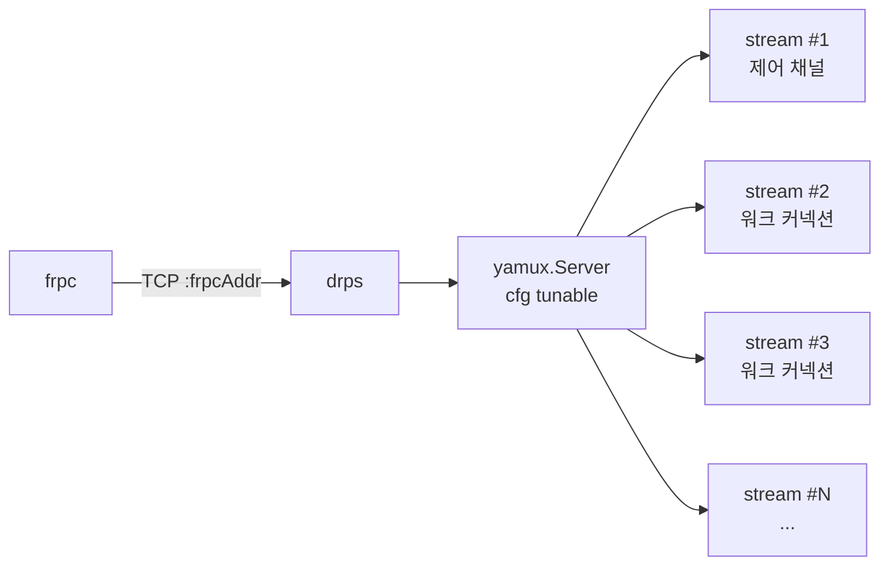
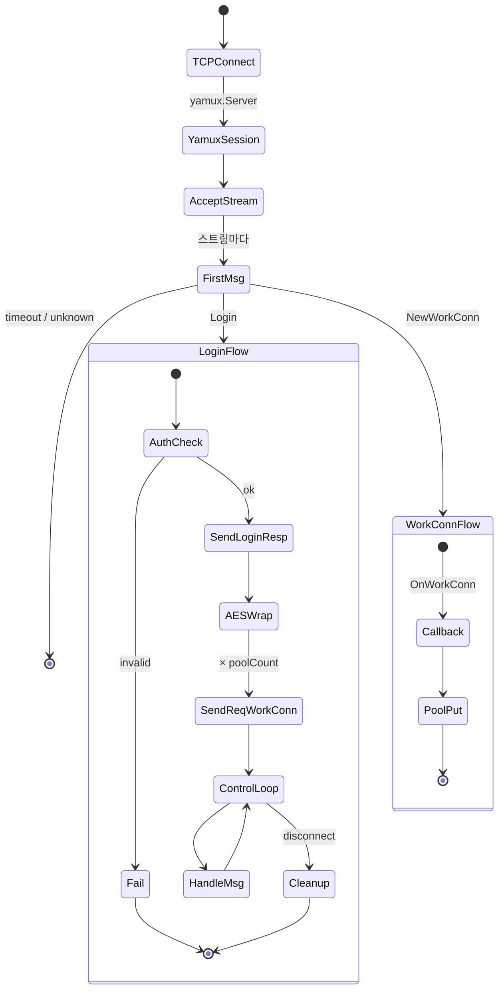
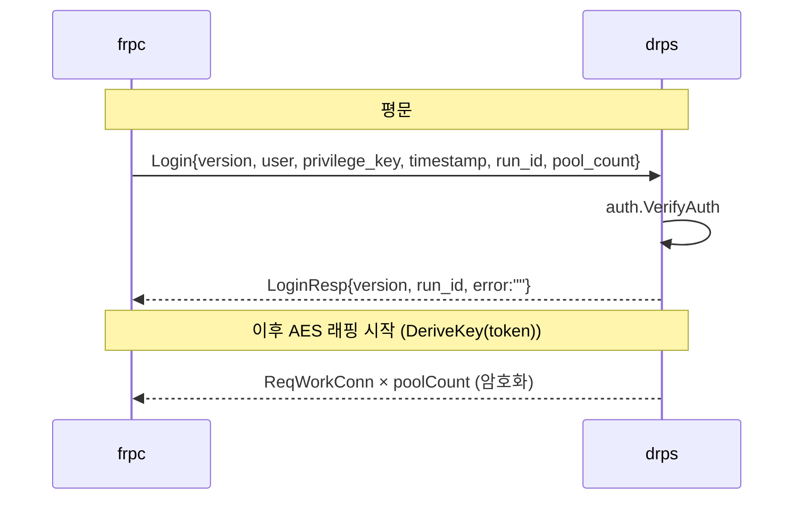
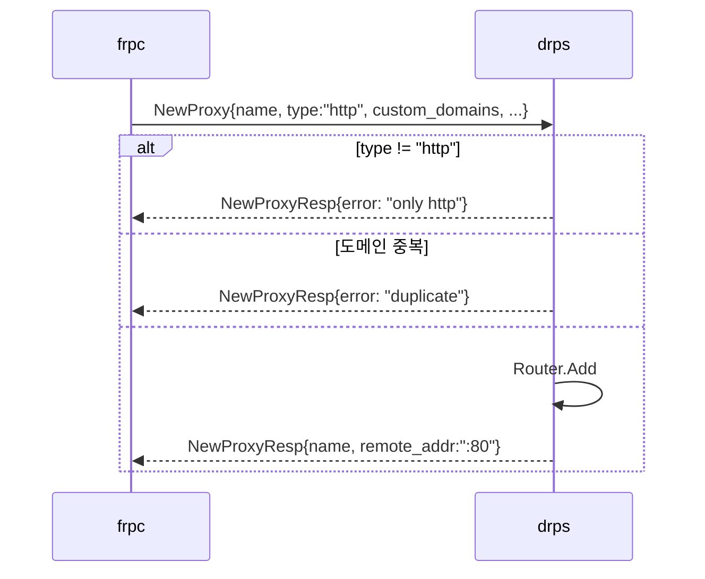
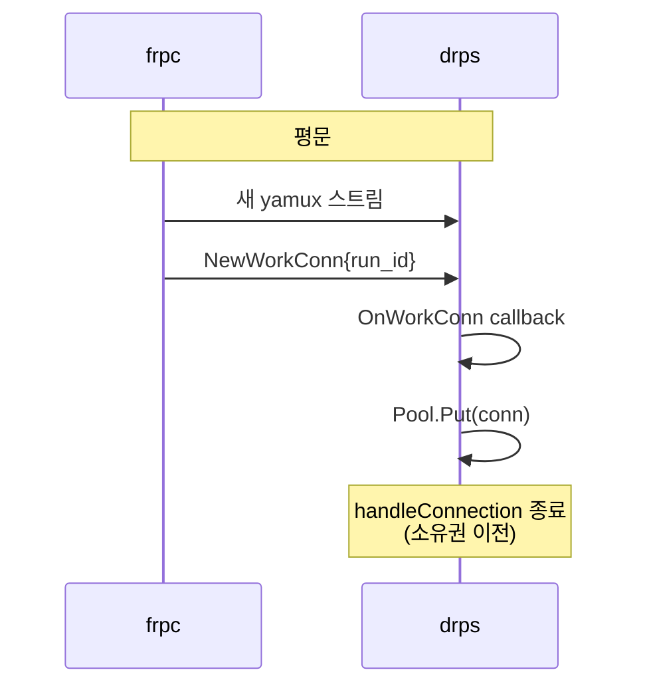
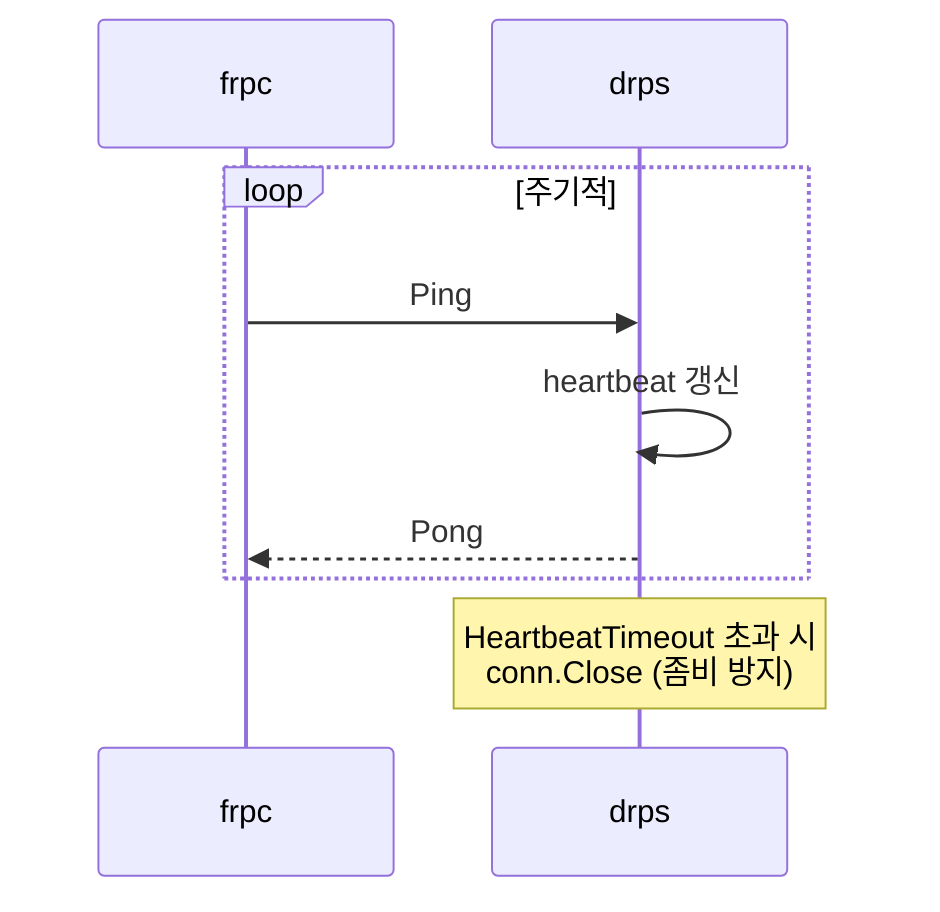
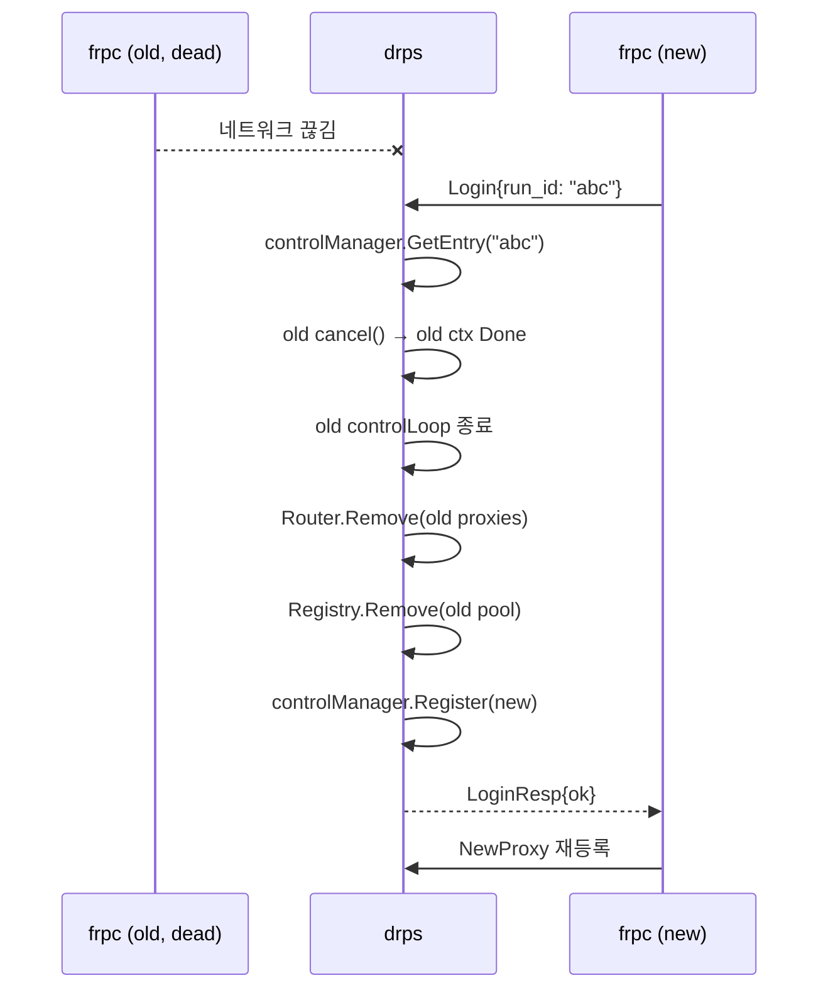
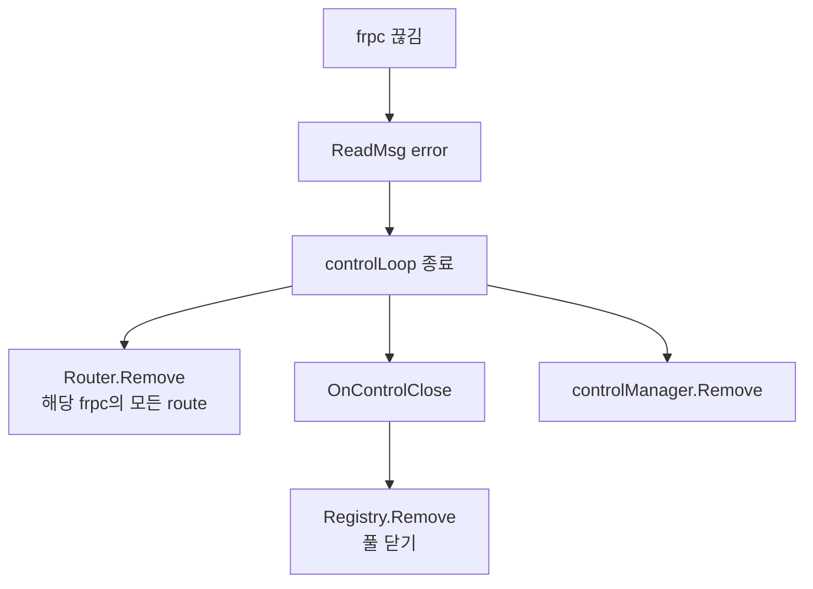

# 연결 스펙

## TCP + yamux

하나의 TCP 연결 위에 N개의 논리 스트림. yamux 파라미터는 `DRPS_YAMUX_*`로 튜닝 가능.

## 연결 생명주기

## 1. Login (스트림 #1)

**규칙**:
- Login 자체는 평문
- LoginResp까지 평문 → 이후부터 암호화
- `run_id`가 빈 문자열이면 drps가 새로 생성
- `HeartbeatTimeout`은 `Handler` 설정 시에만 동작 (현재 `cmd/drps/main.go` 기본값은 미설정)

## 2. 프록시 등록 (암호화)

## 3. 워크 커넥션 (스트림 #2+)

## 4. Heartbeat (암호화)

## 재연결 (같은 RunID)

현재 구현은 `Register()`에서 old `cancel()` 후 new 엔트리를 즉시 등록한다.
old 세션 정리는 비동기로 이어서 진행되며, cleanup 완료를 동기적으로 기다리지는 않는다.

## 연결 해제

구현: `internal/server/handle.go` 는 refactor rounds 1-3 에서 5개 파일로 분할되었다. 기존 `metrics.go`, `util.go` 는 그대로 유지된다.

| 파일 | 담당 |
|---|---|
| `handle.go` | `Handler`, `HandleConnection`, `handleLogin`, `controlLoop`, `bootstrapReqWorkConn`, `cleanupControlSession` |
| `control_writer.go` | `controlWriter` + `sendLoop` wrapper, adaptive batching, flush timer |
| `control_manager.go` | `controlManager`, `controlEntry` (per-session state, RLock 핫패스) |
| `proxy_register.go` | `handleNewProxy` (NewProxy → router 등록 + rollback) |
| `stats.go` | `ReqWorkConnStats`, `ReqWorkConnSnapshot` |
| `metrics.go` | `MetricsHandler` — `/__drps/metrics` JSON 엔드포인트 (preexisting) |
| `util.go` | `generateRunID` — 랜덤 8-byte hex (preexisting) |

세션 teardown 은 `cancel()` 단일 시그널로만 전파된다 — `reqCh`/`sendCh` 는 **never closed**. `cleanupControlSession` 은 `cancel()` → `controls.Remove` → `Router.Remove(registeredProxies)` → `OnControlClose(runID)` 콜백 순으로 정리하지만, 채널 close 는 없다.
