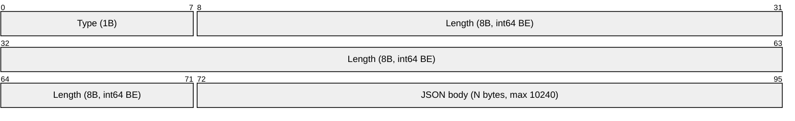
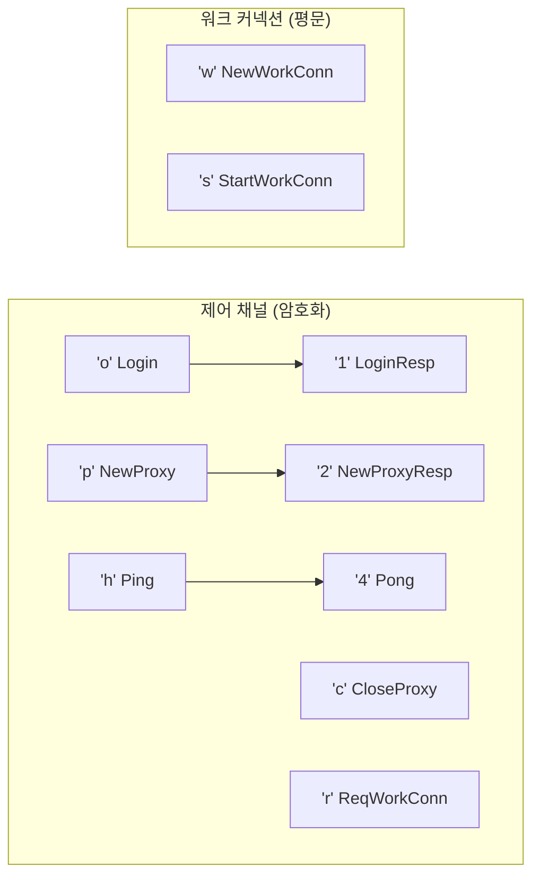
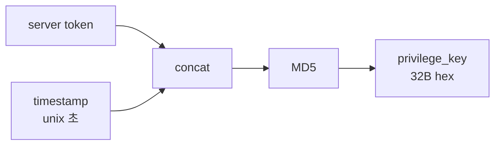
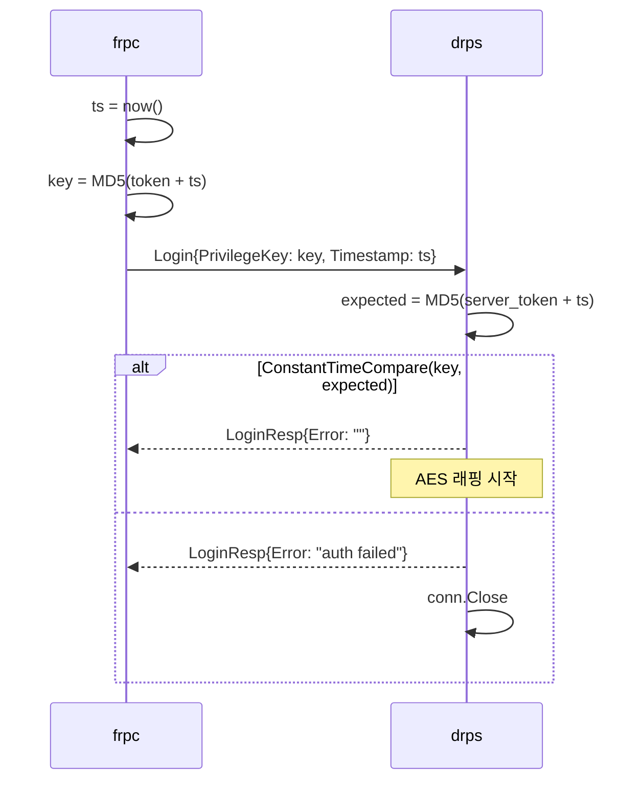
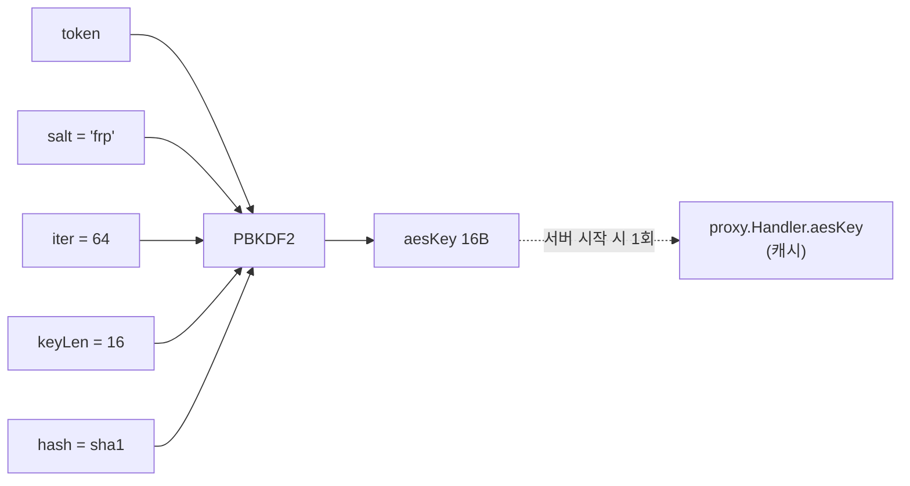
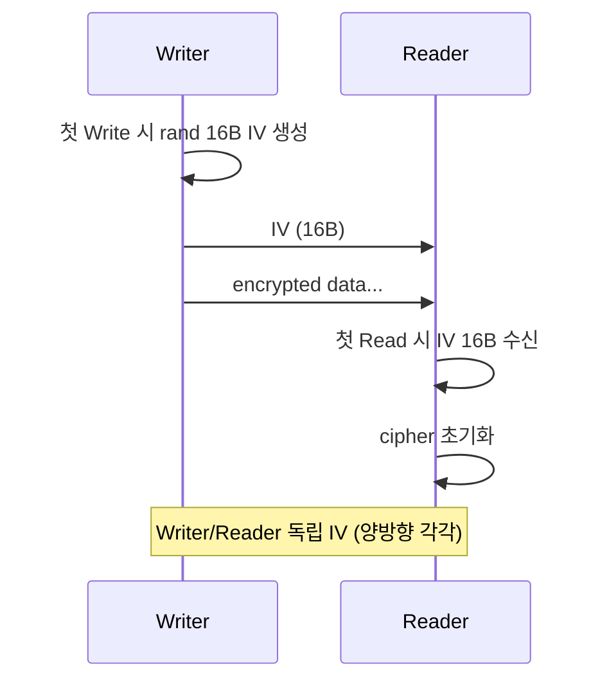
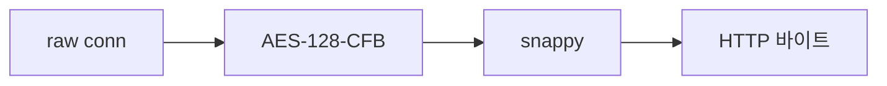
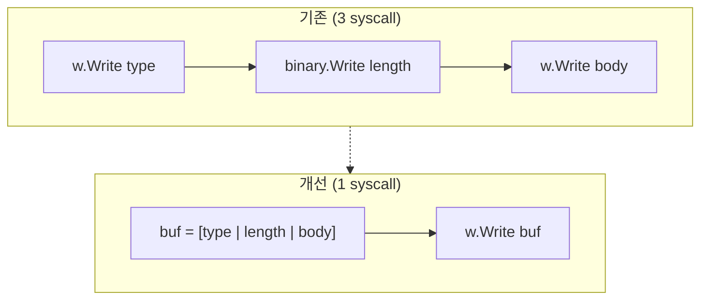

# 프로토콜 스펙

frpc v0.68.0 호환. frp 패키지 import 없이 직접 구현.

## 와이어 포맷



- 최대 본문 크기: **10240 bytes**
- `length`는 int64 Big-Endian
- 음수 length → 거부 (보안)

## 메시지 타입 (10개)



| 바이트 | 이름 | 방향 | 용도 |
|--------|------|------|------|
| `'o'` | Login | frpc → drps | 로그인 요청 |
| `'1'` | LoginResp | drps → frpc | 로그인 응답 |
| `'p'` | NewProxy | frpc → drps | 프록시 등록 |
| `'2'` | NewProxyResp | drps → frpc | 등록 응답 |
| `'c'` | CloseProxy | frpc → drps | 프록시 해제 |
| `'r'` | ReqWorkConn | drps → frpc | 워크 커넥션 요청 |
| `'w'` | NewWorkConn | frpc → drps | 워크 커넥션 등록 |
| `'s'` | StartWorkConn | drps → frpc | 워크 커넥션 사용 시작 |
| `'h'` | Ping | frpc → drps | 하트비트 |
| `'4'` | Pong | drps → frpc | 하트비트 응답 |

구현: `internal/msg` — 10개 구조체 + ReadMsg/WriteMsg.

## 인증

### 키 생성



### 검증 순서



구현: `internal/auth` — `crypto/md5` + `crypto/subtle.ConstantTimeCompare`.

## 암호화 (AES-128-CFB)

### 키 파생



`DefaultSalt = "crypto"`는 frp가 `init()`에서 `"frp"`로 덮어씀. drps는 처음부터 `"frp"` 사용.

### IV 전송 규칙



### 적용 위치

| 위치 | 적용 시점 | 키 소스 |
|------|----------|---------|
| 제어 채널 | Login 성공 후 (항상) | `crypto.DeriveKey(token)` (로그인 시 계산) |
| 워크 커넥션 | `UseEncryption=true` (선택) | 서버 시작 시 계산된 캐시 키 (`proxy.Handler.aesKey`) |

## 압축 (snappy)

`UseCompression=true` 시 적용. 동일 라이브러리 (`github.com/golang/snappy`). **Write마다 자동 Flush** (양방향 통신 데드락 방지).

## 래핑 순서

drps ↔ frpc 양쪽 동일.



제어 채널: `conn → AES → 제어 메시지`
워크 커넥션: `conn → StartWorkConn(평문) → [AES?] → [snappy?] → HTTP`

## 성능 설계

### WriteMsg 단일 버퍼



### TypeOf 리플렉션 제거

```go
// 기존: fmt.Sprintf("%T", m) → map lookup (문자열 할당)
// 개선: switch type assertion (0 allocs)
func TypeOf(m Message) (byte, bool) {
    switch m.(type) {
    case *Login:     return 'o', true
    case *LoginResp: return '1', true
    // ...
    }
}
```

### ReadMsg 버퍼 재사용

- 헤더 9바이트: 스택 할당 `[9]byte`
- Body 버퍼: `sync.Pool` 재사용

구현: `internal/msg`, `internal/auth`, `internal/crypto`
