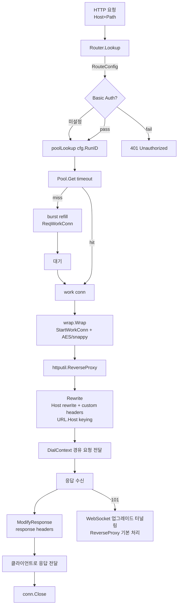
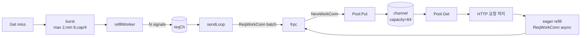
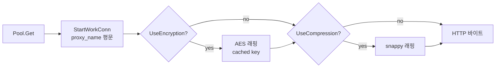
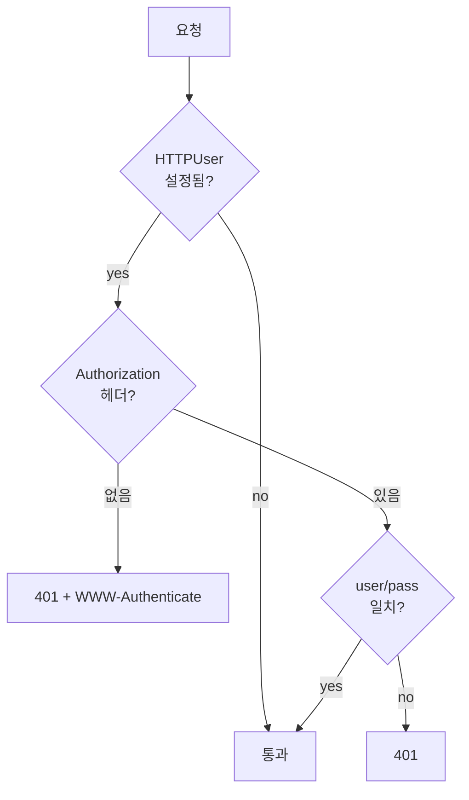
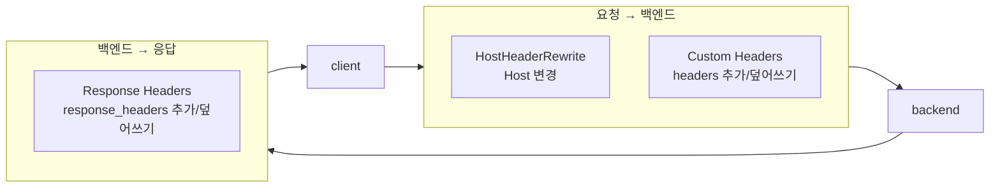
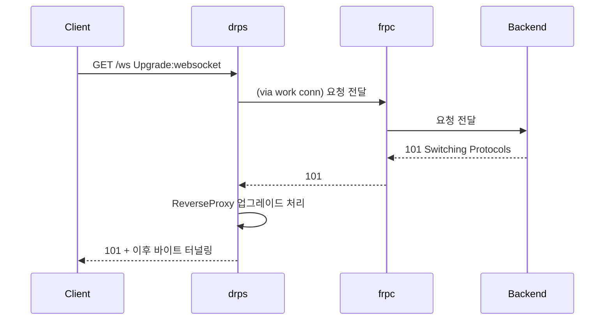
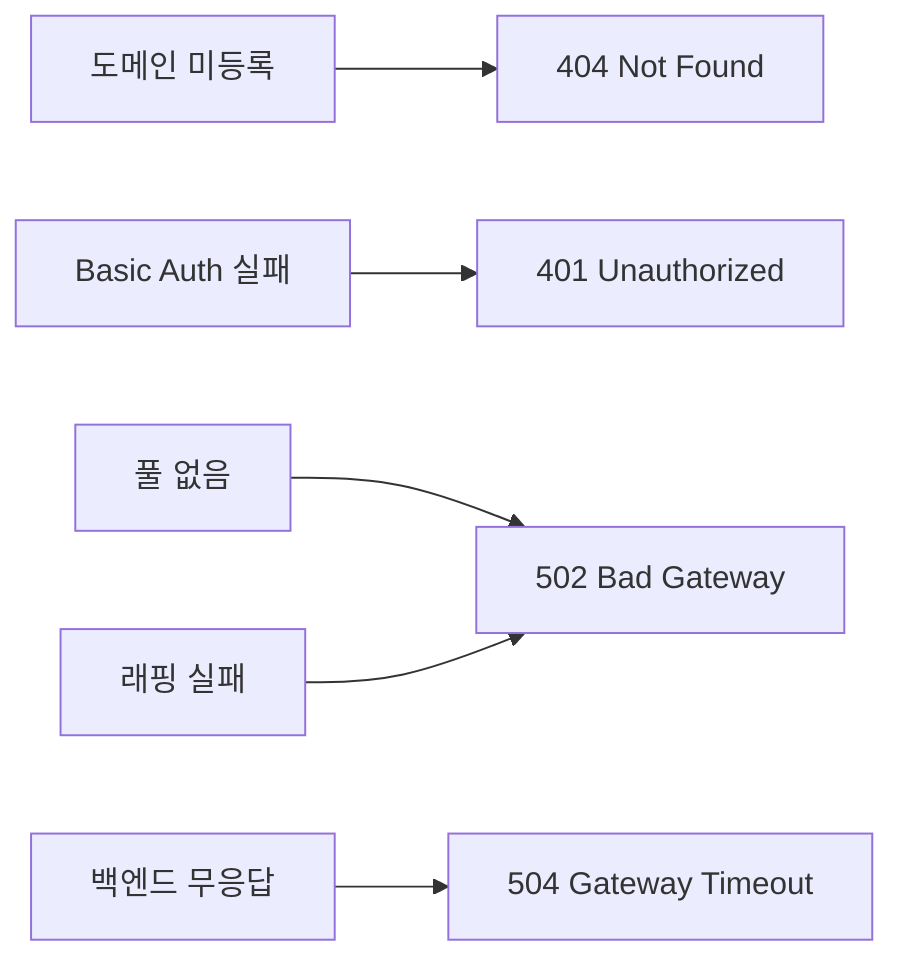

# HTTP 프록시 스펙

## 요청 처리 흐름



## 핵심 최적화

| 항목 | 이전 | 개선 |
|------|------|------|
| Pool 조회 | proxyName → RangeByProxy O(N) → runID → Get | **cfg.RunID → Get O(1)** |
| AES 키 | 매 요청 DeriveKey (PBKDF2) | **시작 시 1회 계산, 캐시 전달** |
| 응답 바디 버퍼 | 매 요청 임시 버퍼 | **ReverseProxy BufferPool 재사용** |
| 라우트 격리 | 주소 충돌 가능 | **`routeDialKey(cfg)` = `Domain.Location.ProxyName.drps` 로 라우트별 idle conn 격리** |
| HTTP/2 cleartext | 미지원 | **h2c.NewHandler 기반 지원** |
| WriteMsg | 3 syscall | **1 syscall** |

## 워크 커넥션 풀



**Burst refill**: pool이 비어있을 때 1개가 아니라 N개를 한꺼번에 요청 → 지연 감소.

### StartWorkConn

워크 커넥션을 꺼낸 후 frpc에 보내는 첫 메시지.



## Basic Auth



## 헤더 조작



## WebSocket



drps는 별도 `handleUpgrade` 함수를 두지 않고 `httputil.ReverseProxy` 경로에서 업그레이드를 처리한다.

## URL.Host keying

ReverseProxy는 `Transport` 커넥션 재사용 키로 `URL.Host`를 사용한다.  
drps는 다음 synthetic host를 사용해 라우트 단위로 idle connection pool을 분리한다.

```text
{Domain}.{Location}.{ProxyName}.drps
예) app.example.com./api.web.drps
```

이 키는 네트워크 목적지가 아니며, 실제 연결은 `DialContext`에서 워크 커넥션을 직접 가져와 처리한다.

## 에러 매핑



## 타임아웃

| 타임아웃 | 기본값 | 설명 |
|---------|--------|------|
| `WorkConnTimeout` | 10초 | 풀에서 워크 커넥션 대기 |
| `ResponseTimeout` | 0(비활성) | wrapped conn 전체 I/O deadline (`DRPS_RESPONSE_TIMEOUT_SEC`로 설정) |
| `ResponseHeaderTimeout` | 60초 | ReverseProxy Transport 응답 헤더 대기 |
| `IdleConnTimeout` | 60초 | ReverseProxy idle conn 유지 시간 |
| `MaxIdleConnsPerHost` | 5 | synthetic host 키당 idle conn 개수 |
| `ReadHeaderTimeout` | 60초 | HTTP 헤더 읽기 (slowloris 방지) |

구현:
- `internal/proxy` — Handler.ServeHTTP, ReverseProxy(Rewrite/ModifyResponse/DialContext)
- `internal/wrap` — Wrap
- `internal/pool` — Pool, Registry, refillWorker
