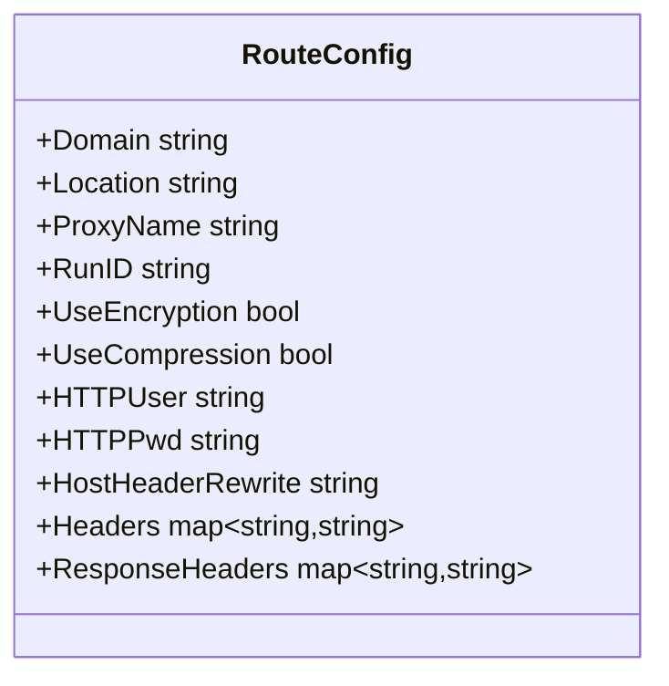
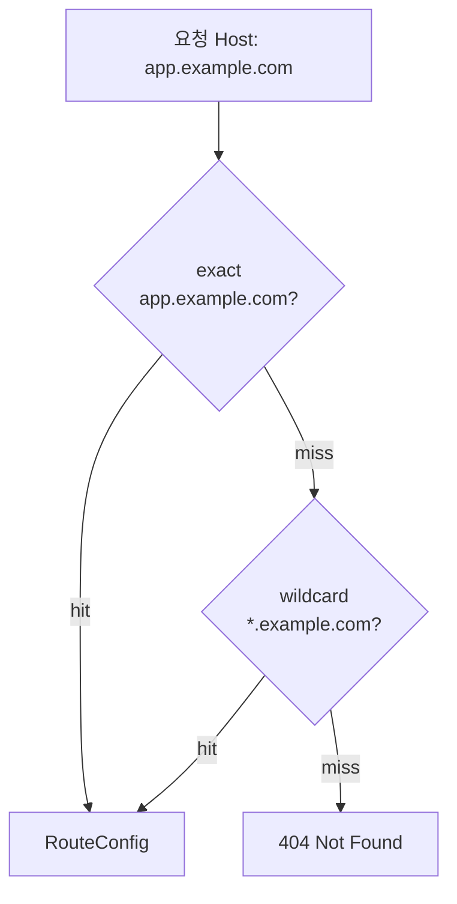
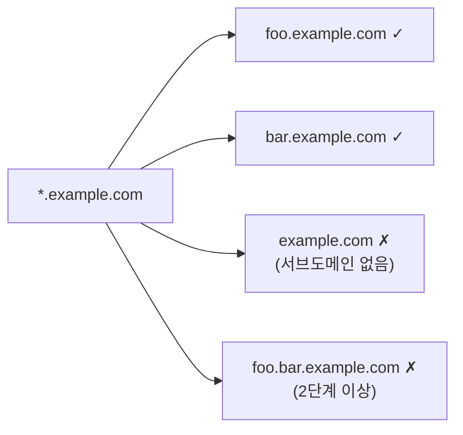
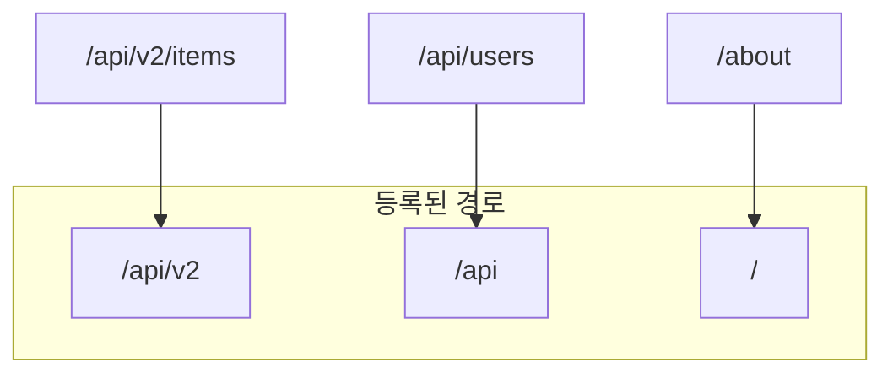
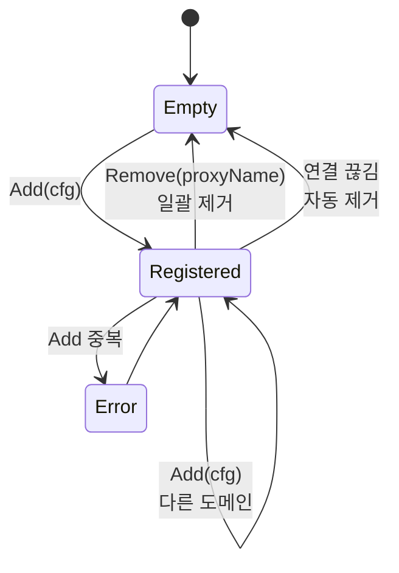
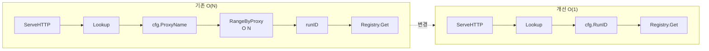

# 라우팅 스펙

## 라우팅 테이블

도메인 + 경로 → `RouteConfig` 매핑.

## 도메인 매칭 우선순위

### 와일드카드 규칙

## 경로 매칭 — Longest Prefix

같은 도메인에 대해 가장 긴 prefix 우선.

## 등록/해제

- **Add**: 도메인+경로 중복 → 에러
- **Remove(proxyName)**: 해당 프록시의 모든 도메인+경로 일괄 제거
- **연결 끊김**: frpc가 등록한 모든 프록시 자동 제거

## Pool 조회 경로

`RangeByProxy` 메서드는 제거. `Lookup` 결과에 이미 `RunID`가 포함되어 있으므로 역방향 조회 불필요.

구현: `internal/router` — Router.Add, Remove, Lookup
