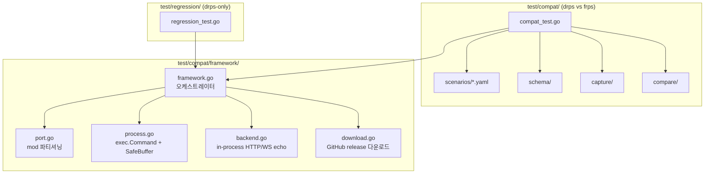

# E2E 테스트

프로세스 기반 (Docker 불필요). frp v0.68.0 바이너리는 GitHub releases 에서 자동 다운로드 + 캐시.

2-suite 구조:
- **test/compat/**: drps vs frps 등가 비교 (YAML 시나리오)
- **test/regression/**: drps 단독 검증 (Go 코드)

## 환경

```
프로세스 기반 테스트 인프라 (test/compat/framework/):
  - drps: go build ./cmd/drps/ (TestMain 에서 1회)
  - frps/frpc: GitHub releases v0.68.0 다운로드 (캐시: $DRP_FRP_CACHE)
  - backend: in-process HTTP echo / WS echo (goroutine)
  - 포트 할당: mod 기반 파티셔닝 (10000-30000)
  - readiness: stdout 패턴 매칭 + TCP dial poll
```

## Compat Suite (test/compat/) — 2 시나리오

drps 와 frps 를 동일 조건에서 실행, 응답의 semantic equivalence 비교 (status + body hash + Content-Type + WS frames).

| ID | 시나리오 | 모드 | 비교 |
|----|---------|------|------|
| C-01 | http-get | http | status + SHA256(body) + Content-Type |
| C-02 | websocket-echo | websocket | upgrade 101 + WS frame list (opcode + payload) |

시나리오 추가: `test/compat/scenarios/` 에 YAML 파일 1개 추가. Go 코드 변경 불필요.

### expected_divergence

drps 와 frps 사이 알려진 의도적 차이는 YAML 의 `expected_divergence` allow-list 로 선언. 선언되지 않은 diff → FAIL, 선언되었는데 없는 diff → FAIL (over-matching 방지).

### load profile (선택)

```yaml
load:
  total: 1000
  concurrency: 50
```

시나리오에 `load:` 필드 추가 시 burst 등가 비교 실행.

## Regression Suite (test/regression/) — 9 테스트

drps 단독 기능 검증. frps 비교 없음.

### 기본 기능 (3)

| ID | 테스트 | 중요도 | 검증 |
|----|--------|--------|------|
| R-01 | TestFrpcLoginSuccess | P0 | frpc → drps Login → "login to server success" 로그 |
| R-02 | TestFrpcNotFoundDomain | P1 | 미등록 도메인 Host → 404 응답 |
| R-03 | TestFrpcMultipleProxies | P0 | 2개 프록시 (site-a, site-b) → 각각 200 응답 |

### HTTP 부하 (2)

| ID | 테스트 | 중요도 | 검증 |
|----|--------|--------|------|
| R-04 | TestHTTPConcurrentProxyNo5xx | P0 | 120 req / 20 concurrency → 전부 200, non-2xx = 0 |
| R-05 | TestHTTPBurst1000NoNon2xx | P0 | 1000 req / 50 concurrency → non-2xx = 0, failed = 0 |

### WebSocket (2)

| ID | 테스트 | 중요도 | 검증 |
|----|--------|--------|------|
| R-06 | TestWebSocketBasic | P0 | drps 경유 WS upgrade → 101 + "hello" echo 성공 |
| R-07 | TestWSBurstNoFail | P0 | 500 conn / 10 concurrency → fail = 0 |

### 메트릭 (2)

| ID | 테스트 | 중요도 | 검증 |
|----|--------|--------|------|
| R-08 | TestMetricsEndpointAfterTraffic | P1 | 20 req 후 /__drps/metrics → requested > 0, sent > 0, get_hit > 0 |
| R-09 | TestMetricsInflightZeroAfterBurst | P1 | 300 req / 30 concurrency 후 → inflight = 0 |

## 검증 범위

| 항목 | 단위 테스트 | Compat (drps vs frps) | Regression (drps-only) |
|------|-----------|----------------------|----------------------|
| 와이어 프로토콜 호환 | O (포맷 검증) | O (실제 frpc 통신) | O |
| 인증 | O | - | O (LoginSuccess) |
| AES 암호화 | O | O (frpc 기본 제어채널) | O |
| yamux 멀티플렉싱 | O (net.Pipe) | O (실제 TCP) | O |
| HTTP 프록시 | O (fakeFrpc) | O (등가 비교) | O |
| 멀티 프록시 | O | - | O |
| WebSocket | O (단위) | O (등가 비교) | O (basic + burst) |
| HTTP 동시접속 부하 | X | O (load profile) | O (최대 1000 req) |
| WS 동시접속 부하 | X | - | O (500 conn) |
| 메트릭 엔드포인트 | X | - | O (JSON 검증) |
| 메트릭 inflight 정합성 | X | - | O (burst 후 = 0) |

## 실행

```bash
# 전체 E2E (Docker 불필요)
go test ./test/... -v -timeout 300s

# compat 만
go test ./test/compat/... -v -timeout 300s

# regression 만
go test ./test/regression/... -v -timeout 300s

# 단위 테스트만
go test ./internal/... -v

# 짧은 모드 (E2E 건너뛰기)
go test ./test/... -short

# frp 바이너리 캐시 경로 지정 (CI 용)
DRP_FRP_CACHE=/tmp/drp-frp-cache go test ./test/... -v

# 벤치마크
go test ./internal/... -bench=. -benchmem
```

## 아키텍처



## CI

```yaml
# .github/workflows/ci.yml (e2e job)
- actions/cache@v4 (frp binaries, keyed on version)
- go test ./test/compat/...    (Compat)
- go test ./test/regression/... (Regression)
```

Docker/dind 불필요. ARC runner 에서 Go 툴체인 + 네트워크만 있으면 동작.
