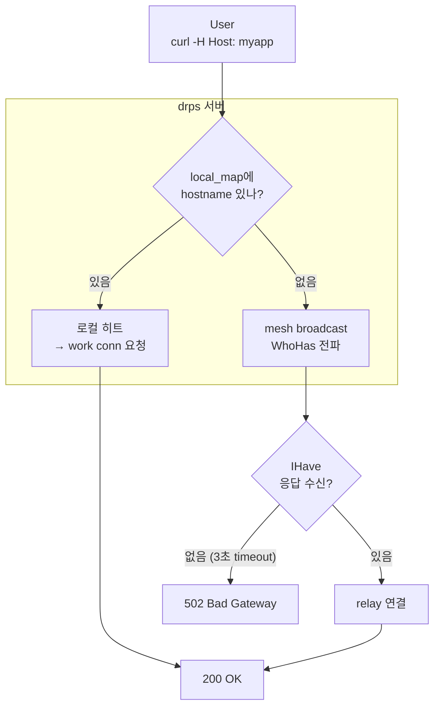

# 00. 전체 구조

## 한 문장

> NAT 뒤 서비스를 N대 서버 중 **아무 데나** 요청해도 도달하게 한다.

## 구성 요소

| 컴포넌트 | 역할 | POC 파일 |
|----------|------|----------|
| **drps** (server) | HTTP 수신, Host 라우팅, mesh 통신 | `drps.py` |
| **drpc** (client) | NAT 뒤에서 서버에 outbound 연결, work conn 제공 | `drpc.py` |
| **mesh** | 서버 간 peer 연결, broadcast, relay | `mesh.py` |
| **protocol** | TLV+JSON 프레임, 메시지 생성 | `protocol.py` |

## 물리 구성

```
┌─────────────────────────── Public ───────────────────────────┐
│                                                              │
│   User ──── curl -H "Host: myapp.example.com" ──────┐       │
│                                                      │       │
│  ┌────────────┐   ┌────────────┐   ┌────────────┐   │       │
│  │  drps-A    │   │  drps-B    │   │  drps-C    │◄──┘       │
│  │ :8001/9001 │   │ :8002/9002 │   │ :8003/9003 │           │
│  │            │   │            │   │            │           │
│  │ local_map: │   │ local_map: │   │ local_map: │           │
│  │  myapp ✓  │   │  (empty)   │   │  (empty)   │           │
│  └─────┬──────┘   └─────┬──────┘   └─────┬──────┘           │
│        │   mesh         │   mesh         │                   │
│        ◄────────────────►◄───────────────►                   │
│                                                              │
└──────────────────────────┬───────────────────────────────────┘
                           │
┌──────────────── NAT ─────┼───────────────────────────────────┐
│                          │                                   │
│  ┌──────────┐            │  outbound TCP to :9001            │
│  │  drpc    │────────────┘                                   │
│  │          │                                                │
│  │ myapp.example.com → localhost:15000                       │
│  └────┬─────┘                                                │
│       │                                                      │
│  ┌────▼─────┐                                                │
│  │ local    │  python3 -m http.server 15000                  │
│  │ :15000   │                                                │
│  └──────────┘                                                │
│                                                              │
└──────────────────────────────────────────────────────────────┘
```

## 요청 처리 3가지 경로



| 경로 | 조건 | 테스트 |
|------|------|--------|
| 로컬 히트 | drpc가 이 서버에 연결됨 | H1 |
| relay | 다른 서버에 연결됨 → mesh로 찾아서 relay | H2, H3 |
| 실패 | 어디에도 없음 → broadcast timeout | F1 |

## 포트 구조

각 drps는 2개 포트를 사용한다:

```
HTTP 포트 (:8001)              제어 포트 (:9001)
─────────────────              ──────────────────
User의 HTTP 요청 수신           drpc 로그인
Host 헤더로 라우팅              mesh peer 연결
                               work conn 수신
                               relay 연결
```

## 파일 의존성

```
protocol.py          ← 의존성 없음 (stdlib only)
    │
    ├── mesh.py      ← protocol 사용
    │
    ├── drpc.py      ← protocol 사용
    │
    └── drps.py      ← protocol + mesh 사용
```
