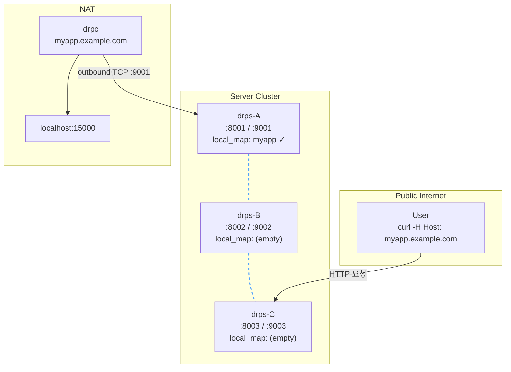
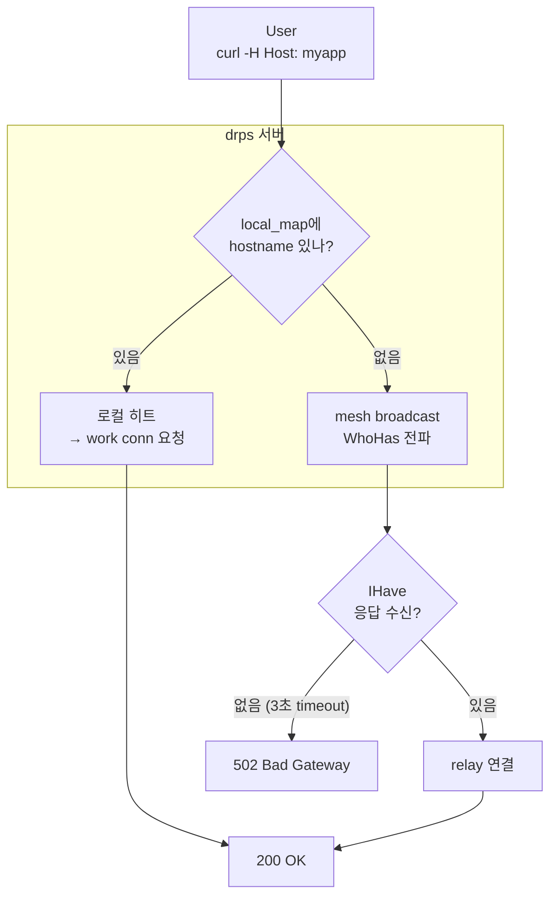
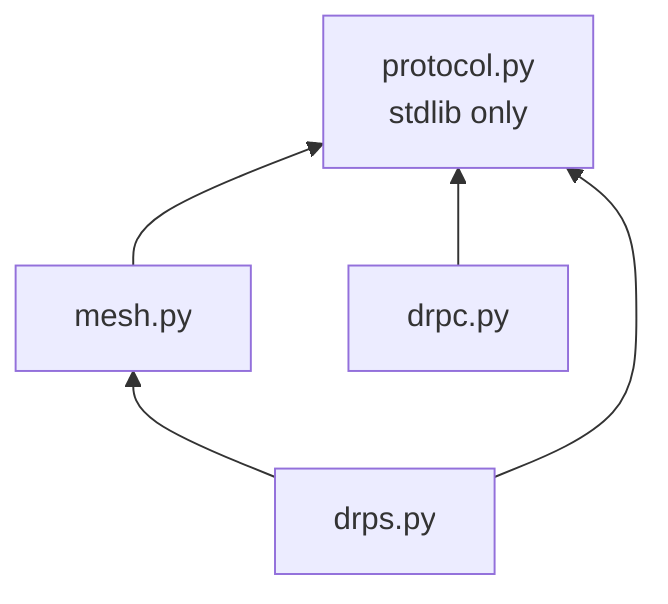

# 00. 전체 구조

## 한 문장

> NAT 뒤 서비스를 N대 서버 중 **아무 데나** 요청해도 도달하게 한다.

## 구성 요소

| 컴포넌트 | 역할 | POC 파일 |
|----------|------|----------|
| **drps** (server) | HTTP 수신, Host 라우팅, mesh 통신 | `drps.py` |
| **drpc** (client) | NAT 뒤에서 서버에 outbound 연결, work conn 제공 | `drpc.py` |
| **mesh** | 서버 간 peer 연결, broadcast, relay | `mesh.py` |
| **protocol** | TLV+JSON 프레임, 메시지 생성 | `protocol.py` |

## 물리 구성

### 노드 상세

| 노드 | 위치 | HTTP 포트 | 제어 포트 | local_map | 역할 |
|------|------|----------|----------|-----------|------|
| drps-A | Public | :8001 | :9001 | myapp ✓ | drpc 연결됨, 서비스 보유 |
| drps-B | Public | :8002 | :9002 | (empty) | 중간 relay hop |
| drps-C | Public | :8003 | :9003 | (empty) | User 요청 수신 |
| drpc | NAT | - | - | - | outbound로 drps-A에 연결 |
| local | NAT | - | :15000 | - | 실제 서비스 (http.server) |

### 연결 관계

| 연결 | 방향 | 프로토콜 | 용도 |
|------|------|---------|------|
| User → drps-C | inbound | HTTP | 서비스 요청 |
| drpc → drps-A | outbound | TLV+JSON | 로그인, 서비스 등록, work conn |
| drps-A — drps-B | 양방향 | TLV+JSON (mesh) | WhoHas/IHave, relay |
| drps-B — drps-C | 양방향 | TLV+JSON (mesh) | WhoHas/IHave, relay |
| drpc → localhost | outbound | TCP | 로컬 서비스 프록시 |

## 요청 처리 3가지 경로

| 경로 | 조건 | 테스트 |
|------|------|--------|
| 로컬 히트 | drpc가 이 서버에 연결됨 | H1 |
| relay | 다른 서버에 연결됨 → mesh로 찾아서 relay | H2, H3 |
| 실패 | 어디에도 없음 → broadcast timeout | F1 |

## 포트 구조

각 drps는 2개 포트를 사용한다:

| 포트 | 용도 | 수신 대상 | 라우팅 기준 |
|------|------|----------|------------|
| HTTP (:8001) | User HTTP 요청 수신 | 외부 User | Host 헤더 |
| Control (:9001) | drpc 로그인, mesh peer, work conn, relay | drpc / 다른 drps | 첫 TLV 메시지 타입 |

## 파일 의존성

