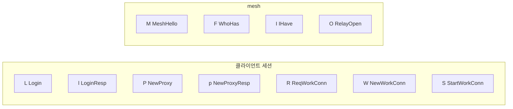

# 01. TLV + JSON 프로토콜

## TLV 프레임

모든 메시지는 동일한 바이너리 프레임으로 감싼다:

```
┌──────────┬──────────────────┬─────────────────────┐
│ Type     │ Length           │ Body                │
│ 1 byte   │ 4 bytes (BE)    │ N bytes (UTF-8 JSON)│
│ ASCII    │ big-endian u32   │                     │
└──────────┴──────────────────┴─────────────────────┘
```

```
예시: Login 메시지

 4C  00 00 00 1A  {"alias":"myapp","hostname":"myapp.example.com"}
 ──  ───────────  ─────────────────────────────────────────────────
 'L'   26 bytes   JSON body
```

## 메시지 타입

| Type | ASCII | 방향 | 용도 |
|------|-------|------|------|
| `L` | Login | drpc → drps | 클라이언트 인증 요청 |
| `l` | LoginResp | drps → drpc | 인증 응답 |
| `P` | NewProxy | drpc → drps | 서비스 등록 (hostname 매핑) |
| `p` | NewProxyResp | drps → drpc | 등록 응답 |
| `R` | ReqWorkConn | drps → drpc | work conn 요청 |
| `W` | NewWorkConn | drpc → drps | work conn 제공 (새 TCP) |
| `S` | StartWorkConn | drps → drpc | HTTP 데이터 전송 시작 |
| `M` | MeshHello | drps ↔ drps | peer 핸드셰이크 |
| `F` | WhoHas | drps → peers | 서비스 검색 broadcast |
| `I` | IHave | drps → drps | 서비스 검색 응답 |
| `O` | RelayOpen | drps → drps | relay 파이프 연결 요청 |

## 메시지 흐름별 그룹



## 주요 메시지 body 구조

### Login (L)

```json
{
  "alias": "myapp"
}
```

### NewProxy (P)

```json
{
  "alias": "myapp",
  "hostname": "myapp.example.com"
}
```

### MeshHello (M)

```json
{
  "node_id": "A",
  "peers": [],
  "control_port": 9001
}
```

`control_port`는 필수. 없으면 inbound peer가 ephemeral 포트를 relay 주소로 기록하는 버그 발생.

### WhoHas (F)

```json
{
  "msg_id": "uuid-xxx",
  "hostname": "myapp.example.com",
  "ttl": 5,
  "path": ["B"]
}
```

### IHave (I)

```json
{
  "msg_id": "uuid-xxx",
  "hostname": "myapp.example.com",
  "node_id": "A",
  "path": ["B"]
}
```

### RelayOpen (O)

```json
{
  "relay_id": "uuid-yyy",
  "hostname": "myapp.example.com",
  "next_hops": ["A"]
}
```
