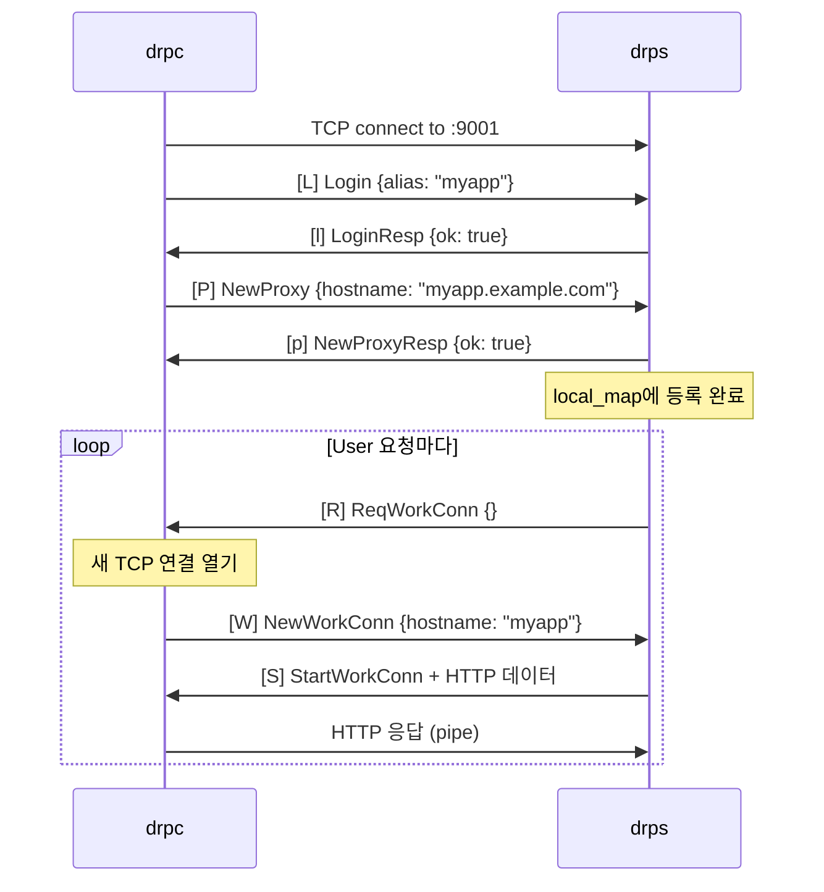
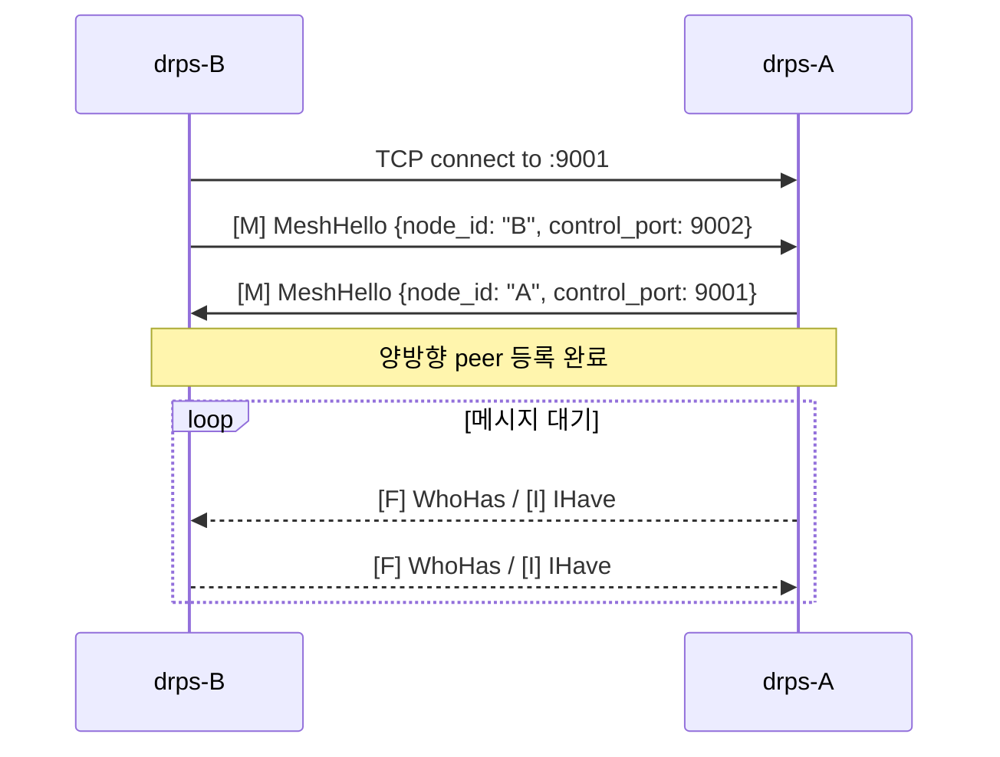

# 02. 제어 포트 디스패처

## 핵심 아이디어

제어 포트(:9001) 하나로 4종류 연결을 처리한다. TCP 연결이 들어오면 **첫 TLV 메시지의 type 바이트** 하나로 분기한다.

## 분기 로직

```
TCP 연결 수신 (:9001)
        │
        ▼
  첫 TLV 메시지 읽기
  Type = ?
        │
        ├── 'L' (Login)        → 클라이언트 세션 시작
        │                        Login → LoginResp → NewProxy → NewProxyResp
        │                        이후 ReqWorkConn 루프
        │
        ├── 'M' (MeshHello)    → mesh peer 등록
        │                        양방향 hello 교환 → _peer_loop
        │                        (WhoHas/IHave 수신 대기)
        │
        ├── 'W' (NewWorkConn)  → work conn 큐에 저장
        │                        hostname별 asyncio.Queue
        │                        HTTP 요청 처리시 꺼내 씀
        │
        └── 'O' (RelayOpen)    → relay 파이프
                                 next_hops 남았으면 → 다음 hop으로 전달
                                 next_hops 비었으면 → work conn 연결 후 pipe
```

## 왜 포트 하나인가

```
AS-IS (포트 4개)                TO-BE (포트 1개)
────────────────                ────────────────
:9001  client login             :9001  전부 처리
:9002  mesh peer                       첫 바이트로 분기
:9003  work conn
:9004  relay

LB 설정: 4개 포트 열어야 함      LB 설정: 1개 포트만
방화벽: 4개 규칙                 방화벽: 1개 규칙
```

## drps.py 구현

```python
async def handle_control(reader, writer):
    msg_type, body = await read_msg(reader)

    if msg_type == MSG_LOGIN:
        await handle_client_session(reader, writer, body)

    elif msg_type == MSG_MESH_HELLO:
        await mesh.handle_peer(reader, writer, body)

    elif msg_type == MSG_NEW_WORK_CONN:
        hostname = body.get("hostname")
        await work_queues[hostname].put((reader, writer))

    elif msg_type == MSG_RELAY_OPEN:
        await mesh.handle_relay_open(reader, writer, body)
```

## 시퀀스: 클라이언트 세션



## 시퀀스: Mesh Peer 연결


