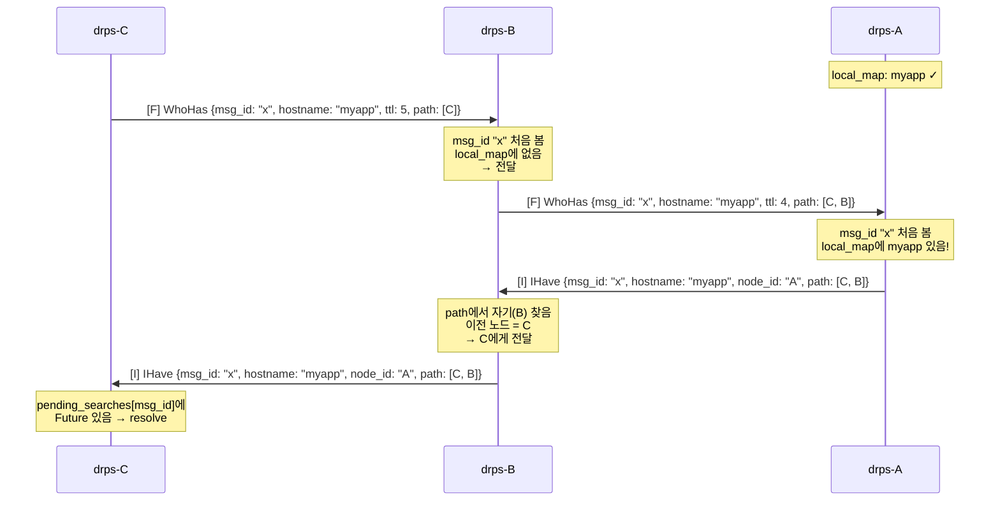

# 03. Mesh Broadcast — 서비스 검색

## 핵심 아이디어

User가 drps-C에 요청했는데 서비스가 drps-A에 있다. drps-C는 이걸 모른다.

해법: **모든 peer에게 물어본다** (broadcast). 가진 노드가 **역방향으로 응답**한다.

## 알고리즘: Timed Flooding with Deduplication

```
1. WhoHas 메시지 생성 (고유 msg_id, ttl=5)
2. 모든 peer에게 전송
3. 수신한 peer:
   a. msg_id 본 적 있으면 → 무시 (중복 방지)
   b. ttl ≤ 0 이면 → 무시 (무한 전파 방지)
   c. local_map에 hostname 있으면 → IHave 응답
   d. 없으면 → ttl-1, path에 자기 추가, 나머지 peer에게 전달
4. 3초 안에 IHave 없으면 → 서비스 없음 (502)
```

## 전파 과정: Linear Mesh (A—B—C)



## IHave 역방향 라우팅

IHave는 broadcast처럼 퍼지지 않는다. **path를 따라 역방향**으로만 전달된다.

```
WhoHas 전파 경로:       C → B → A     (path: [C, B])
IHave 응답 경로:        A → B → C     (path를 역순으로 추적)
```

역방향 추적 로직:

```python
# path = [C, B] 이고 나는 B
# path에서 나(B)를 찾음 → index 1
# 이전 노드 = path[index - 1] = C
# → C에게 전달
```

## relay_path 구성

IHave를 수신한 origin 노드(C)가 relay 연결을 열 때:

```
IHave body:
  node_id: "A"        ← 서비스 보유 노드
  path: [C, B]        ← WhoHas가 지나온 경로

relay_path = path[1:] + [node_id]
           = [B] + [A]
           = [B, A]

의미: C → B → A 순서로 relay 연결
```

## 루프 방지: seen_messages

Triangle mesh (A—B—C—A)에서 broadcast가 순환할 수 있다:

```
루프 없이:  B → A, B → C → A → B → C → A → ...  (무한)
루프 방지:  B → A, B → C.  C → A (ok), C → B (seen → 무시)
```

```
seen_messages = { "msg_id_x": 1708234567.0, ... }

WhoHas 수신:
  msg_id가 seen_messages에 있나?
    있으면 → return (무시)
    없으면 → seen_messages에 기록 → 처리 계속
```

## TTL (Time-To-Live)

seen_messages가 주요 방어선이고, TTL은 안전망:

```
ttl=5 에서 시작
  hop 1: ttl=4
  hop 2: ttl=3
  ...
  hop 5: ttl=0 → 무시

현실적으로 5홉 이상 mesh는 없음.
seen_messages가 먼저 잡지만, 혹시 모를 경우 TTL이 최종 방어.
```

## 테스트 커버리지

| 테스트 | 검증 항목 |
|--------|----------|
| H2 | 1홉 broadcast → IHave → relay 성공 |
| H3 | 2홉 broadcast 전파 → IHave 역방향 라우팅 |
| F1 | 없는 hostname → 3초 timeout → 502 |
| F5 | Triangle mesh에서 seen_messages가 루프 차단 |
