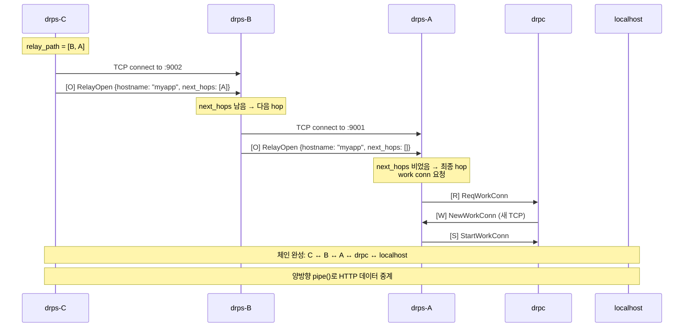

# 04. 멀티홉 릴레이

## 핵심 아이디어

broadcast로 서비스 위치를 찾았으면, 그 경로를 따라 **TCP 파이프 체인**을 구성한다.

```
User → drps-C → drps-B → drps-A → drpc → localhost
         │         │         │
         └─ relay ─┘─ relay ─┘
```

각 hop에서 새 TCP 연결을 열고, 양방향 `pipe()`로 데이터를 중계한다.

## relay path 구성

broadcast의 IHave 응답에서 relay 경로를 추출한다:

```
IHave 수신 (drps-C에서):
  msg_id: "x"
  node_id: "A"         ← 서비스 보유 노드
  path: [C, B]         ← WhoHas가 지나온 노드들

relay_path = path[1:] + [node_id]
           = [B] + [A]
           = [B, A]

해석:
  path[0] = C (나 자신 → 제외)
  path[1:] = [B] (중간 hop)
  + [A] (최종 목적지)
```

## RelayOpen 메시지

각 hop에서 다음 hop으로 전달하는 메시지:

```json
{
  "relay_id": "uuid-yyy",
  "hostname": "myapp.example.com",
  "next_hops": ["A"]
}
```

`next_hops`가 빌 때까지 한 hop씩 소비된다.

## 릴레이 체인 구성 과정



## 각 hop의 동작

```
open_relay (요청 발신 측):
  1. relay_path에서 첫 번째 hop 꺼냄
  2. peer_addresses[hop]로 TCP 연결
  3. RelayOpen 전송 (나머지 hops 포함)
  4. (reader, writer) 반환 → HTTP 데이터 pipe

handle_relay_open (요청 수신 측):
  next_hops 남았나?
    ├── 있음 → 다음 hop으로 TCP 열고 RelayOpen 전달
    │         양방향 pipe(inbound ↔ outbound)
    │
    └── 비었음 → 최종 hop
              work conn 요청 → pipe(relay ↔ work_conn)
```

## 최종 hop에서 work conn 연결

```
drps-A (최종 hop):
  1. get_work_conn_cb("myapp") 호출
  2. drpc에게 ReqWorkConn 전송
  3. drpc가 localhost:15000에 TCP 연결
  4. drpc가 NewWorkConn으로 새 TCP를 drps-A에 제공
  5. pipe(relay_reader, work_writer) + pipe(work_reader, relay_writer)
```

## pipe() 함수

모든 relay의 핵심. 한쪽에서 읽어서 다른 쪽에 쓴다:

```python
async def pipe(reader, writer):
    try:
        while True:
            data = await reader.read(4096)
            if not data:
                break
            writer.write(data)
            await writer.drain()
    finally:
        writer.close()
```

체인의 각 hop에서 `pipe()` 2개가 양방향으로 동작:

```
pipe(left_reader,  right_writer)   →  요청 방향
pipe(right_reader, left_writer)    ←  응답 방향
```
