# 시나리오 정의

## 0. 일반화: drp가 푸는 문제

### 한 문장

> NAT 뒤 서비스를 N대 공개 서버 중 **아무 데나** 요청해도 도달하게 하는 것.

### 일반 모델

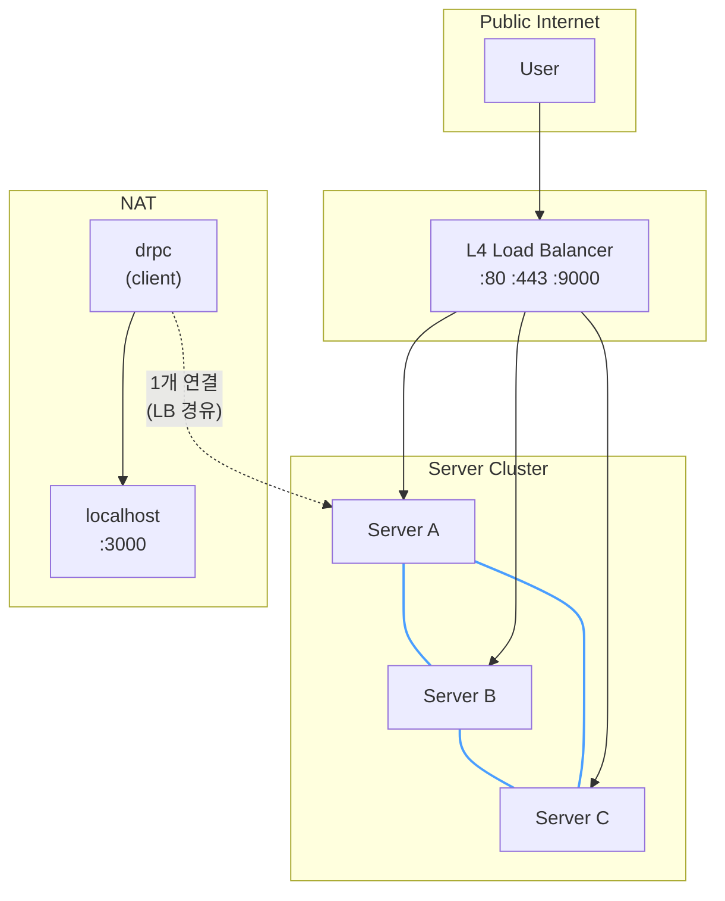

### 이 구조가 풀 수 있는 것

| # | 풀 수 있는 것 | 조건 |
|---|-------------|------|
| 1 | NAT 뒤 HTTP/HTTPS 서비스 외부 노출 | 클라이언트가 아웃바운드 TCP 가능 |
| 2 | 서버 N대 중 아무 데나 요청해도 동작 | 서버 간 mesh 연결 존재 |
| 3 | 서버 추가/제거 시 클라이언트 재설정 불필요 | LB + mesh gossip |
| 4 | 특정 인프라에 종속되지 않음 | 순수 TCP + 메시지 프로토콜 |

### 이 구조가 풀 수 없는 것

| # | 풀 수 없는 것 | 이유 |
|---|-------------|------|
| 1 | 순수 TCP (SSH, DB) | 첫 바이트에 라우팅 식별자 없음 |
| 2 | UDP | 연결 지향 mesh에 적용 불가 |
| 3 | LB 장애 | drp 위의 레이어. 인프라 책임 |
| 4 | 전체 서버 다운 | 당연히 불가 |
| 5 | 아웃바운드 TCP도 차단된 환경 | NAT 관통 자체가 불가 |
| 6 | 10대+ 서버 | O(N²) mesh. 설계 목표는 2~5대 |

---

## 1. Happy Cases

> 시스템이 정상일 때 동작하는 모든 경우.
> **POC의 핵심 검증 대상.**

### H1. 로컬 히트

가장 단순한 경우. 요청이 클라이언트가 연결된 서버에 도착.

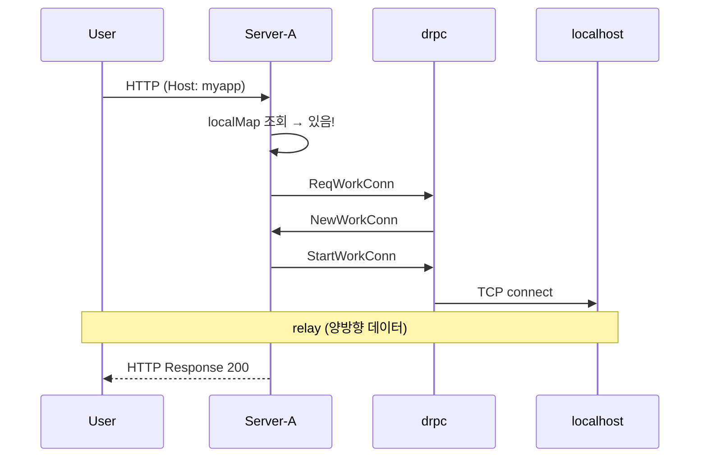

**검증**: mesh 없이도 동작하는가?

---

### H2. 리모트 히트 (Full Mesh, 1 hop)

**drp의 핵심.** 요청이 클라이언트 없는 서버에 도착.

```
Mesh:  A ═══ B     drpc → A
```

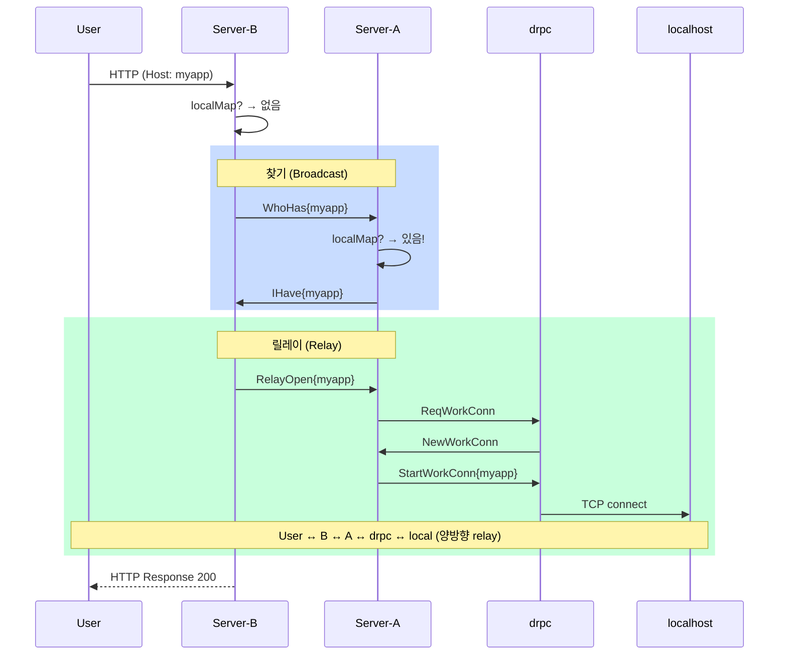

**검증**: broadcast → 응답 → relay 체인이 동작하는가?

---

### H3. Partial Mesh (Multi-hop)

A와 C가 직접 연결 없음. B를 경유.

```
Mesh:  A ═══ B ═══ C     (A↔C 직접 연결 없음)
drpc → A
```

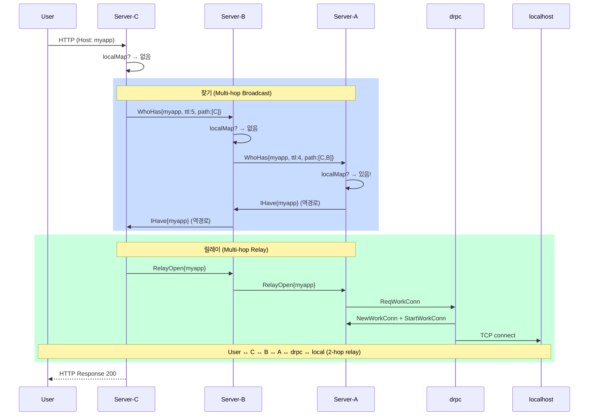

**검증**: TTL 감소 + path 기록 + 역경로 + multi-hop relay

---

### H4. 다중 서비스

서로 다른 서비스가 서로 다른 서버에 연결.

```
Mesh:  A ═══ B ═══ C
drpc-1 (myapp) → A
drpc-2 (api)   → C
```

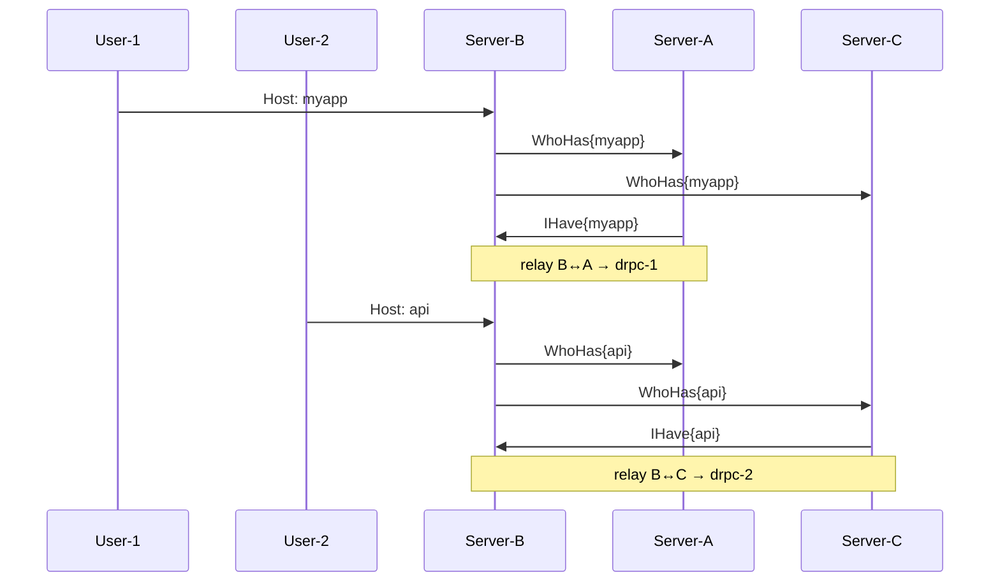

**검증**: broadcast가 서비스별로 독립 동작하는가?

---

### H5. 동시 요청

같은 서비스에 여러 요청이 동시에 들어옴.

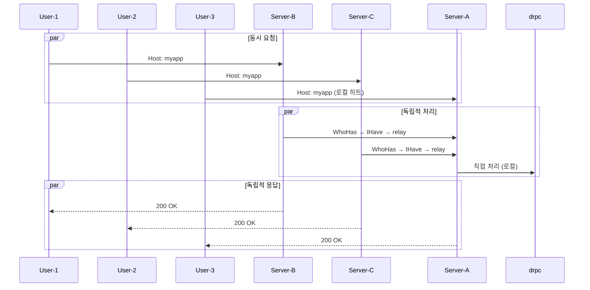

**검증**: work conn 여러 개가 동시에 활성화되어도 간섭 없는가?

---

## 2. Non-Happy Cases

> 인프라 장애 시 **내구성(durability)**.
> POC에서는 **동작 정의** 중심. 구현은 선택적.

### F1. 서비스 없음 (broadcast 실패)

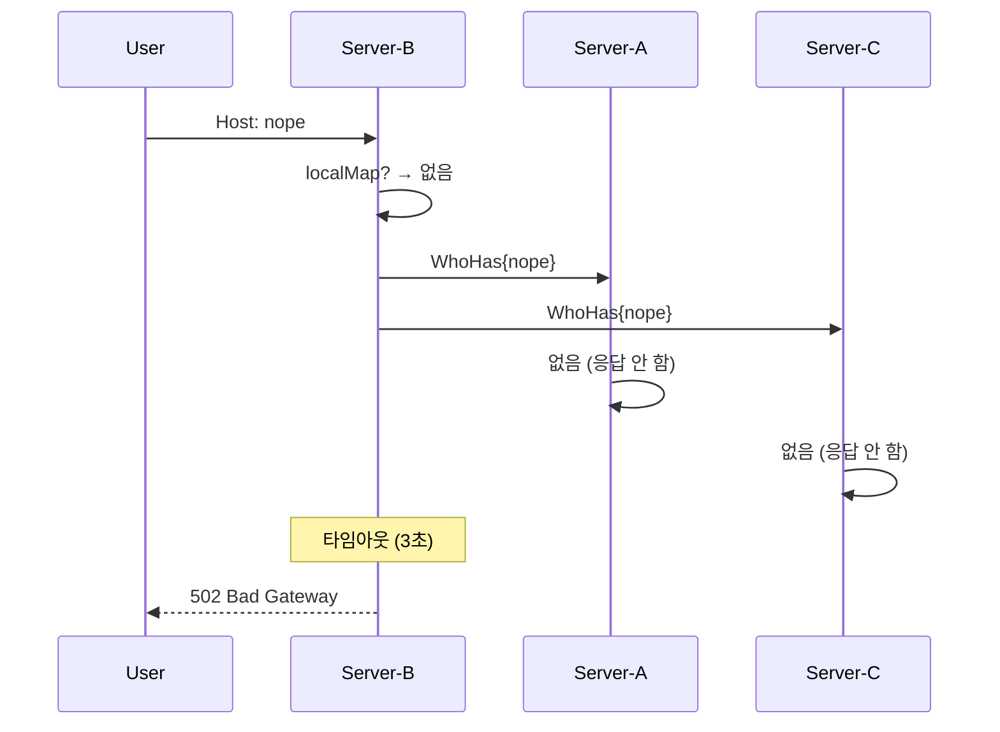

**동작**: broadcast 후 타임아웃 → 502

---

### F2. drpc 연결 끊김

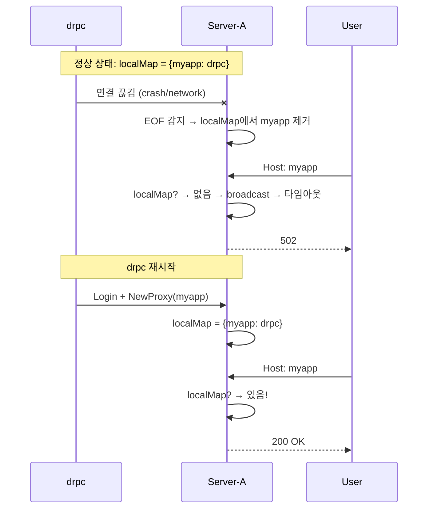

**핵심**: 연결 끊김 감지(EOF) → 자동 정리 → 재연결로 복구

---

### F3. drps 노드 크래시

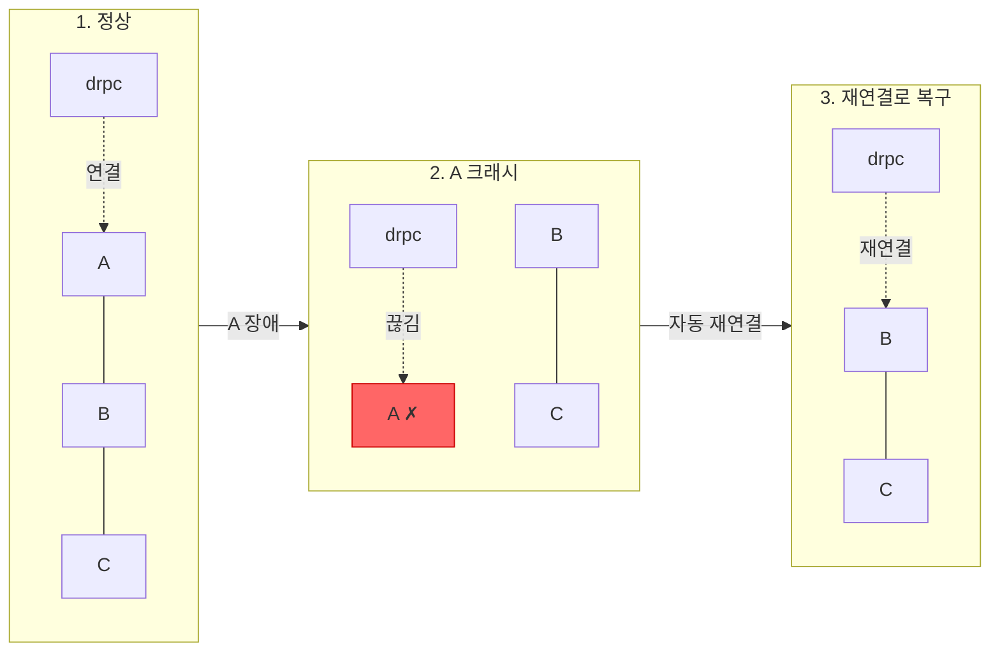

**핵심**: 클라이언트 **자동 재연결**이 복구의 열쇠. 재연결 전까지 서비스 불가.

---

### F4. Mesh 링크 단절

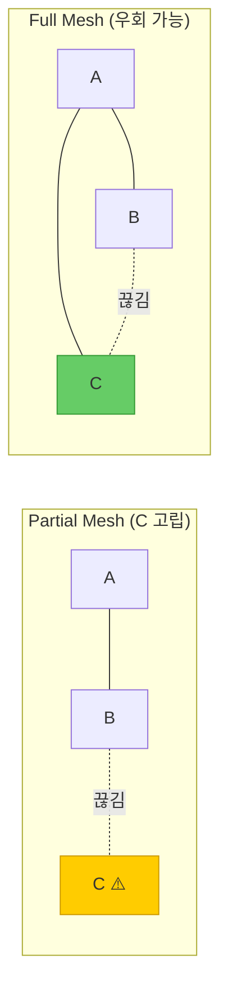

| 토폴로지 | B↔C 단절 시 | User→C 결과 |
|----------|------------|------------|
| Partial (A-B-C) | C 고립 | **502** |
| Full (A-B, A-C, B-C) | A↔C로 우회 | **200 OK** |

**핵심**: Full mesh일수록 링크 단절에 강함. Partial mesh는 고립 위험.

---

### F5. Broadcast 루프

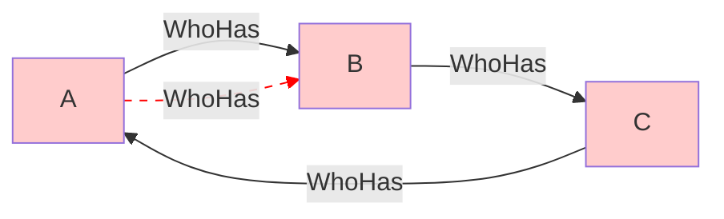

> 삼각형 mesh = 루프 존재 → WhoHas가 A→B→C→A→B→... 무한 순환!

**방어 (필수, 2중)**:

| 방어 | 역할 |
|------|------|
| `seen_messages[msg.id]` | 이미 처리한 메시지 → 즉시 무시 |
| `msg.ttl -= 1` → `ttl <= 0` 시 드롭 | seen이 실패해도 홉 수로 제한 |

---

## 3. 케이스별 POC 대응

| 케이스 | 유형 | POC 구현 | 우선순위 |
|--------|------|----------|---------|
| **H1** 로컬 히트 | Happy | ✅ 필수 | P0 |
| **H2** 리모트 히트 (1 hop) | Happy | ✅ 필수 | P0 |
| **H3** Partial mesh (multi-hop) | Happy | ✅ 필수 | P0 |
| **H4** 다중 서비스 | Happy | ✅ 필수 | P1 |
| **H5** 동시 요청 | Happy | ✅ 필수 | P1 |
| **F1** 서비스 없음 | Non-Happy | ✅ 타임아웃+502 | P1 |
| **F2** drpc 끊김 | Non-Happy | ⚠️ EOF 감지+정리 | P2 |
| **F3** drps 크래시 | Non-Happy | ⚠️ 재연결 | P2 |
| **F4** Mesh 링크 단절 | Non-Happy | ⚠️ 인지만 | P2 |
| **F5** Broadcast 루프 | Non-Happy | ✅ seen+TTL 필수 | P0 |

### 구현 순서

```
Phase 1 (P0): 핵심 동작 증명
  H1 → H2 → H3 + F5(루프 방지)

Phase 2 (P1): 실용성 검증
  H4 → H5 → F1(타임아웃)

Phase 3 (P2): 내구성 (선택)
  F2 → F3 → F4
```
